```python
#Imports
import tensorflow as tf
from tensorflow import keras

import numpy as np
import pandas as pd
import matplotlib.pyplot as plt
import seaborn as sns
from json import loads
from sklearn import *

from sklearn.linear_model import Ridge, Lasso
from sklearn.metrics import r2_score
```


```python
# dataset
train1_data = pd.read_csv('tmdb/TMDB_10000_Popular_Movies.csv')
train2_data =  pd.read_csv('tmdb/TMDB_7000_Top_Rated_Movies.csv')
train_data = train1_data.append(train2_data)
train_data = train_data.drop_duplicates(subset='TMDb_Id')
print(train1_data.shape, train2_data.shape, train_data.shape)
```

    (10000, 22) (7101, 22) (10649, 22)
    


```python
train_data.info()
```

    <class 'pandas.core.frame.DataFrame'>
    Int64Index: 10649 entries, 0 to 7093
    Data columns (total 22 columns):
     #   Column                Non-Null Count  Dtype  
    ---  ------                --------------  -----  
     0   TMDb_Id               10649 non-null  int64  
     1   IMDb_Id               10578 non-null  object 
     2   Title                 10649 non-null  object 
     3   Original_Title        10649 non-null  object 
     4   Overview              10609 non-null  object 
     5   Genres                10580 non-null  object 
     6   Cast                  10596 non-null  object 
     7   Crew                  10636 non-null  object 
     8   Collection            10648 non-null  object 
     9   Release_Date          10646 non-null  object 
     10  Release_Status        10648 non-null  object 
     11  Original_Language     10649 non-null  object 
     12  Languages_Spoken      10565 non-null  object 
     13  Runtime               10634 non-null  float64
     14  Tagline               7862 non-null   object 
     15  Popularity            10649 non-null  float64
     16  Rating_average        10649 non-null  float64
     17  Rating_Count          10649 non-null  int64  
     18  Production_Companies  10307 non-null  object 
     19  Country_of_Origin     10521 non-null  object 
     20  Budget                10648 non-null  float64
     21  Revenue               10648 non-null  float64
    dtypes: float64(5), int64(2), object(15)
    memory usage: 1.9+ MB
    


```python
train_data = train_data.dropna()
```


```python
# EDA/preprocessing
```


```python

```


```python
top_N = 10
casts = {}
for i, revenue in zip(train_data['Cast'],train_data['Revenue']):
    try:
        for cast in map(lambda x:x.strip(), i.split('|')):
            casts[cast] = casts.get(cast, 0) + revenue
    except:
        print(i)

top_cast = [i[0] for i in sorted(casts.items(), key=lambda x:-x[1])[:top_N]]


cast_encoding = []
for i in train_data['Cast']:
    flag = False
    encoded_row = [0]*(top_N+1)
    for index, cast in enumerate(top_cast):
        if cast[0] in i:
            encoded_row[index] = 1
            flag = True
    if (not flag): encoded_row[-1]=1
    cast_encoding.append(encoded_row)


one_hot_cast = pd.DataFrame(cast_encoding, columns=top_cast+['other'])
one_hot_cast.index = train_data.index

train_data = train_data.join(one_hot_cast)
```


```python
train_data.drop(columns = ['TMDb_Id'], axis=1).describe()
```


<div>
<style scoped>
    .dataframe tbody tr th:only-of-type {
        vertical-align: middle;
    }

    .dataframe tbody tr th {
        vertical-align: top;
    }

    .dataframe thead th {
        text-align: right;
    }
</style>
<table border="1" class="dataframe">
  <thead>
    <tr style="text-align: right;">
      <th></th>
      <th>Runtime</th>
      <th>Popularity</th>
      <th>Rating_average</th>
      <th>Rating_Count</th>
      <th>Budget</th>
      <th>Revenue</th>
      <th>Stan Lee</th>
      <th>Samuel L. Jackson</th>
      <th>Frank Welker</th>
      <th>Warwick Davis</th>
      <th>Jess Harnell</th>
      <th>Scarlett Johansson</th>
      <th>Robert Downey Jr.</th>
      <th>John Ratzenberger</th>
      <th>Chris Evans</th>
      <th>Andy Serkis</th>
      <th>other</th>
    </tr>
  </thead>
  <tbody>
    <tr>
      <th>count</th>
      <td>8182.000000</td>
      <td>8182.000000</td>
      <td>8182.000000</td>
      <td>8182.000000</td>
      <td>8.182000e+03</td>
      <td>8.182000e+03</td>
      <td>8182.000000</td>
      <td>8182.000000</td>
      <td>8182.000000</td>
      <td>8182.000000</td>
      <td>8182.000000</td>
      <td>8182.000000</td>
      <td>8182.000000</td>
      <td>8182.000000</td>
      <td>8182.000000</td>
      <td>8182.000000</td>
      <td>8182.000000</td>
    </tr>
    <tr>
      <th>mean</th>
      <td>105.940112</td>
      <td>13.703239</td>
      <td>6.425507</td>
      <td>1246.205451</td>
      <td>2.352207e+07</td>
      <td>7.078893e+07</td>
      <td>0.938890</td>
      <td>0.938890</td>
      <td>0.708384</td>
      <td>0.736006</td>
      <td>0.919091</td>
      <td>0.938890</td>
      <td>0.877536</td>
      <td>0.919091</td>
      <td>0.914813</td>
      <td>0.889636</td>
      <td>0.000856</td>
    </tr>
    <tr>
      <th>std</th>
      <td>21.374361</td>
      <td>10.670395</td>
      <td>0.968621</td>
      <td>2184.444782</td>
      <td>3.872208e+07</td>
      <td>1.616703e+08</td>
      <td>0.239546</td>
      <td>0.239546</td>
      <td>0.454534</td>
      <td>0.440823</td>
      <td>0.272712</td>
      <td>0.239546</td>
      <td>0.327841</td>
      <td>0.272712</td>
      <td>0.279177</td>
      <td>0.313362</td>
      <td>0.029239</td>
    </tr>
    <tr>
      <th>min</th>
      <td>0.000000</td>
      <td>0.600000</td>
      <td>0.000000</td>
      <td>0.000000</td>
      <td>0.000000e+00</td>
      <td>0.000000e+00</td>
      <td>0.000000</td>
      <td>0.000000</td>
      <td>0.000000</td>
      <td>0.000000</td>
      <td>0.000000</td>
      <td>0.000000</td>
      <td>0.000000</td>
      <td>0.000000</td>
      <td>0.000000</td>
      <td>0.000000</td>
      <td>0.000000</td>
    </tr>
    <tr>
      <th>25%</th>
      <td>93.000000</td>
      <td>9.887250</td>
      <td>5.900000</td>
      <td>209.000000</td>
      <td>0.000000e+00</td>
      <td>0.000000e+00</td>
      <td>1.000000</td>
      <td>1.000000</td>
      <td>0.000000</td>
      <td>0.000000</td>
      <td>1.000000</td>
      <td>1.000000</td>
      <td>1.000000</td>
      <td>1.000000</td>
      <td>1.000000</td>
      <td>1.000000</td>
      <td>0.000000</td>
    </tr>
    <tr>
      <th>50%</th>
      <td>103.000000</td>
      <td>11.717500</td>
      <td>6.500000</td>
      <td>444.000000</td>
      <td>7.820652e+06</td>
      <td>1.200000e+07</td>
      <td>1.000000</td>
      <td>1.000000</td>
      <td>1.000000</td>
      <td>1.000000</td>
      <td>1.000000</td>
      <td>1.000000</td>
      <td>1.000000</td>
      <td>1.000000</td>
      <td>1.000000</td>
      <td>1.000000</td>
      <td>0.000000</td>
    </tr>
    <tr>
      <th>75%</th>
      <td>116.000000</td>
      <td>14.456250</td>
      <td>7.100000</td>
      <td>1217.000000</td>
      <td>3.000000e+07</td>
      <td>6.764000e+07</td>
      <td>1.000000</td>
      <td>1.000000</td>
      <td>1.000000</td>
      <td>1.000000</td>
      <td>1.000000</td>
      <td>1.000000</td>
      <td>1.000000</td>
      <td>1.000000</td>
      <td>1.000000</td>
      <td>1.000000</td>
      <td>0.000000</td>
    </tr>
    <tr>
      <th>max</th>
      <td>366.000000</td>
      <td>463.487000</td>
      <td>10.000000</td>
      <td>25159.000000</td>
      <td>3.800000e+08</td>
      <td>2.797801e+09</td>
      <td>1.000000</td>
      <td>1.000000</td>
      <td>1.000000</td>
      <td>1.000000</td>
      <td>1.000000</td>
      <td>1.000000</td>
      <td>1.000000</td>
      <td>1.000000</td>
      <td>1.000000</td>
      <td>1.000000</td>
      <td>1.000000</td>
    </tr>
  </tbody>
</table>
</div>


```python
train_data = train_data[(train_data['Budget']!=0) & (train_data['Revenue']!=0) & (train_data['Runtime']!=0) & (train_data['Rating_Count']!=0)]
train_data.head()
```


<div>
<style scoped>
    .dataframe tbody tr th:only-of-type {
        vertical-align: middle;
    }

    .dataframe tbody tr th {
        vertical-align: top;
    }

    .dataframe thead th {
        text-align: right;
    }
</style>
<table border="1" class="dataframe">
  <thead>
    <tr style="text-align: right;">
      <th></th>
      <th>TMDb_Id</th>
      <th>IMDb_Id</th>
      <th>Title</th>
      <th>Original_Title</th>
      <th>Overview</th>
      <th>Genres</th>
      <th>Cast</th>
      <th>Crew</th>
      <th>Collection</th>
      <th>Release_Date</th>
      <th>...</th>
      <th>Samuel L. Jackson</th>
      <th>Frank Welker</th>
      <th>Warwick Davis</th>
      <th>Jess Harnell</th>
      <th>Scarlett Johansson</th>
      <th>Robert Downey Jr.</th>
      <th>John Ratzenberger</th>
      <th>Chris Evans</th>
      <th>Andy Serkis</th>
      <th>other</th>
    </tr>
  </thead>
  <tbody>
    <tr>
      <th>0</th>
      <td>419704</td>
      <td>tt2935510</td>
      <td>Ad Astra</td>
      <td>Ad Astra</td>
      <td>The near future, a time when both hope and har...</td>
      <td>Drama | Science Fiction</td>
      <td>Brad Pitt | Tommy Lee Jones | Ruth Negga | Joh...</td>
      <td>Brad Pitt | Arnon Milchan | Gary Rydstrom | Ga...</td>
      <td>Single</td>
      <td>2019-09-17</td>
      <td>...</td>
      <td>1</td>
      <td>1</td>
      <td>1</td>
      <td>1</td>
      <td>1</td>
      <td>1</td>
      <td>1</td>
      <td>1</td>
      <td>1</td>
      <td>0</td>
    </tr>
    <tr>
      <th>1</th>
      <td>338762</td>
      <td>tt1634106</td>
      <td>Bloodshot</td>
      <td>Bloodshot</td>
      <td>After he and his wife are murdered, marine Ray...</td>
      <td>Action | Science Fiction</td>
      <td>Vin Diesel | Eiza González | Sam Heughan | Tob...</td>
      <td>John Papsidera | Matthew Vaughn | Jim May | Ne...</td>
      <td>Single</td>
      <td>2020-03-05</td>
      <td>...</td>
      <td>1</td>
      <td>0</td>
      <td>0</td>
      <td>1</td>
      <td>1</td>
      <td>1</td>
      <td>1</td>
      <td>1</td>
      <td>1</td>
      <td>0</td>
    </tr>
    <tr>
      <th>3</th>
      <td>102899</td>
      <td>tt0478970</td>
      <td>Ant-Man</td>
      <td>Ant-Man</td>
      <td>Armed with the astonishing ability to shrink i...</td>
      <td>Action | Adventure | Science Fiction</td>
      <td>Paul Rudd | Michael Douglas | Evangeline Lilly...</td>
      <td>David Lazan | Jackie Burch | Sala Baker | Sala...</td>
      <td>Ant-Man Collection</td>
      <td>2015-07-14</td>
      <td>...</td>
      <td>1</td>
      <td>1</td>
      <td>1</td>
      <td>1</td>
      <td>1</td>
      <td>1</td>
      <td>1</td>
      <td>1</td>
      <td>1</td>
      <td>0</td>
    </tr>
    <tr>
      <th>4</th>
      <td>76285</td>
      <td>tt1854564</td>
      <td>Percy Jackson: Sea of Monsters</td>
      <td>Percy Jackson: Sea of Monsters</td>
      <td>In their quest to confront the ultimate evil, ...</td>
      <td>Adventure | Fantasy | Family</td>
      <td>Logan Lerman | Alexandra Daddario | Douglas Sm...</td>
      <td>Mark Goldblatt | Shelly Johnson | Karen Rosenf...</td>
      <td>Percy Jackson Collection</td>
      <td>2013-08-07</td>
      <td>...</td>
      <td>1</td>
      <td>1</td>
      <td>1</td>
      <td>1</td>
      <td>1</td>
      <td>1</td>
      <td>1</td>
      <td>1</td>
      <td>1</td>
      <td>0</td>
    </tr>
    <tr>
      <th>5</th>
      <td>495764</td>
      <td>tt7713068</td>
      <td>Birds of Prey (and the Fantabulous Emancipatio...</td>
      <td>Birds of Prey (and the Fantabulous Emancipatio...</td>
      <td>Harley Quinn joins forces with a singer, an as...</td>
      <td>Action | Comedy | Crime</td>
      <td>Margot Robbie | Ewan McGregor | Mary Elizabeth...</td>
      <td>K.K. Barrett | K.K. Barrett | Matthew Libatiqu...</td>
      <td>Single</td>
      <td>2020-02-05</td>
      <td>...</td>
      <td>1</td>
      <td>1</td>
      <td>1</td>
      <td>1</td>
      <td>1</td>
      <td>1</td>
      <td>1</td>
      <td>1</td>
      <td>1</td>
      <td>0</td>
    </tr>
  </tbody>
</table>
<p>5 rows × 33 columns</p>
</div>


```python
train_data
```


<div>
<style scoped>
    .dataframe tbody tr th:only-of-type {
        vertical-align: middle;
    }

    .dataframe tbody tr th {
        vertical-align: top;
    }

    .dataframe thead th {
        text-align: right;
    }
</style>
<table border="1" class="dataframe">
  <thead>
    <tr style="text-align: right;">
      <th></th>
      <th>TMDb_Id</th>
      <th>IMDb_Id</th>
      <th>Title</th>
      <th>Original_Title</th>
      <th>Overview</th>
      <th>Genres</th>
      <th>Cast</th>
      <th>Crew</th>
      <th>Collection</th>
      <th>Release_Date</th>
      <th>...</th>
      <th>Samuel L. Jackson</th>
      <th>Frank Welker</th>
      <th>Warwick Davis</th>
      <th>Jess Harnell</th>
      <th>Scarlett Johansson</th>
      <th>Robert Downey Jr.</th>
      <th>John Ratzenberger</th>
      <th>Chris Evans</th>
      <th>Andy Serkis</th>
      <th>other</th>
    </tr>
  </thead>
  <tbody>
    <tr>
      <th>0</th>
      <td>419704</td>
      <td>tt2935510</td>
      <td>Ad Astra</td>
      <td>Ad Astra</td>
      <td>The near future, a time when both hope and har...</td>
      <td>Drama | Science Fiction</td>
      <td>Brad Pitt | Tommy Lee Jones | Ruth Negga | Joh...</td>
      <td>Brad Pitt | Arnon Milchan | Gary Rydstrom | Ga...</td>
      <td>Single</td>
      <td>2019-09-17</td>
      <td>...</td>
      <td>1</td>
      <td>1</td>
      <td>1</td>
      <td>1</td>
      <td>1</td>
      <td>1</td>
      <td>1</td>
      <td>1</td>
      <td>1</td>
      <td>0</td>
    </tr>
    <tr>
      <th>1</th>
      <td>338762</td>
      <td>tt1634106</td>
      <td>Bloodshot</td>
      <td>Bloodshot</td>
      <td>After he and his wife are murdered, marine Ray...</td>
      <td>Action | Science Fiction</td>
      <td>Vin Diesel | Eiza González | Sam Heughan | Tob...</td>
      <td>John Papsidera | Matthew Vaughn | Jim May | Ne...</td>
      <td>Single</td>
      <td>2020-03-05</td>
      <td>...</td>
      <td>1</td>
      <td>0</td>
      <td>0</td>
      <td>1</td>
      <td>1</td>
      <td>1</td>
      <td>1</td>
      <td>1</td>
      <td>1</td>
      <td>0</td>
    </tr>
    <tr>
      <th>3</th>
      <td>102899</td>
      <td>tt0478970</td>
      <td>Ant-Man</td>
      <td>Ant-Man</td>
      <td>Armed with the astonishing ability to shrink i...</td>
      <td>Action | Adventure | Science Fiction</td>
      <td>Paul Rudd | Michael Douglas | Evangeline Lilly...</td>
      <td>David Lazan | Jackie Burch | Sala Baker | Sala...</td>
      <td>Ant-Man Collection</td>
      <td>2015-07-14</td>
      <td>...</td>
      <td>1</td>
      <td>1</td>
      <td>1</td>
      <td>1</td>
      <td>1</td>
      <td>1</td>
      <td>1</td>
      <td>1</td>
      <td>1</td>
      <td>0</td>
    </tr>
    <tr>
      <th>4</th>
      <td>76285</td>
      <td>tt1854564</td>
      <td>Percy Jackson: Sea of Monsters</td>
      <td>Percy Jackson: Sea of Monsters</td>
      <td>In their quest to confront the ultimate evil, ...</td>
      <td>Adventure | Fantasy | Family</td>
      <td>Logan Lerman | Alexandra Daddario | Douglas Sm...</td>
      <td>Mark Goldblatt | Shelly Johnson | Karen Rosenf...</td>
      <td>Percy Jackson Collection</td>
      <td>2013-08-07</td>
      <td>...</td>
      <td>1</td>
      <td>1</td>
      <td>1</td>
      <td>1</td>
      <td>1</td>
      <td>1</td>
      <td>1</td>
      <td>1</td>
      <td>1</td>
      <td>0</td>
    </tr>
    <tr>
      <th>5</th>
      <td>495764</td>
      <td>tt7713068</td>
      <td>Birds of Prey (and the Fantabulous Emancipatio...</td>
      <td>Birds of Prey (and the Fantabulous Emancipatio...</td>
      <td>Harley Quinn joins forces with a singer, an as...</td>
      <td>Action | Comedy | Crime</td>
      <td>Margot Robbie | Ewan McGregor | Mary Elizabeth...</td>
      <td>K.K. Barrett | K.K. Barrett | Matthew Libatiqu...</td>
      <td>Single</td>
      <td>2020-02-05</td>
      <td>...</td>
      <td>1</td>
      <td>1</td>
      <td>1</td>
      <td>1</td>
      <td>1</td>
      <td>1</td>
      <td>1</td>
      <td>1</td>
      <td>1</td>
      <td>0</td>
    </tr>
    <tr>
      <th>...</th>
      <td>...</td>
      <td>...</td>
      <td>...</td>
      <td>...</td>
      <td>...</td>
      <td>...</td>
      <td>...</td>
      <td>...</td>
      <td>...</td>
      <td>...</td>
      <td>...</td>
      <td>...</td>
      <td>...</td>
      <td>...</td>
      <td>...</td>
      <td>...</td>
      <td>...</td>
      <td>...</td>
      <td>...</td>
      <td>...</td>
      <td>...</td>
    </tr>
    <tr>
      <th>9920</th>
      <td>16007</td>
      <td>tt0758742</td>
      <td>Death Note</td>
      <td>デスノート</td>
      <td>Light Yagami finds the "Death Note," a noteboo...</td>
      <td>Fantasy | Mystery | Thriller</td>
      <td>Tatsuya Fujiwara | Kenichi Matsuyama | Erika T...</td>
      <td>Shusuke Kaneko | Takeshi Obata | Tetsuya Oishi...</td>
      <td>Death Note Collection</td>
      <td>2006-06-17</td>
      <td>...</td>
      <td>1</td>
      <td>1</td>
      <td>0</td>
      <td>0</td>
      <td>1</td>
      <td>1</td>
      <td>0</td>
      <td>1</td>
      <td>1</td>
      <td>0</td>
    </tr>
    <tr>
      <th>9922</th>
      <td>316002</td>
      <td>tt1137470</td>
      <td>Accidental Love</td>
      <td>Accidental Love</td>
      <td>A small town waitress gets a nail accidentally...</td>
      <td>Comedy | Romance</td>
      <td>Jake Gyllenhaal | Jessica Biel | James Marsden...</td>
      <td>Judy Becker | Dennis Bradford | David O. Russe...</td>
      <td>Single</td>
      <td>2015-02-10</td>
      <td>...</td>
      <td>0</td>
      <td>1</td>
      <td>1</td>
      <td>1</td>
      <td>0</td>
      <td>1</td>
      <td>1</td>
      <td>1</td>
      <td>1</td>
      <td>0</td>
    </tr>
    <tr>
      <th>9925</th>
      <td>31909</td>
      <td>tt0091276</td>
      <td>Invaders from Mars</td>
      <td>Invaders from Mars</td>
      <td>In this attempted remake of the classic 50s SF...</td>
      <td>Adventure | Horror | Mystery | Science Fiction...</td>
      <td>Hunter Carson | Karen Black | Timothy Bottoms ...</td>
      <td>Dan O'Bannon | Leslie Dilley | Dana Lyman | Da...</td>
      <td>Single</td>
      <td>1986-01-01</td>
      <td>...</td>
      <td>1</td>
      <td>1</td>
      <td>1</td>
      <td>1</td>
      <td>1</td>
      <td>1</td>
      <td>1</td>
      <td>1</td>
      <td>1</td>
      <td>0</td>
    </tr>
    <tr>
      <th>9927</th>
      <td>8193</td>
      <td>tt0374900</td>
      <td>Napoleon Dynamite</td>
      <td>Napoleon Dynamite</td>
      <td>A listless and alienated teenager decides to h...</td>
      <td>Comedy</td>
      <td>Jon Heder | Aaron Ruell | Jon Gries | Efren Ra...</td>
      <td>John Swihart | Jared Hess | Jared Hess | Sean ...</td>
      <td>Single</td>
      <td>2004-06-11</td>
      <td>...</td>
      <td>1</td>
      <td>0</td>
      <td>0</td>
      <td>1</td>
      <td>1</td>
      <td>1</td>
      <td>1</td>
      <td>0</td>
      <td>1</td>
      <td>0</td>
    </tr>
    <tr>
      <th>9928</th>
      <td>57119</td>
      <td>tt1640484</td>
      <td>Jumping the Broom</td>
      <td>Jumping the Broom</td>
      <td>Two very different families converge on Martha...</td>
      <td>Comedy</td>
      <td>Paula Patton | Julie Bowen | Meagan Good | Mik...</td>
      <td>Tracey Edmonds | Arlene Gibbs | Elizabeth Hunt...</td>
      <td>Single</td>
      <td>2011-05-06</td>
      <td>...</td>
      <td>1</td>
      <td>0</td>
      <td>0</td>
      <td>1</td>
      <td>1</td>
      <td>1</td>
      <td>1</td>
      <td>0</td>
      <td>1</td>
      <td>0</td>
    </tr>
  </tbody>
</table>
<p>4718 rows × 33 columns</p>
</div>


```python
train_data.drop(columns='TMDb_Id', axis=1).describe()
```


<div>
<style scoped>
    .dataframe tbody tr th:only-of-type {
        vertical-align: middle;
    }

    .dataframe tbody tr th {
        vertical-align: top;
    }

    .dataframe thead th {
        text-align: right;
    }
</style>
<table border="1" class="dataframe">
  <thead>
    <tr style="text-align: right;">
      <th></th>
      <th>Runtime</th>
      <th>Popularity</th>
      <th>Rating_average</th>
      <th>Rating_Count</th>
      <th>Budget</th>
      <th>Revenue</th>
      <th>Stan Lee</th>
      <th>Samuel L. Jackson</th>
      <th>Frank Welker</th>
      <th>Warwick Davis</th>
      <th>Jess Harnell</th>
      <th>Scarlett Johansson</th>
      <th>Robert Downey Jr.</th>
      <th>John Ratzenberger</th>
      <th>Chris Evans</th>
      <th>Andy Serkis</th>
      <th>other</th>
    </tr>
  </thead>
  <tbody>
    <tr>
      <th>count</th>
      <td>4718.000000</td>
      <td>4718.000000</td>
      <td>4718.000000</td>
      <td>4718.000000</td>
      <td>4.718000e+03</td>
      <td>4.718000e+03</td>
      <td>4718.000000</td>
      <td>4718.000000</td>
      <td>4718.000000</td>
      <td>4718.000000</td>
      <td>4718.000000</td>
      <td>4718.000000</td>
      <td>4718.000000</td>
      <td>4718.000000</td>
      <td>4718.000000</td>
      <td>4718.000000</td>
      <td>4718.000000</td>
    </tr>
    <tr>
      <th>mean</th>
      <td>110.333616</td>
      <td>15.227671</td>
      <td>6.508584</td>
      <td>1911.129716</td>
      <td>3.852109e+07</td>
      <td>1.195253e+08</td>
      <td>0.959941</td>
      <td>0.959941</td>
      <td>0.753073</td>
      <td>0.789953</td>
      <td>0.950403</td>
      <td>0.959941</td>
      <td>0.914582</td>
      <td>0.950403</td>
      <td>0.944044</td>
      <td>0.909496</td>
      <td>0.000212</td>
    </tr>
    <tr>
      <th>std</th>
      <td>20.432222</td>
      <td>12.305679</td>
      <td>0.835895</td>
      <td>2664.205808</td>
      <td>4.457167e+07</td>
      <td>1.987648e+08</td>
      <td>0.196119</td>
      <td>0.196119</td>
      <td>0.431269</td>
      <td>0.407385</td>
      <td>0.217134</td>
      <td>0.196119</td>
      <td>0.279532</td>
      <td>0.217134</td>
      <td>0.229861</td>
      <td>0.286934</td>
      <td>0.014559</td>
    </tr>
    <tr>
      <th>min</th>
      <td>26.000000</td>
      <td>0.600000</td>
      <td>2.600000</td>
      <td>6.000000</td>
      <td>1.000000e+00</td>
      <td>5.000000e+00</td>
      <td>0.000000</td>
      <td>0.000000</td>
      <td>0.000000</td>
      <td>0.000000</td>
      <td>0.000000</td>
      <td>0.000000</td>
      <td>0.000000</td>
      <td>0.000000</td>
      <td>0.000000</td>
      <td>0.000000</td>
      <td>0.000000</td>
    </tr>
    <tr>
      <th>25%</th>
      <td>96.000000</td>
      <td>10.675250</td>
      <td>6.000000</td>
      <td>391.000000</td>
      <td>9.100000e+06</td>
      <td>1.611862e+07</td>
      <td>1.000000</td>
      <td>1.000000</td>
      <td>1.000000</td>
      <td>1.000000</td>
      <td>1.000000</td>
      <td>1.000000</td>
      <td>1.000000</td>
      <td>1.000000</td>
      <td>1.000000</td>
      <td>1.000000</td>
      <td>0.000000</td>
    </tr>
    <tr>
      <th>50%</th>
      <td>107.000000</td>
      <td>12.665000</td>
      <td>6.500000</td>
      <td>897.000000</td>
      <td>2.400000e+07</td>
      <td>5.000625e+07</td>
      <td>1.000000</td>
      <td>1.000000</td>
      <td>1.000000</td>
      <td>1.000000</td>
      <td>1.000000</td>
      <td>1.000000</td>
      <td>1.000000</td>
      <td>1.000000</td>
      <td>1.000000</td>
      <td>1.000000</td>
      <td>0.000000</td>
    </tr>
    <tr>
      <th>75%</th>
      <td>120.000000</td>
      <td>16.211250</td>
      <td>7.100000</td>
      <td>2253.250000</td>
      <td>5.000000e+07</td>
      <td>1.338019e+08</td>
      <td>1.000000</td>
      <td>1.000000</td>
      <td>1.000000</td>
      <td>1.000000</td>
      <td>1.000000</td>
      <td>1.000000</td>
      <td>1.000000</td>
      <td>1.000000</td>
      <td>1.000000</td>
      <td>1.000000</td>
      <td>0.000000</td>
    </tr>
    <tr>
      <th>max</th>
      <td>248.000000</td>
      <td>463.487000</td>
      <td>8.800000</td>
      <td>25159.000000</td>
      <td>3.800000e+08</td>
      <td>2.797801e+09</td>
      <td>1.000000</td>
      <td>1.000000</td>
      <td>1.000000</td>
      <td>1.000000</td>
      <td>1.000000</td>
      <td>1.000000</td>
      <td>1.000000</td>
      <td>1.000000</td>
      <td>1.000000</td>
      <td>1.000000</td>
      <td>1.000000</td>
    </tr>
  </tbody>
</table>
</div>


```python
train_data.head()
```


<div>
<style scoped>
    .dataframe tbody tr th:only-of-type {
        vertical-align: middle;
    }

    .dataframe tbody tr th {
        vertical-align: top;
    }

    .dataframe thead th {
        text-align: right;
    }
</style>
<table border="1" class="dataframe">
  <thead>
    <tr style="text-align: right;">
      <th></th>
      <th>TMDb_Id</th>
      <th>IMDb_Id</th>
      <th>Title</th>
      <th>Original_Title</th>
      <th>Overview</th>
      <th>Genres</th>
      <th>Cast</th>
      <th>Crew</th>
      <th>Collection</th>
      <th>Release_Date</th>
      <th>...</th>
      <th>Samuel L. Jackson</th>
      <th>Frank Welker</th>
      <th>Warwick Davis</th>
      <th>Jess Harnell</th>
      <th>Scarlett Johansson</th>
      <th>Robert Downey Jr.</th>
      <th>John Ratzenberger</th>
      <th>Chris Evans</th>
      <th>Andy Serkis</th>
      <th>other</th>
    </tr>
  </thead>
  <tbody>
    <tr>
      <th>0</th>
      <td>419704</td>
      <td>tt2935510</td>
      <td>Ad Astra</td>
      <td>Ad Astra</td>
      <td>The near future, a time when both hope and har...</td>
      <td>Drama | Science Fiction</td>
      <td>Brad Pitt | Tommy Lee Jones | Ruth Negga | Joh...</td>
      <td>Brad Pitt | Arnon Milchan | Gary Rydstrom | Ga...</td>
      <td>Single</td>
      <td>2019-09-17</td>
      <td>...</td>
      <td>1</td>
      <td>1</td>
      <td>1</td>
      <td>1</td>
      <td>1</td>
      <td>1</td>
      <td>1</td>
      <td>1</td>
      <td>1</td>
      <td>0</td>
    </tr>
    <tr>
      <th>1</th>
      <td>338762</td>
      <td>tt1634106</td>
      <td>Bloodshot</td>
      <td>Bloodshot</td>
      <td>After he and his wife are murdered, marine Ray...</td>
      <td>Action | Science Fiction</td>
      <td>Vin Diesel | Eiza González | Sam Heughan | Tob...</td>
      <td>John Papsidera | Matthew Vaughn | Jim May | Ne...</td>
      <td>Single</td>
      <td>2020-03-05</td>
      <td>...</td>
      <td>1</td>
      <td>0</td>
      <td>0</td>
      <td>1</td>
      <td>1</td>
      <td>1</td>
      <td>1</td>
      <td>1</td>
      <td>1</td>
      <td>0</td>
    </tr>
    <tr>
      <th>3</th>
      <td>102899</td>
      <td>tt0478970</td>
      <td>Ant-Man</td>
      <td>Ant-Man</td>
      <td>Armed with the astonishing ability to shrink i...</td>
      <td>Action | Adventure | Science Fiction</td>
      <td>Paul Rudd | Michael Douglas | Evangeline Lilly...</td>
      <td>David Lazan | Jackie Burch | Sala Baker | Sala...</td>
      <td>Ant-Man Collection</td>
      <td>2015-07-14</td>
      <td>...</td>
      <td>1</td>
      <td>1</td>
      <td>1</td>
      <td>1</td>
      <td>1</td>
      <td>1</td>
      <td>1</td>
      <td>1</td>
      <td>1</td>
      <td>0</td>
    </tr>
    <tr>
      <th>4</th>
      <td>76285</td>
      <td>tt1854564</td>
      <td>Percy Jackson: Sea of Monsters</td>
      <td>Percy Jackson: Sea of Monsters</td>
      <td>In their quest to confront the ultimate evil, ...</td>
      <td>Adventure | Fantasy | Family</td>
      <td>Logan Lerman | Alexandra Daddario | Douglas Sm...</td>
      <td>Mark Goldblatt | Shelly Johnson | Karen Rosenf...</td>
      <td>Percy Jackson Collection</td>
      <td>2013-08-07</td>
      <td>...</td>
      <td>1</td>
      <td>1</td>
      <td>1</td>
      <td>1</td>
      <td>1</td>
      <td>1</td>
      <td>1</td>
      <td>1</td>
      <td>1</td>
      <td>0</td>
    </tr>
    <tr>
      <th>5</th>
      <td>495764</td>
      <td>tt7713068</td>
      <td>Birds of Prey (and the Fantabulous Emancipatio...</td>
      <td>Birds of Prey (and the Fantabulous Emancipatio...</td>
      <td>Harley Quinn joins forces with a singer, an as...</td>
      <td>Action | Comedy | Crime</td>
      <td>Margot Robbie | Ewan McGregor | Mary Elizabeth...</td>
      <td>K.K. Barrett | K.K. Barrett | Matthew Libatiqu...</td>
      <td>Single</td>
      <td>2020-02-05</td>
      <td>...</td>
      <td>1</td>
      <td>1</td>
      <td>1</td>
      <td>1</td>
      <td>1</td>
      <td>1</td>
      <td>1</td>
      <td>1</td>
      <td>1</td>
      <td>0</td>
    </tr>
  </tbody>
</table>
<p>5 rows × 33 columns</p>
</div>


```python
#Visualizations
```


```python
countries = {}

for i in train_data['Country_of_Origin'].dropna(axis=0):
      for j in i.split('|'):
        countries[j] = countries.get(j,0)+1
          
```


```python
plt.figure(figsize=(20,10))
scountries = sorted(countries.items(), key=lambda x:-x[1])
country, count = zip(*scountries)
plt.bar(country, count)
```


    <BarContainer object of 185 artists>


    
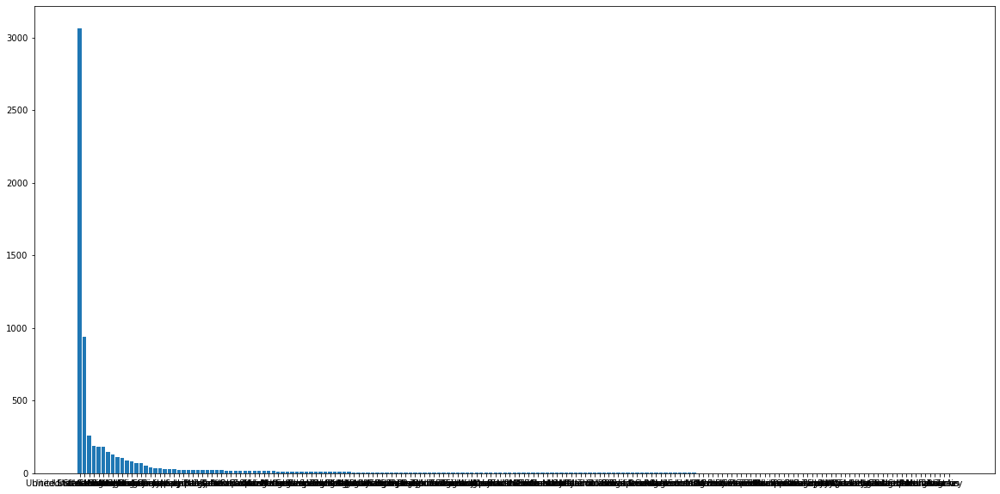
    


```python
# classify top 5 countries and others
```


```python
train_data['isTitleDifferent'] = 1
train_data.loc[ train_data['Original_Title'] == train_data['Title'] ,"isTitleDifferent"] = 0 
sns.catplot(x="isTitleDifferent", y="Revenue", data=train_data)
plt.title('Revenue of movies with single and multiple titles');
```


    
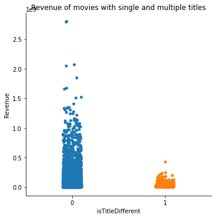
    


```python
train_data['isOriginalLanguageEng'] = 0 
train_data.loc[ train_data['Original_Language'] == "en" ,"isOriginalLanguageEng"] = 1
sns.catplot(x="isOriginalLanguageEng", y="Revenue", data=train_data)
plt.title('Revenue of movies when Original Language is English and Not English');
```


    
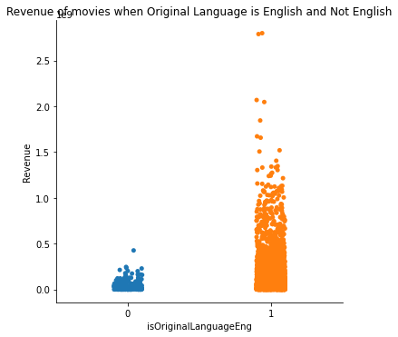
    


```python
plt.figure(figsize=(20,10))
plt.scatter(x = train_data['Budget'], y = train_data['Revenue'], marker = 'x', color = 'black')

# We fit a linear model
model = linear_model.HuberRegressor()
model.fit(X = np.array(train_data['Budget']).reshape(-1,1), y = train_data['Revenue'])
rev_pred = model.predict(np.array(train_data['Budget']).reshape(-1,1))

# We plot the fit 
plt.plot(train_data['Budget'], rev_pred, color = 'orange', label = 'linear')


plt.xlabel('budget')
plt.ylabel('revenue')
plt.title('Buged impact')
plt.legend()
plt.show()
```


    
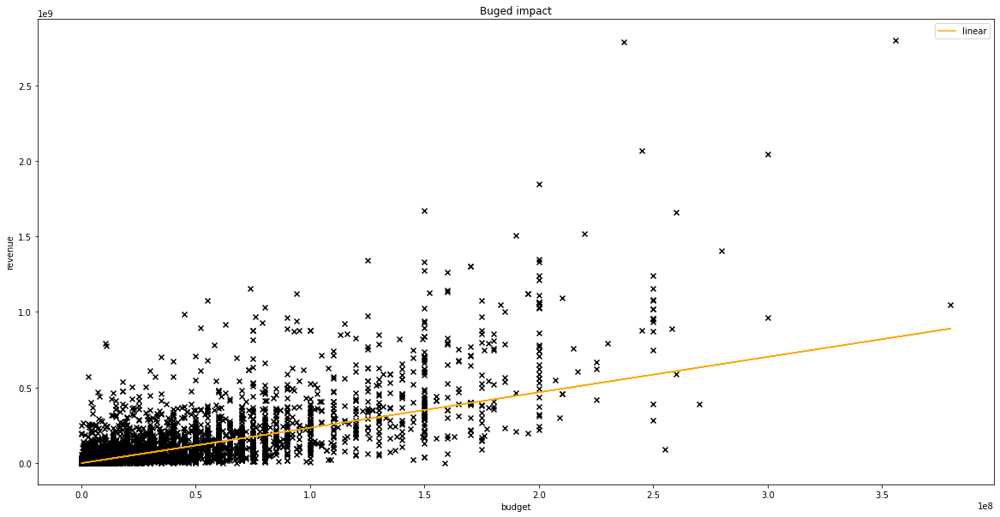
    


```python
plt.figure(figsize=(20,10))
plt.scatter(x = train_data['Popularity'], y = train_data['Revenue'], marker = 'x', color = 'black')

# We fit a linear model
model = linear_model.HuberRegressor()
model.fit(X = np.array(train_data['Popularity']).reshape(-1,1), y = train_data['Revenue'])
rev_pred = model.predict(np.array(train_data['Popularity']).reshape(-1,1))

# We plot the fit 
plt.plot(train_data['Popularity'], rev_pred, color = 'orange', label = 'linear')

plt.xlabel('popularity')
plt.ylabel('revenue')
plt.title('Popularity impact')
plt.legend()
plt.show()
```


    
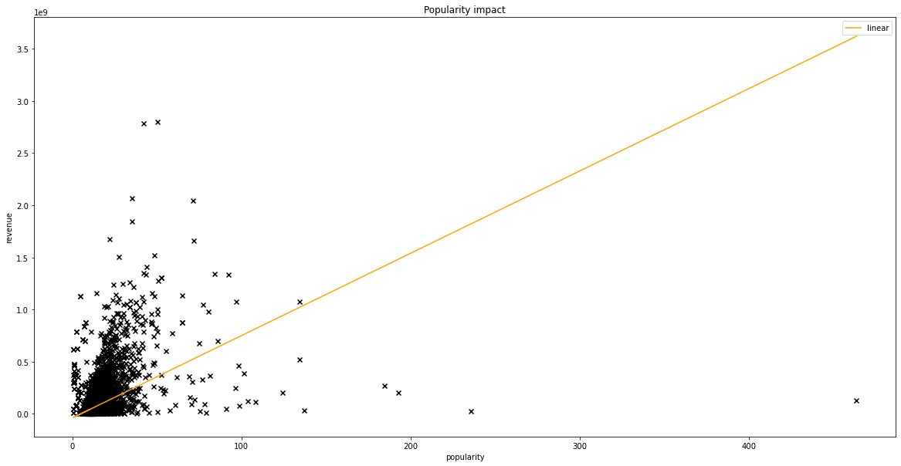
    


```python
genres = pd.Series(list(set(", ".join(train_data['Genres'].unique().tolist()).split('|')))).str.split(",").tolist()#.str[1].str.split("'").str[0].tolist()
unique_genres = set()
for i in genres:
  for j in i:
    unique_genres.add(j.strip())

len(unique_genres)
#.split("|")#.str[1].str.split("|").str[0].tolist()
```


    19


```python
plt.figure(figsize=(16, 8))
plt.subplot(1, 2, 1)
train_data['log_revenue'] = np.log1p(train_data['Revenue'])
sns.boxplot(x='Original_Language', y='Revenue', data=train_data.loc[train_data['Original_Language'].isin(train_data['Original_Language'].value_counts().head(10).index)]);
plt.title('Mean revenue per language');
plt.subplot(1, 2, 2)
sns.boxplot(x='Original_Language', y='log_revenue', data=train_data.loc[train_data['Original_Language'].isin(train_data['Original_Language'].value_counts().head(10).index)]);
plt.title('Mean log revenue per language');
```


    
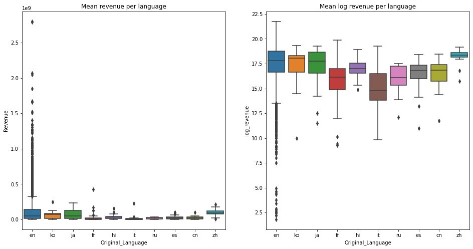
    


```python
# "genres": Clean, EDA and create bools > True if belongs to a specific genre, False if not
genres_df = train_data[['Revenue', 'Genres']]
genres_df['genres_test'] = genres_df['Genres']

genres_df.genres_test[genres_df.genres_test.isnull()] = ''
genres_list = pd.Series(list(set(", ".join(genres_df.genres_test.unique().tolist()).split('|')))).str.split(",").tolist()

for i, genre in enumerate(unique_genres):
    genres_df[genre] = np.nan
    genres_df[genre][genres_df.genres_test.str.contains(genre)] = genres_df['Revenue'][genres_df.genres_test.str.contains(genre)]
genres_df.drop(columns=['Revenue', 'Genres', 'genres_test'], inplace=True)

plt.figure(figsize=(20,12))
sns.boxplot(data=genres_df)
plt.xlabel('Genres')
plt.ylabel('revenue')
plt.title('Box plot of genres')
plt.show()
```

    <ipython-input-23-92974d42268c>:3: SettingWithCopyWarning: 
    A value is trying to be set on a copy of a slice from a DataFrame.
    Try using .loc[row_indexer,col_indexer] = value instead
    
    See the caveats in the documentation: https://pandas.pydata.org/pandas-docs/stable/user_guide/indexing.html#returning-a-view-versus-a-copy
      genres_df['genres_test'] = genres_df['Genres']
    <ipython-input-23-92974d42268c>:5: SettingWithCopyWarning: 
    A value is trying to be set on a copy of a slice from a DataFrame
    
    See the caveats in the documentation: https://pandas.pydata.org/pandas-docs/stable/user_guide/indexing.html#returning-a-view-versus-a-copy
      genres_df.genres_test[genres_df.genres_test.isnull()] = ''
    C:\ProgramData\Anaconda3\lib\site-packages\pandas\core\series.py:992: SettingWithCopyWarning: 
    A value is trying to be set on a copy of a slice from a DataFrame
    
    See the caveats in the documentation: https://pandas.pydata.org/pandas-docs/stable/user_guide/indexing.html#returning-a-view-versus-a-copy
      self._where(~key, value, inplace=True)
    <ipython-input-23-92974d42268c>:9: SettingWithCopyWarning: 
    A value is trying to be set on a copy of a slice from a DataFrame.
    Try using .loc[row_indexer,col_indexer] = value instead
    
    See the caveats in the documentation: https://pandas.pydata.org/pandas-docs/stable/user_guide/indexing.html#returning-a-view-versus-a-copy
      genres_df[genre] = np.nan
    <ipython-input-23-92974d42268c>:10: SettingWithCopyWarning: 
    A value is trying to be set on a copy of a slice from a DataFrame
    
    See the caveats in the documentation: https://pandas.pydata.org/pandas-docs/stable/user_guide/indexing.html#returning-a-view-versus-a-copy
      genres_df[genre][genres_df.genres_test.str.contains(genre)] = genres_df['Revenue'][genres_df.genres_test.str.contains(genre)]
    C:\ProgramData\Anaconda3\lib\site-packages\pandas\core\indexing.py:1637: SettingWithCopyWarning: 
    A value is trying to be set on a copy of a slice from a DataFrame
    
    See the caveats in the documentation: https://pandas.pydata.org/pandas-docs/stable/user_guide/indexing.html#returning-a-view-versus-a-copy
      self._setitem_single_block(indexer, value, name)
    C:\ProgramData\Anaconda3\lib\site-packages\pandas\core\indexing.py:692: SettingWithCopyWarning: 
    A value is trying to be set on a copy of a slice from a DataFrame
    
    See the caveats in the documentation: https://pandas.pydata.org/pandas-docs/stable/user_guide/indexing.html#returning-a-view-versus-a-copy
      iloc._setitem_with_indexer(indexer, value, self.name)
    C:\ProgramData\Anaconda3\lib\site-packages\pandas\core\frame.py:4308: SettingWithCopyWarning: 
    A value is trying to be set on a copy of a slice from a DataFrame
    
    See the caveats in the documentation: https://pandas.pydata.org/pandas-docs/stable/user_guide/indexing.html#returning-a-view-versus-a-copy
      return super().drop(
    


    
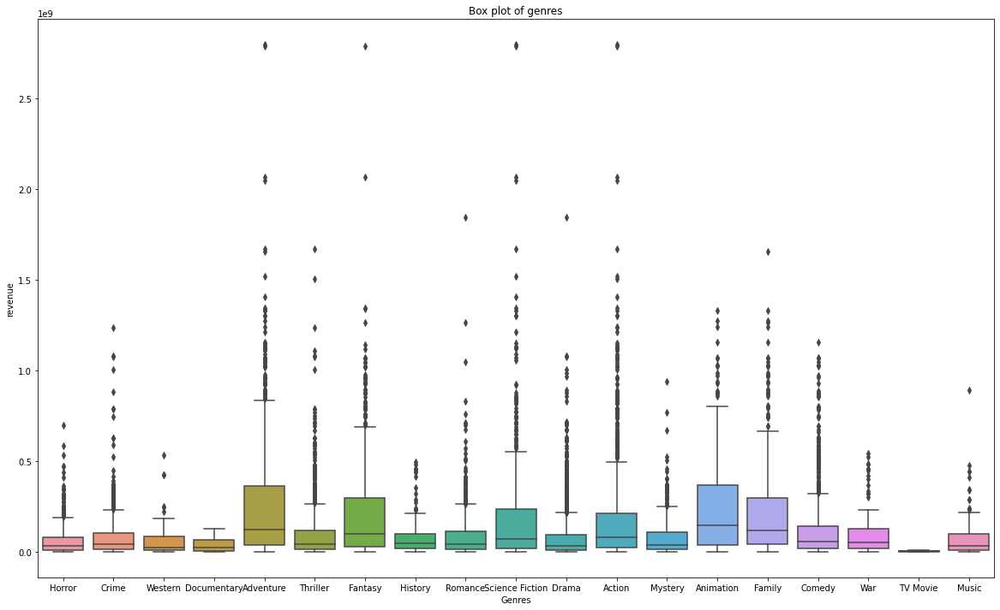
    


```python
plt.figure(figsize=(20, 6))
plt.subplot(1, 3, 1)
plt.hist(train_data['Runtime'].fillna(0) / 60, bins=40);
plt.title('Distribution of length of film in hours');
plt.subplot(1, 3, 2)
plt.scatter(train_data['Runtime'].fillna(0), train_data['Revenue'])
plt.title('runtime vs revenue');
plt.subplot(1, 3, 3)
plt.scatter(train_data['Runtime'].fillna(0), train_data['Popularity'])
plt.title('runtime vs popularity');
```


    
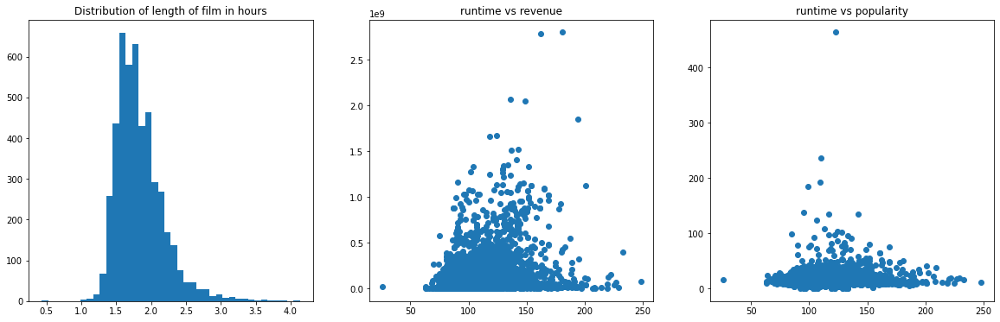
    


```python
plt.figure(figsize=(18,15))
sns.heatmap(train_data.drop(columns=['TMDb_Id', 'log_revenue']).corr(), annot=True)
```


    <AxesSubplot:>


    
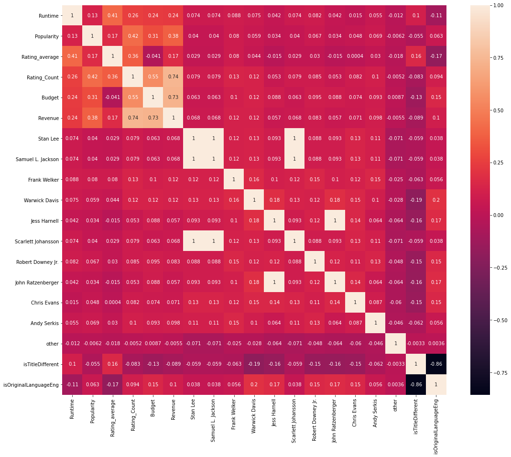
    


# Models


```python
from sklearn.model_selection import train_test_split
from sklearn.metrics import *
```


```python
train_data.columns
```


    Index(['TMDb_Id', 'IMDb_Id', 'Title', 'Original_Title', 'Overview', 'Genres',
           'Cast', 'Crew', 'Collection', 'Release_Date', 'Release_Status',
           'Original_Language', 'Languages_Spoken', 'Runtime', 'Tagline',
           'Popularity', 'Rating_average', 'Rating_Count', 'Production_Companies',
           'Country_of_Origin', 'Budget', 'Revenue', 'Stan Lee',
           'Samuel L. Jackson', 'Frank Welker', 'Warwick Davis', 'Jess Harnell',
           'Scarlett Johansson', 'Robert Downey Jr.', 'John Ratzenberger',
           'Chris Evans', 'Andy Serkis', 'other', 'isTitleDifferent',
           'isOriginalLanguageEng', 'log_revenue'],
          dtype='object')


```python
drop_columns = ['TMDb_Id', 'IMDb_Id', 'Original_Title', 'Overview', 'Country_of_Origin', 'Languages_Spoken', 'Production_Companies', 'Tagline', 'Title', 'Cast', 'Crew', 'Release_Date', 'Genres' ,'Collection']
train_data = train_data.dropna()
x=pd.get_dummies(train_data.drop(columns=drop_columns, axis=1))
```


```python
for i in unique_genres:
  x[i] = 0

for i in countries:
  x[i.strip()] = 0

for i in range(len(x)):
  for j in train_data['Genres'].iloc[i].split('|'):
      x[j.strip()].iloc[i]=1
    
  for j in train_data['Country_of_Origin'].iloc[i].split('|'):
      x[j.strip()].iloc[i]= 1
  
```

    C:\ProgramData\Anaconda3\lib\site-packages\pandas\core\indexing.py:1637: SettingWithCopyWarning: 
    A value is trying to be set on a copy of a slice from a DataFrame
    
    See the caveats in the documentation: https://pandas.pydata.org/pandas-docs/stable/user_guide/indexing.html#returning-a-view-versus-a-copy
      self._setitem_single_block(indexer, value, name)
    


```python
x.head()
```


<div>
<style scoped>
    .dataframe tbody tr th:only-of-type {
        vertical-align: middle;
    }

    .dataframe tbody tr th {
        vertical-align: top;
    }

    .dataframe thead th {
        text-align: right;
    }
</style>
<table border="1" class="dataframe">
  <thead>
    <tr style="text-align: right;">
      <th></th>
      <th>Runtime</th>
      <th>Popularity</th>
      <th>Rating_average</th>
      <th>Rating_Count</th>
      <th>Budget</th>
      <th>Revenue</th>
      <th>Stan Lee</th>
      <th>Samuel L. Jackson</th>
      <th>Frank Welker</th>
      <th>Warwick Davis</th>
      <th>...</th>
      <th>Uganda</th>
      <th>Ghana</th>
      <th>Croatia</th>
      <th>Ukraine</th>
      <th>Portugal</th>
      <th>Monaco</th>
      <th>Namibia</th>
      <th>Liechtenstein</th>
      <th>Angola</th>
      <th>Belarus</th>
    </tr>
  </thead>
  <tbody>
    <tr>
      <th>0</th>
      <td>123.0</td>
      <td>463.487</td>
      <td>5.9</td>
      <td>2863</td>
      <td>87500000.0</td>
      <td>127175922.0</td>
      <td>1</td>
      <td>1</td>
      <td>1</td>
      <td>1</td>
      <td>...</td>
      <td>0</td>
      <td>0</td>
      <td>0</td>
      <td>0</td>
      <td>0</td>
      <td>0</td>
      <td>0</td>
      <td>0</td>
      <td>0</td>
      <td>0</td>
    </tr>
    <tr>
      <th>1</th>
      <td>110.0</td>
      <td>235.701</td>
      <td>7.2</td>
      <td>1384</td>
      <td>42000000.0</td>
      <td>24573617.0</td>
      <td>1</td>
      <td>1</td>
      <td>0</td>
      <td>0</td>
      <td>...</td>
      <td>0</td>
      <td>0</td>
      <td>0</td>
      <td>0</td>
      <td>0</td>
      <td>0</td>
      <td>0</td>
      <td>0</td>
      <td>0</td>
      <td>0</td>
    </tr>
    <tr>
      <th>3</th>
      <td>117.0</td>
      <td>134.294</td>
      <td>7.1</td>
      <td>13625</td>
      <td>130000000.0</td>
      <td>519311965.0</td>
      <td>1</td>
      <td>1</td>
      <td>1</td>
      <td>1</td>
      <td>...</td>
      <td>0</td>
      <td>0</td>
      <td>0</td>
      <td>0</td>
      <td>0</td>
      <td>0</td>
      <td>0</td>
      <td>0</td>
      <td>0</td>
      <td>0</td>
    </tr>
    <tr>
      <th>4</th>
      <td>106.0</td>
      <td>124.417</td>
      <td>5.9</td>
      <td>3547</td>
      <td>90000000.0</td>
      <td>199850315.0</td>
      <td>1</td>
      <td>1</td>
      <td>1</td>
      <td>1</td>
      <td>...</td>
      <td>0</td>
      <td>0</td>
      <td>0</td>
      <td>0</td>
      <td>0</td>
      <td>0</td>
      <td>0</td>
      <td>0</td>
      <td>0</td>
      <td>0</td>
    </tr>
    <tr>
      <th>5</th>
      <td>109.0</td>
      <td>192.582</td>
      <td>7.1</td>
      <td>2681</td>
      <td>75000000.0</td>
      <td>199158461.0</td>
      <td>1</td>
      <td>1</td>
      <td>1</td>
      <td>1</td>
      <td>...</td>
      <td>0</td>
      <td>0</td>
      <td>0</td>
      <td>0</td>
      <td>0</td>
      <td>0</td>
      <td>0</td>
      <td>0</td>
      <td>0</td>
      <td>0</td>
    </tr>
  </tbody>
</table>
<p>5 rows × 148 columns</p>
</div>


```python
x=x.dropna()
x=x[x['Revenue']>=100000]
x=x[x['Budget']>=100000]
```


```python
x
```


<div>
<style scoped>
    .dataframe tbody tr th:only-of-type {
        vertical-align: middle;
    }

    .dataframe tbody tr th {
        vertical-align: top;
    }

    .dataframe thead th {
        text-align: right;
    }
</style>
<table border="1" class="dataframe">
  <thead>
    <tr style="text-align: right;">
      <th></th>
      <th>Runtime</th>
      <th>Popularity</th>
      <th>Rating_average</th>
      <th>Rating_Count</th>
      <th>Budget</th>
      <th>Revenue</th>
      <th>Stan Lee</th>
      <th>Samuel L. Jackson</th>
      <th>Frank Welker</th>
      <th>Warwick Davis</th>
      <th>...</th>
      <th>Uganda</th>
      <th>Ghana</th>
      <th>Croatia</th>
      <th>Ukraine</th>
      <th>Portugal</th>
      <th>Monaco</th>
      <th>Namibia</th>
      <th>Liechtenstein</th>
      <th>Angola</th>
      <th>Belarus</th>
    </tr>
  </thead>
  <tbody>
    <tr>
      <th>0</th>
      <td>123.0</td>
      <td>463.487</td>
      <td>5.9</td>
      <td>2863</td>
      <td>87500000.0</td>
      <td>127175922.0</td>
      <td>1</td>
      <td>1</td>
      <td>1</td>
      <td>1</td>
      <td>...</td>
      <td>0</td>
      <td>0</td>
      <td>0</td>
      <td>0</td>
      <td>0</td>
      <td>0</td>
      <td>0</td>
      <td>0</td>
      <td>0</td>
      <td>0</td>
    </tr>
    <tr>
      <th>1</th>
      <td>110.0</td>
      <td>235.701</td>
      <td>7.2</td>
      <td>1384</td>
      <td>42000000.0</td>
      <td>24573617.0</td>
      <td>1</td>
      <td>1</td>
      <td>0</td>
      <td>0</td>
      <td>...</td>
      <td>0</td>
      <td>0</td>
      <td>0</td>
      <td>0</td>
      <td>0</td>
      <td>0</td>
      <td>0</td>
      <td>0</td>
      <td>0</td>
      <td>0</td>
    </tr>
    <tr>
      <th>3</th>
      <td>117.0</td>
      <td>134.294</td>
      <td>7.1</td>
      <td>13625</td>
      <td>130000000.0</td>
      <td>519311965.0</td>
      <td>1</td>
      <td>1</td>
      <td>1</td>
      <td>1</td>
      <td>...</td>
      <td>0</td>
      <td>0</td>
      <td>0</td>
      <td>0</td>
      <td>0</td>
      <td>0</td>
      <td>0</td>
      <td>0</td>
      <td>0</td>
      <td>0</td>
    </tr>
    <tr>
      <th>4</th>
      <td>106.0</td>
      <td>124.417</td>
      <td>5.9</td>
      <td>3547</td>
      <td>90000000.0</td>
      <td>199850315.0</td>
      <td>1</td>
      <td>1</td>
      <td>1</td>
      <td>1</td>
      <td>...</td>
      <td>0</td>
      <td>0</td>
      <td>0</td>
      <td>0</td>
      <td>0</td>
      <td>0</td>
      <td>0</td>
      <td>0</td>
      <td>0</td>
      <td>0</td>
    </tr>
    <tr>
      <th>5</th>
      <td>109.0</td>
      <td>192.582</td>
      <td>7.1</td>
      <td>2681</td>
      <td>75000000.0</td>
      <td>199158461.0</td>
      <td>1</td>
      <td>1</td>
      <td>1</td>
      <td>1</td>
      <td>...</td>
      <td>0</td>
      <td>0</td>
      <td>0</td>
      <td>0</td>
      <td>0</td>
      <td>0</td>
      <td>0</td>
      <td>0</td>
      <td>0</td>
      <td>0</td>
    </tr>
    <tr>
      <th>...</th>
      <td>...</td>
      <td>...</td>
      <td>...</td>
      <td>...</td>
      <td>...</td>
      <td>...</td>
      <td>...</td>
      <td>...</td>
      <td>...</td>
      <td>...</td>
      <td>...</td>
      <td>...</td>
      <td>...</td>
      <td>...</td>
      <td>...</td>
      <td>...</td>
      <td>...</td>
      <td>...</td>
      <td>...</td>
      <td>...</td>
      <td>...</td>
    </tr>
    <tr>
      <th>9914</th>
      <td>102.0</td>
      <td>9.467</td>
      <td>6.7</td>
      <td>124</td>
      <td>23000000.0</td>
      <td>10827816.0</td>
      <td>1</td>
      <td>1</td>
      <td>1</td>
      <td>0</td>
      <td>...</td>
      <td>0</td>
      <td>0</td>
      <td>0</td>
      <td>0</td>
      <td>0</td>
      <td>0</td>
      <td>0</td>
      <td>0</td>
      <td>0</td>
      <td>0</td>
    </tr>
    <tr>
      <th>9920</th>
      <td>126.0</td>
      <td>7.617</td>
      <td>6.9</td>
      <td>327</td>
      <td>20000000.0</td>
      <td>27793200.0</td>
      <td>1</td>
      <td>1</td>
      <td>1</td>
      <td>0</td>
      <td>...</td>
      <td>0</td>
      <td>0</td>
      <td>0</td>
      <td>0</td>
      <td>0</td>
      <td>0</td>
      <td>0</td>
      <td>0</td>
      <td>0</td>
      <td>0</td>
    </tr>
    <tr>
      <th>9925</th>
      <td>100.0</td>
      <td>8.215</td>
      <td>5.5</td>
      <td>103</td>
      <td>12000000.0</td>
      <td>4884663.0</td>
      <td>1</td>
      <td>1</td>
      <td>1</td>
      <td>1</td>
      <td>...</td>
      <td>0</td>
      <td>0</td>
      <td>0</td>
      <td>0</td>
      <td>0</td>
      <td>0</td>
      <td>0</td>
      <td>0</td>
      <td>0</td>
      <td>0</td>
    </tr>
    <tr>
      <th>9927</th>
      <td>95.0</td>
      <td>7.716</td>
      <td>6.8</td>
      <td>1063</td>
      <td>400000.0</td>
      <td>46118097.0</td>
      <td>1</td>
      <td>1</td>
      <td>0</td>
      <td>0</td>
      <td>...</td>
      <td>0</td>
      <td>0</td>
      <td>0</td>
      <td>0</td>
      <td>0</td>
      <td>0</td>
      <td>0</td>
      <td>0</td>
      <td>0</td>
      <td>0</td>
    </tr>
    <tr>
      <th>9928</th>
      <td>112.0</td>
      <td>9.968</td>
      <td>6.0</td>
      <td>133</td>
      <td>6600000.0</td>
      <td>37710610.0</td>
      <td>1</td>
      <td>1</td>
      <td>0</td>
      <td>0</td>
      <td>...</td>
      <td>0</td>
      <td>0</td>
      <td>0</td>
      <td>0</td>
      <td>0</td>
      <td>0</td>
      <td>0</td>
      <td>0</td>
      <td>0</td>
      <td>0</td>
    </tr>
  </tbody>
</table>
<p>4624 rows × 148 columns</p>
</div>


```python
X_train, X_test, y_train, y_test = train_test_split(x.drop('Revenue', axis=1), x['Revenue'], test_size=0.33, random_state=0)
```


```python
X_train.shape, X_test.shape
```


    ((3098, 147), (1526, 147))


```python
from sklearn.linear_model import LinearRegression
lr = LinearRegression()
```


```python
lr.fit(X_train, y_train)
lr.score(X_test, y_test), lr.score(X_train, y_train)
```


    (0.7173078797428235, 0.7447041854636236)


```python
y_pred = lr.predict(X_test)
plt.figure(figsize=(10,10))
plt.scatter(y_test, y_pred, c='crimson')
p1 = max(max(y_pred), max(y_test))
p2 = min(min(y_pred), min(y_test))
plt.plot([p1, p2], [p1, p2], 'b-')
plt.xlabel('True Values', fontsize=15)
plt.ylabel('Predictions', fontsize=15)
plt.axis('equal')
plt.title('Linear Regression')
plt.show()
```


    
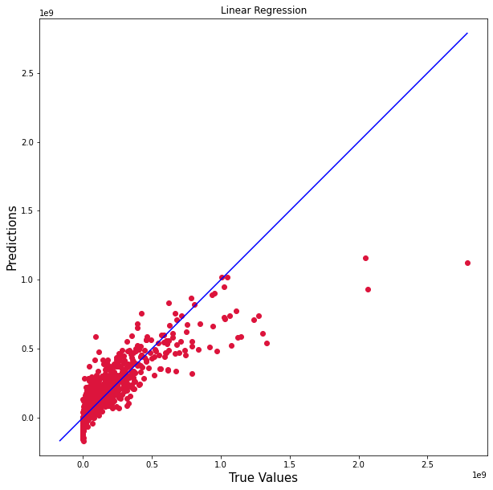
    


```python
plt.plot(abs(y_test - y_pred), c='crimson', marker='o',  linestyle='')
```


    [<matplotlib.lines.Line2D at 0x1d3234e0040>]


    
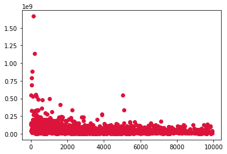
    


```python
print('Linear Regression RMSE, MAE')
mean_squared_error(y_pred, y_test, squared=False), mean_absolute_error(y_pred, y_test)
```

    Linear Regression RMSE, MAE
    


    (106268722.42322591, 60120427.01779315)


```python
from sklearn.tree import DecisionTreeRegressor
regressor = DecisionTreeRegressor(random_state = 0, max_depth=3)  
regressor.fit(X_train, y_train)
```


    DecisionTreeRegressor(max_depth=3, random_state=0)


```python
regressor.score(X_test, y_test), regressor.score(X_train, y_train)
```


    (0.9556930944520043, 0.962980012016669)


```python
y_pred = regressor.predict(X_test)
plt.figure(figsize=(10,10))
plt.scatter(y_test, y_pred, c='blue')
p1 = max(max(y_pred), max(y_test))
p2 = min(min(y_pred), min(y_test))
plt.plot([p1, p2], [p1, p2], 'b-')
plt.xlabel('True Values', fontsize=15)
plt.ylabel('Predictions', fontsize=15)
plt.axis('equal')
plt.title('Decision Tree Regression')
plt.show()

```


    
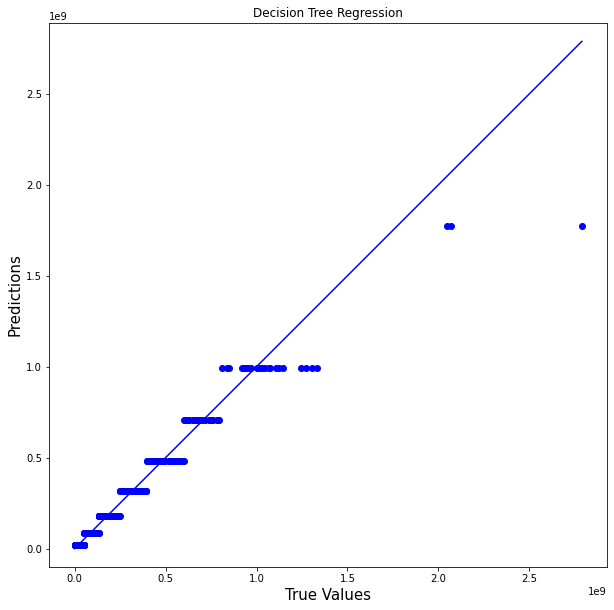
    


```python
plt.plot(abs(y_test - y_pred), c='blue', marker='o',  linestyle='')
```


    [<matplotlib.lines.Line2D at 0x1d32314a730>]


    
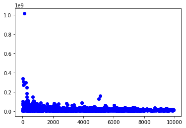
    


```python
print('Decision tree Regressor RMSE, MAE')
mean_squared_error(y_pred, y_test, squared=False), mean_absolute_error(y_pred, y_test)
```

    Decision tree Regressor RMSE, MAE
    


    (42071143.617812976, 22058687.981937233)


```python
from sklearn.ensemble import RandomForestRegressor
rforest = RandomForestRegressor(max_depth=5, random_state=0, criterion='mse')
rforest.fit(X_train, y_train)
rforest.score(X_test, y_test), rforest.score(X_train, y_train)
```


    (0.9811497404481334, 0.9979577650283642)


```python
y_pred = rforest.predict(X_test)
plt.figure(figsize=(10,10))
plt.scatter(y_test, y_pred, c='g')

p1 = max(max(y_pred), max(y_test))
p2 = min(min(y_pred), min(y_test))
plt.plot([p1, p2], [p1, p2], 'b-')
plt.xlabel('True Values', fontsize=15)
plt.ylabel('Predictions', fontsize=15)
plt.title('Random Forest Regression')
plt.axis('equal')
plt.show()
```


    
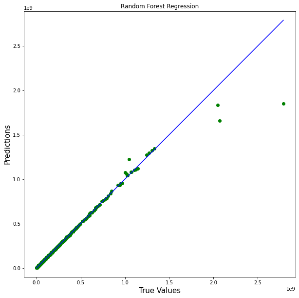
    


```python
plt.plot(abs(y_test - y_pred), c='g', marker='o',  linestyle='')
```


    [<matplotlib.lines.Line2D at 0x1d323520310>]


    
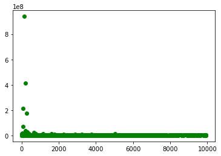
    


```python
print('random Forest RMSE, MAE')
mean_squared_error(y_pred, y_test, squared=False), mean_absolute_error(y_pred, y_test)
```

    random Forest RMSE, MAE
    


    (27441463.865783583, 3361622.62497971)


```python
from sklearn.model_selection import learning_curve
from sklearn.model_selection import ShuffleSplit


def plot_learning_curve(estimator, title, X, y, ylim=None, cv=None,
                        n_jobs=None, train_sizes=np.linspace(.1, 1.0, 5)):
    plt.figure()
    plt.title(title)
    if ylim is not None:
        plt.ylim(*ylim)
    plt.xlabel("Training examples")
    plt.ylabel("Score")
    train_sizes, train_scores, test_scores = learning_curve(
        estimator, X, y, cv=cv, n_jobs=n_jobs, train_sizes=train_sizes)
    train_scores_mean = np.mean(train_scores, axis=1)
    train_scores_std = np.std(train_scores, axis=1)
    test_scores_mean = np.mean(test_scores, axis=1)
    test_scores_std = np.std(test_scores, axis=1)
    plt.grid()

    plt.fill_between(train_sizes, train_scores_mean - train_scores_std,
                     train_scores_mean + train_scores_std, alpha=0.1,
                     color="r")
    plt.fill_between(train_sizes, test_scores_mean - test_scores_std,
                     test_scores_mean + test_scores_std, alpha=0.1, color="g")
    plt.plot(train_sizes, train_scores_mean, 'o-', color="r",
             label="Training score")
    plt.plot(train_sizes, test_scores_mean, 'o-', color="g",
             label="Cross-validation score")

    plt.legend(loc="best")
    return plt

plot_learning_curve(lr, 'Linear Regression', x.drop('Revenue', axis=1), x['Revenue'])
```


    <module 'matplotlib.pyplot' from 'C:\\ProgramData\\Anaconda3\\lib\\site-packages\\matplotlib\\pyplot.py'>


    
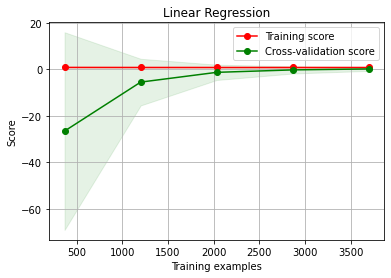
    


```python
plot_learning_curve(regressor, 'Decision Tree Regression', x.drop('Revenue', axis=1), x['Revenue'])
```


    <module 'matplotlib.pyplot' from 'C:\\ProgramData\\Anaconda3\\lib\\site-packages\\matplotlib\\pyplot.py'>


    
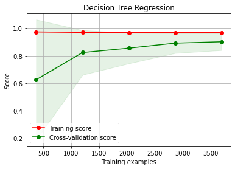
    


```python
plot_learning_curve(rforest, 'Random Forest Regression', x.drop('Revenue', axis=1), x['Revenue'])
```


    <module 'matplotlib.pyplot' from 'C:\\ProgramData\\Anaconda3\\lib\\site-packages\\matplotlib\\pyplot.py'>


    
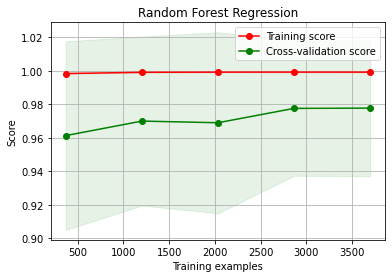
    


```python
X_train.shape
```


    (3098, 147)


# MLP Regressor


```python
(147+1)/2
```


    74.0


```python
model = keras.Sequential([
    keras.layers.Dense(units=147, input_shape=(X_train.shape[1],), activation='linear'),
    keras.layers.Dense(units=74, input_shape=(X_train.shape[1],), activation='linear'),
    keras.layers.Dense(units=1, activation='linear')
])
```


```python
model.compile(optimizer='adam', 
              loss=tf.losses.MeanSquaredError(),
              metrics=[tf.keras.metrics.RootMeanSquaredError(name='rmse'), 'mean_squared_error', 'mean_absolute_error'])

history = model.fit(
    X_train.astype('float32'), y_train,
    epochs=1000,
    verbose=1
)
```

    Epoch 1/1000
    97/97 [==============================] - 1s 3ms/step - loss: 22797808813735936.0000 - rmse: 150989440.0000 - mean_squared_error: 22797808813735936.0000 - mean_absolute_error: 81112376.0000
    Epoch 2/1000
    97/97 [==============================] - 0s 3ms/step - loss: 18626285320273920.0000 - rmse: 136478144.0000 - mean_squared_error: 18626285320273920.0000 - mean_absolute_error: 78452160.0000
    Epoch 3/1000
    97/97 [==============================] - 0s 3ms/step - loss: 18591837535076352.0000 - rmse: 136351888.0000 - mean_squared_error: 18591837535076352.0000 - mean_absolute_error: 77482552.0000
    Epoch 4/1000
    97/97 [==============================] - 0s 2ms/step - loss: 18681084808003584.0000 - rmse: 136678768.0000 - mean_squared_error: 18681084808003584.0000 - mean_absolute_error: 78769624.0000
    Epoch 5/1000
    97/97 [==============================] - 0s 2ms/step - loss: 18936306797117440.0000 - rmse: 137609248.0000 - mean_squared_error: 18936306797117440.0000 - mean_absolute_error: 77087480.0000
    Epoch 6/1000
    97/97 [==============================] - 0s 2ms/step - loss: 18904985748111360.0000 - rmse: 137495392.0000 - mean_squared_error: 18904985748111360.0000 - mean_absolute_error: 78802208.0000
    Epoch 7/1000
    97/97 [==============================] - 0s 2ms/step - loss: 18821513058713600.0000 - rmse: 137191520.0000 - mean_squared_error: 18821513058713600.0000 - mean_absolute_error: 77228520.0000
    Epoch 8/1000
    97/97 [==============================] - 0s 2ms/step - loss: 18786255672180736.0000 - rmse: 137062960.0000 - mean_squared_error: 18786255672180736.0000 - mean_absolute_error: 79004528.0000
    Epoch 9/1000
    97/97 [==============================] - 0s 2ms/step - loss: 18687733417377792.0000 - rmse: 136703072.0000 - mean_squared_error: 18687733417377792.0000 - mean_absolute_error: 78379240.0000
    Epoch 10/1000
    97/97 [==============================] - 0s 2ms/step - loss: 18787859842465792.0000 - rmse: 137068816.0000 - mean_squared_error: 18787859842465792.0000 - mean_absolute_error: 77770472.0000
    Epoch 11/1000
    97/97 [==============================] - 0s 2ms/step - loss: 18731752537194496.0000 - rmse: 136863984.0000 - mean_squared_error: 18731752537194496.0000 - mean_absolute_error: 77756336.0000
    Epoch 12/1000
    97/97 [==============================] - 0s 2ms/step - loss: 18682600931459072.0000 - rmse: 136684304.0000 - mean_squared_error: 18682600931459072.0000 - mean_absolute_error: 78252984.0000
    Epoch 13/1000
    97/97 [==============================] - 0s 2ms/step - loss: 18702999878631424.0000 - rmse: 136758912.0000 - mean_squared_error: 18702999878631424.0000 - mean_absolute_error: 77651376.0000
    Epoch 14/1000
    97/97 [==============================] - 0s 2ms/step - loss: 18561098454138880.0000 - rmse: 136239120.0000 - mean_squared_error: 18561098454138880.0000 - mean_absolute_error: 77479256.0000
    Epoch 15/1000
    97/97 [==============================] - 0s 2ms/step - loss: 18689923850698752.0000 - rmse: 136711088.0000 - mean_squared_error: 18689923850698752.0000 - mean_absolute_error: 78857416.0000
    Epoch 16/1000
    97/97 [==============================] - 0s 2ms/step - loss: 18703294083891200.0000 - rmse: 136759984.0000 - mean_squared_error: 18703294083891200.0000 - mean_absolute_error: 77921656.0000
    Epoch 17/1000
    97/97 [==============================] - 0s 2ms/step - loss: 18761069983956992.0000 - rmse: 136971056.0000 - mean_squared_error: 18761069983956992.0000 - mean_absolute_error: 77885784.0000
    Epoch 18/1000
    97/97 [==============================] - 0s 2ms/step - loss: 18606431833948160.0000 - rmse: 136405392.0000 - mean_squared_error: 18606431833948160.0000 - mean_absolute_error: 77789864.0000
    Epoch 19/1000
    97/97 [==============================] - 0s 2ms/step - loss: 18742749800955904.0000 - rmse: 136904160.0000 - mean_squared_error: 18742749800955904.0000 - mean_absolute_error: 78525624.0000
    Epoch 20/1000
    97/97 [==============================] - 0s 2ms/step - loss: 18744338938855424.0000 - rmse: 136909968.0000 - mean_squared_error: 18744338938855424.0000 - mean_absolute_error: 78000080.0000
    Epoch 21/1000
    97/97 [==============================] - 0s 2ms/step - loss: 18651178950721536.0000 - rmse: 136569312.0000 - mean_squared_error: 18651178950721536.0000 - mean_absolute_error: 78255472.0000
    Epoch 22/1000
    97/97 [==============================] - 0s 2ms/step - loss: 18506273196605440.0000 - rmse: 136037760.0000 - mean_squared_error: 18506273196605440.0000 - mean_absolute_error: 78268376.0000
    Epoch 23/1000
    97/97 [==============================] - 0s 2ms/step - loss: 18755145076572160.0000 - rmse: 136949424.0000 - mean_squared_error: 18755145076572160.0000 - mean_absolute_error: 77426208.0000
    Epoch 24/1000
    97/97 [==============================] - 0s 2ms/step - loss: 18718004346880000.0000 - rmse: 136813760.0000 - mean_squared_error: 18718004346880000.0000 - mean_absolute_error: 77976832.0000
    Epoch 25/1000
    97/97 [==============================] - 0s 2ms/step - loss: 18873744156000256.0000 - rmse: 137381744.0000 - mean_squared_error: 18873744156000256.0000 - mean_absolute_error: 78173768.0000
    Epoch 26/1000
    97/97 [==============================] - 0s 2ms/step - loss: 18750676163100672.0000 - rmse: 136933104.0000 - mean_squared_error: 18750676163100672.0000 - mean_absolute_error: 78332816.0000
    Epoch 27/1000
    97/97 [==============================] - 0s 2ms/step - loss: 18808729088557056.0000 - rmse: 137144912.0000 - mean_squared_error: 18808729088557056.0000 - mean_absolute_error: 77535496.0000
    Epoch 28/1000
    97/97 [==============================] - 0s 2ms/step - loss: 19019373612105728.0000 - rmse: 137910736.0000 - mean_squared_error: 19019373612105728.0000 - mean_absolute_error: 77978656.0000
    Epoch 29/1000
    97/97 [==============================] - 0s 2ms/step - loss: 18655338626547712.0000 - rmse: 136584544.0000 - mean_squared_error: 18655338626547712.0000 - mean_absolute_error: 77943592.0000
    Epoch 30/1000
    97/97 [==============================] - 0s 2ms/step - loss: 18523066518732800.0000 - rmse: 136099472.0000 - mean_squared_error: 18523066518732800.0000 - mean_absolute_error: 77505424.0000
    Epoch 31/1000
    97/97 [==============================] - 0s 2ms/step - loss: 18549998111162368.0000 - rmse: 136198384.0000 - mean_squared_error: 18549998111162368.0000 - mean_absolute_error: 77427344.0000
    Epoch 32/1000
    97/97 [==============================] - 0s 2ms/step - loss: 19029703008452608.0000 - rmse: 137948192.0000 - mean_squared_error: 19029703008452608.0000 - mean_absolute_error: 79253288.0000
    Epoch 33/1000
    97/97 [==============================] - 0s 2ms/step - loss: 18713765214158848.0000 - rmse: 136798256.0000 - mean_squared_error: 18713765214158848.0000 - mean_absolute_error: 78385576.0000
    Epoch 34/1000
    97/97 [==============================] - 0s 2ms/step - loss: 18794401077657600.0000 - rmse: 137092672.0000 - mean_squared_error: 18794401077657600.0000 - mean_absolute_error: 77244152.0000
    Epoch 35/1000
    97/97 [==============================] - 0s 2ms/step - loss: 18632766425923584.0000 - rmse: 136501888.0000 - mean_squared_error: 18632766425923584.0000 - mean_absolute_error: 78195928.0000
    Epoch 36/1000
    97/97 [==============================] - 0s 2ms/step - loss: 18913062434111488.0000 - rmse: 137524768.0000 - mean_squared_error: 18913062434111488.0000 - mean_absolute_error: 77838600.0000
    Epoch 37/1000
    97/97 [==============================] - 0s 2ms/step - loss: 18649935557689344.0000 - rmse: 136564768.0000 - mean_squared_error: 18649935557689344.0000 - mean_absolute_error: 77945696.0000
    Epoch 38/1000
    97/97 [==============================] - 0s 2ms/step - loss: 18518797321240576.0000 - rmse: 136083792.0000 - mean_squared_error: 18518797321240576.0000 - mean_absolute_error: 77726072.0000
    Epoch 39/1000
    97/97 [==============================] - 0s 2ms/step - loss: 18726884191764480.0000 - rmse: 136846208.0000 - mean_squared_error: 18726884191764480.0000 - mean_absolute_error: 77567904.0000
    Epoch 40/1000
    97/97 [==============================] - 0s 2ms/step - loss: 18816797184622592.0000 - rmse: 137174336.0000 - mean_squared_error: 18816797184622592.0000 - mean_absolute_error: 78634792.0000
    Epoch 41/1000
    97/97 [==============================] - 0s 2ms/step - loss: 18571569584406528.0000 - rmse: 136277552.0000 - mean_squared_error: 18571569584406528.0000 - mean_absolute_error: 77665648.0000
    Epoch 42/1000
    97/97 [==============================] - 0s 2ms/step - loss: 18534396642459648.0000 - rmse: 136141088.0000 - mean_squared_error: 18534396642459648.0000 - mean_absolute_error: 77555136.0000
    Epoch 43/1000
    97/97 [==============================] - 0s 2ms/step - loss: 18507458607579136.0000 - rmse: 136042128.0000 - mean_squared_error: 18507458607579136.0000 - mean_absolute_error: 78635720.0000
    Epoch 44/1000
    97/97 [==============================] - 0s 2ms/step - loss: 18695859495501824.0000 - rmse: 136732800.0000 - mean_squared_error: 18695859495501824.0000 - mean_absolute_error: 77343776.0000
    Epoch 45/1000
    97/97 [==============================] - 0s 2ms/step - loss: 18599254943596544.0000 - rmse: 136379088.0000 - mean_squared_error: 18599254943596544.0000 - mean_absolute_error: 77772592.0000
    Epoch 46/1000
    97/97 [==============================] - 0s 2ms/step - loss: 18495097691701248.0000 - rmse: 135996688.0000 - mean_squared_error: 18495097691701248.0000 - mean_absolute_error: 77048728.0000
    Epoch 47/1000
    97/97 [==============================] - 0s 2ms/step - loss: 18744139222876160.0000 - rmse: 136909232.0000 - mean_squared_error: 18744139222876160.0000 - mean_absolute_error: 79442528.0000
    Epoch 48/1000
    97/97 [==============================] - 0s 2ms/step - loss: 18692071334346752.0000 - rmse: 136718944.0000 - mean_squared_error: 18692071334346752.0000 - mean_absolute_error: 76939456.0000
    Epoch 49/1000
    97/97 [==============================] - 0s 2ms/step - loss: 18722097450713088.0000 - rmse: 136828704.0000 - mean_squared_error: 18722097450713088.0000 - mean_absolute_error: 78398664.0000
    Epoch 50/1000
    97/97 [==============================] - 0s 2ms/step - loss: 18647272677965824.0000 - rmse: 136555008.0000 - mean_squared_error: 18647272677965824.0000 - mean_absolute_error: 77584560.0000
    Epoch 51/1000
    97/97 [==============================] - 0s 2ms/step - loss: 18635257506955264.0000 - rmse: 136511008.0000 - mean_squared_error: 18635257506955264.0000 - mean_absolute_error: 78316840.0000
    Epoch 52/1000
    97/97 [==============================] - 0s 2ms/step - loss: 18764746475962368.0000 - rmse: 136984480.0000 - mean_squared_error: 18764746475962368.0000 - mean_absolute_error: 77493072.0000
    Epoch 53/1000
    97/97 [==============================] - 0s 2ms/step - loss: 18590390131097600.0000 - rmse: 136346576.0000 - mean_squared_error: 18590390131097600.0000 - mean_absolute_error: 78242672.0000
    Epoch 54/1000
    97/97 [==============================] - 0s 2ms/step - loss: 18808157857906688.0000 - rmse: 137142832.0000 - mean_squared_error: 18808157857906688.0000 - mean_absolute_error: 77126192.0000
    Epoch 55/1000
    97/97 [==============================] - 0s 2ms/step - loss: 18645219683598336.0000 - rmse: 136547488.0000 - mean_squared_error: 18645219683598336.0000 - mean_absolute_error: 77793184.0000
    Epoch 56/1000
    97/97 [==============================] - 0s 2ms/step - loss: 18603751774355456.0000 - rmse: 136395568.0000 - mean_squared_error: 18603751774355456.0000 - mean_absolute_error: 77827176.0000
    Epoch 57/1000
    97/97 [==============================] - 0s 2ms/step - loss: 18745805670187008.0000 - rmse: 136915328.0000 - mean_squared_error: 18745805670187008.0000 - mean_absolute_error: 78757328.0000
    Epoch 58/1000
    97/97 [==============================] - 0s 2ms/step - loss: 18573959733706752.0000 - rmse: 136286320.0000 - mean_squared_error: 18573959733706752.0000 - mean_absolute_error: 77699240.0000
    Epoch 59/1000
    97/97 [==============================] - 0s 2ms/step - loss: 18525209707413504.0000 - rmse: 136107344.0000 - mean_squared_error: 18525209707413504.0000 - mean_absolute_error: 77104648.0000
    Epoch 60/1000
    97/97 [==============================] - 0s 2ms/step - loss: 18680537199673344.0000 - rmse: 136676752.0000 - mean_squared_error: 18680537199673344.0000 - mean_absolute_error: 78417752.0000
    Epoch 61/1000
    97/97 [==============================] - 0s 2ms/step - loss: 18693334054731776.0000 - rmse: 136723568.0000 - mean_squared_error: 18693334054731776.0000 - mean_absolute_error: 77798624.0000
    Epoch 62/1000
    97/97 [==============================] - 0s 2ms/step - loss: 18616353208401920.0000 - rmse: 136441760.0000 - mean_squared_error: 18616353208401920.0000 - mean_absolute_error: 77805864.0000
    Epoch 63/1000
    97/97 [==============================] - 0s 2ms/step - loss: 18665118267080704.0000 - rmse: 136620336.0000 - mean_squared_error: 18665118267080704.0000 - mean_absolute_error: 78588704.0000
    Epoch 64/1000
    97/97 [==============================] - 0s 2ms/step - loss: 18526223319695360.0000 - rmse: 136111072.0000 - mean_squared_error: 18526223319695360.0000 - mean_absolute_error: 77846976.0000
    Epoch 65/1000
    97/97 [==============================] - 0s 2ms/step - loss: 18677189272666112.0000 - rmse: 136664512.0000 - mean_squared_error: 18677189272666112.0000 - mean_absolute_error: 78080864.0000
    Epoch 66/1000
    97/97 [==============================] - 0s 2ms/step - loss: 18613857832402944.0000 - rmse: 136432608.0000 - mean_squared_error: 18613857832402944.0000 - mean_absolute_error: 77221800.0000
    Epoch 67/1000
    97/97 [==============================] - 0s 2ms/step - loss: 18517231805661184.0000 - rmse: 136078032.0000 - mean_squared_error: 18517231805661184.0000 - mean_absolute_error: 77939448.0000
    Epoch 68/1000
    97/97 [==============================] - 0s 2ms/step - loss: 18557494976577536.0000 - rmse: 136225904.0000 - mean_squared_error: 18557494976577536.0000 - mean_absolute_error: 77686848.0000
    Epoch 69/1000
    97/97 [==============================] - 0s 2ms/step - loss: 18570560267091968.0000 - rmse: 136273840.0000 - mean_squared_error: 18570560267091968.0000 - mean_absolute_error: 77289888.0000
    Epoch 70/1000
    97/97 [==============================] - 0s 2ms/step - loss: 18662586383859712.0000 - rmse: 136611072.0000 - mean_squared_error: 18662586383859712.0000 - mean_absolute_error: 78028000.0000
    Epoch 71/1000
    97/97 [==============================] - 0s 2ms/step - loss: 18534181894094848.0000 - rmse: 136140304.0000 - mean_squared_error: 18534181894094848.0000 - mean_absolute_error: 77622888.0000
    Epoch 72/1000
    97/97 [==============================] - 0s 2ms/step - loss: 18873260972179456.0000 - rmse: 137379984.0000 - mean_squared_error: 18873260972179456.0000 - mean_absolute_error: 78242096.0000
    Epoch 73/1000
    97/97 [==============================] - 0s 2ms/step - loss: 18664663000547328.0000 - rmse: 136618672.0000 - mean_squared_error: 18664663000547328.0000 - mean_absolute_error: 77995640.0000
    Epoch 74/1000
    97/97 [==============================] - 0s 2ms/step - loss: 18666161944133632.0000 - rmse: 136624160.0000 - mean_squared_error: 18666161944133632.0000 - mean_absolute_error: 77653768.0000
    Epoch 75/1000
    97/97 [==============================] - 0s 2ms/step - loss: 18536748137054208.0000 - rmse: 136149728.0000 - mean_squared_error: 18536748137054208.0000 - mean_absolute_error: 77422368.0000
    Epoch 76/1000
    97/97 [==============================] - 0s 2ms/step - loss: 18442673320886272.0000 - rmse: 135803808.0000 - mean_squared_error: 18442673320886272.0000 - mean_absolute_error: 77064832.0000
    Epoch 77/1000
    97/97 [==============================] - 0s 2ms/step - loss: 18845655069884416.0000 - rmse: 137279472.0000 - mean_squared_error: 18845655069884416.0000 - mean_absolute_error: 79181680.0000
    Epoch 78/1000
    97/97 [==============================] - 0s 2ms/step - loss: 18646024989966336.0000 - rmse: 136550448.0000 - mean_squared_error: 18646024989966336.0000 - mean_absolute_error: 77906536.0000
    Epoch 79/1000
    97/97 [==============================] - 0s 2ms/step - loss: 18651471008497664.0000 - rmse: 136570384.0000 - mean_squared_error: 18651471008497664.0000 - mean_absolute_error: 77472528.0000
    Epoch 80/1000
    97/97 [==============================] - 0s 2ms/step - loss: 18494281647915008.0000 - rmse: 135993680.0000 - mean_squared_error: 18494281647915008.0000 - mean_absolute_error: 77761672.0000
    Epoch 81/1000
    97/97 [==============================] - 0s 2ms/step - loss: 18617826382184448.0000 - rmse: 136447152.0000 - mean_squared_error: 18617826382184448.0000 - mean_absolute_error: 77935600.0000
    Epoch 82/1000
    97/97 [==============================] - 0s 2ms/step - loss: 18562352584589312.0000 - rmse: 136243728.0000 - mean_squared_error: 18562352584589312.0000 - mean_absolute_error: 76996992.0000
    Epoch 83/1000
    97/97 [==============================] - 0s 2ms/step - loss: 18724710938312704.0000 - rmse: 136838256.0000 - mean_squared_error: 18724710938312704.0000 - mean_absolute_error: 78728464.0000
    Epoch 84/1000
    97/97 [==============================] - 0s 2ms/step - loss: 18514790116753408.0000 - rmse: 136069072.0000 - mean_squared_error: 18514790116753408.0000 - mean_absolute_error: 77646720.0000
    Epoch 85/1000
    97/97 [==============================] - 0s 2ms/step - loss: 18751069152608256.0000 - rmse: 136934544.0000 - mean_squared_error: 18751069152608256.0000 - mean_absolute_error: 77789152.0000
    Epoch 86/1000
    97/97 [==============================] - 0s 2ms/step - loss: 18569621816737792.0000 - rmse: 136270400.0000 - mean_squared_error: 18569621816737792.0000 - mean_absolute_error: 77786920.0000
    Epoch 87/1000
    97/97 [==============================] - 0s 2ms/step - loss: 18640795867283456.0000 - rmse: 136531296.0000 - mean_squared_error: 18640795867283456.0000 - mean_absolute_error: 77651440.0000
    Epoch 88/1000
    97/97 [==============================] - 0s 2ms/step - loss: 18566568094990336.0000 - rmse: 136259200.0000 - mean_squared_error: 18566568094990336.0000 - mean_absolute_error: 77237320.0000
    Epoch 89/1000
    97/97 [==============================] - 0s 2ms/step - loss: 18582051452092416.0000 - rmse: 136316000.0000 - mean_squared_error: 18582051452092416.0000 - mean_absolute_error: 78600912.0000
    Epoch 90/1000
    97/97 [==============================] - 0s 2ms/step - loss: 18707713605238784.0000 - rmse: 136776144.0000 - mean_squared_error: 18707713605238784.0000 - mean_absolute_error: 77894280.0000
    Epoch 91/1000
    97/97 [==============================] - 0s 2ms/step - loss: 18550036765868032.0000 - rmse: 136198528.0000 - mean_squared_error: 18550036765868032.0000 - mean_absolute_error: 77625744.0000
    Epoch 92/1000
    97/97 [==============================] - 0s 2ms/step - loss: 18482133332918272.0000 - rmse: 135949008.0000 - mean_squared_error: 18482133332918272.0000 - mean_absolute_error: 78009760.0000
    Epoch 93/1000
    97/97 [==============================] - 0s 2ms/step - loss: 18510937531088896.0000 - rmse: 136054912.0000 - mean_squared_error: 18510937531088896.0000 - mean_absolute_error: 77151264.0000
    Epoch 94/1000
    97/97 [==============================] - 0s 2ms/step - loss: 18584789493743616.0000 - rmse: 136326032.0000 - mean_squared_error: 18584789493743616.0000 - mean_absolute_error: 77710120.0000
    Epoch 95/1000
    97/97 [==============================] - 0s 2ms/step - loss: 18587587664936960.0000 - rmse: 136336304.0000 - mean_squared_error: 18587587664936960.0000 - mean_absolute_error: 78180032.0000
    Epoch 96/1000
    97/97 [==============================] - 0s 2ms/step - loss: 18681456322674688.0000 - rmse: 136680112.0000 - mean_squared_error: 18681456322674688.0000 - mean_absolute_error: 78225216.0000
    Epoch 97/1000
    97/97 [==============================] - 0s 2ms/step - loss: 18611508485292032.0000 - rmse: 136424000.0000 - mean_squared_error: 18611508485292032.0000 - mean_absolute_error: 77311896.0000
    Epoch 98/1000
    97/97 [==============================] - 0s 2ms/step - loss: 18617465604931584.0000 - rmse: 136445824.0000 - mean_squared_error: 18617465604931584.0000 - mean_absolute_error: 77905008.0000
    Epoch 99/1000
    97/97 [==============================] - 0s 2ms/step - loss: 18622552993693696.0000 - rmse: 136464464.0000 - mean_squared_error: 18622552993693696.0000 - mean_absolute_error: 77581848.0000
    Epoch 100/1000
    97/97 [==============================] - 0s 2ms/step - loss: 18560890148225024.0000 - rmse: 136238352.0000 - mean_squared_error: 18560890148225024.0000 - mean_absolute_error: 77441024.0000
    Epoch 101/1000
    97/97 [==============================] - 0s 2ms/step - loss: 18559633870290944.0000 - rmse: 136233744.0000 - mean_squared_error: 18559633870290944.0000 - mean_absolute_error: 78091728.0000
    Epoch 102/1000
    97/97 [==============================] - 0s 2ms/step - loss: 18532040852897792.0000 - rmse: 136132432.0000 - mean_squared_error: 18532040852897792.0000 - mean_absolute_error: 78275704.0000
    Epoch 103/1000
    97/97 [==============================] - 0s 2ms/step - loss: 18614055400898560.0000 - rmse: 136433328.0000 - mean_squared_error: 18614055400898560.0000 - mean_absolute_error: 77614384.0000
    Epoch 104/1000
    97/97 [==============================] - 0s 2ms/step - loss: 18653846125412352.0000 - rmse: 136579072.0000 - mean_squared_error: 18653846125412352.0000 - mean_absolute_error: 78063008.0000
    Epoch 105/1000
    97/97 [==============================] - 0s 2ms/step - loss: 18596362283122688.0000 - rmse: 136368480.0000 - mean_squared_error: 18596362283122688.0000 - mean_absolute_error: 77581200.0000
    Epoch 106/1000
    97/97 [==============================] - 0s 2ms/step - loss: 18557213656219648.0000 - rmse: 136224864.0000 - mean_squared_error: 18557213656219648.0000 - mean_absolute_error: 77592184.0000
    Epoch 107/1000
    97/97 [==============================] - 0s 2ms/step - loss: 18479446830874624.0000 - rmse: 135939136.0000 - mean_squared_error: 18479446830874624.0000 - mean_absolute_error: 78033184.0000
    Epoch 108/1000
    97/97 [==============================] - 0s 2ms/step - loss: 18795483409416192.0000 - rmse: 137096624.0000 - mean_squared_error: 18795483409416192.0000 - mean_absolute_error: 77317880.0000
    Epoch 109/1000
    97/97 [==============================] - 0s 2ms/step - loss: 18523966314381312.0000 - rmse: 136102784.0000 - mean_squared_error: 18523966314381312.0000 - mean_absolute_error: 77393128.0000
    Epoch 110/1000
    97/97 [==============================] - 0s 2ms/step - loss: 18611119790751744.0000 - rmse: 136422576.0000 - mean_squared_error: 18611119790751744.0000 - mean_absolute_error: 77972128.0000
    Epoch 111/1000
    97/97 [==============================] - 0s 2ms/step - loss: 18534740239843328.0000 - rmse: 136142352.0000 - mean_squared_error: 18534740239843328.0000 - mean_absolute_error: 77046968.0000
    Epoch 112/1000
    97/97 [==============================] - 0s 2ms/step - loss: 18455727873982464.0000 - rmse: 135851856.0000 - mean_squared_error: 18455727873982464.0000 - mean_absolute_error: 78748160.0000
    Epoch 113/1000
    97/97 [==============================] - 0s 2ms/step - loss: 18677532870049792.0000 - rmse: 136665760.0000 - mean_squared_error: 18677532870049792.0000 - mean_absolute_error: 77941224.0000
    Epoch 114/1000
    97/97 [==============================] - 0s 2ms/step - loss: 18776798154194944.0000 - rmse: 137028464.0000 - mean_squared_error: 18776798154194944.0000 - mean_absolute_error: 76656296.0000
    Epoch 115/1000
    97/97 [==============================] - 0s 2ms/step - loss: 18505807192653824.0000 - rmse: 136036048.0000 - mean_squared_error: 18505807192653824.0000 - mean_absolute_error: 77862640.0000
    Epoch 116/1000
    97/97 [==============================] - 0s 2ms/step - loss: 18652501800648704.0000 - rmse: 136574160.0000 - mean_squared_error: 18652501800648704.0000 - mean_absolute_error: 78052600.0000
    Epoch 117/1000
    97/97 [==============================] - 0s 3ms/step - loss: 18560610975350784.0000 - rmse: 136237328.0000 - mean_squared_error: 18560610975350784.0000 - mean_absolute_error: 77239272.0000
    Epoch 118/1000
    97/97 [==============================] - 0s 3ms/step - loss: 18469656452923392.0000 - rmse: 135903120.0000 - mean_squared_error: 18469656452923392.0000 - mean_absolute_error: 77731880.0000
    Epoch 119/1000
    97/97 [==============================] - 0s 2ms/step - loss: 18451407136882688.0000 - rmse: 135835952.0000 - mean_squared_error: 18451407136882688.0000 - mean_absolute_error: 77843608.0000
    Epoch 120/1000
    97/97 [==============================] - 0s 2ms/step - loss: 18497747686522880.0000 - rmse: 136006432.0000 - mean_squared_error: 18497747686522880.0000 - mean_absolute_error: 77706760.0000
    Epoch 121/1000
    97/97 [==============================] - 0s 2ms/step - loss: 18485330936070144.0000 - rmse: 135960768.0000 - mean_squared_error: 18485330936070144.0000 - mean_absolute_error: 78062840.0000
    Epoch 122/1000
    97/97 [==============================] - 0s 2ms/step - loss: 18567074901131264.0000 - rmse: 136261056.0000 - mean_squared_error: 18567074901131264.0000 - mean_absolute_error: 77237384.0000
    Epoch 123/1000
    97/97 [==============================] - 0s 2ms/step - loss: 18507424247840768.0000 - rmse: 136042000.0000 - mean_squared_error: 18507424247840768.0000 - mean_absolute_error: 77571416.0000
    Epoch 124/1000
    97/97 [==============================] - 0s 2ms/step - loss: 18711716514758656.0000 - rmse: 136790768.0000 - mean_squared_error: 18711716514758656.0000 - mean_absolute_error: 78017424.0000
    Epoch 125/1000
    97/97 [==============================] - 0s 2ms/step - loss: 18555134892048384.0000 - rmse: 136217232.0000 - mean_squared_error: 18555134892048384.0000 - mean_absolute_error: 77908720.0000
    Epoch 126/1000
    97/97 [==============================] - 0s 2ms/step - loss: 18682242301689856.0000 - rmse: 136682992.0000 - mean_squared_error: 18682242301689856.0000 - mean_absolute_error: 77477768.0000
    Epoch 127/1000
    97/97 [==============================] - 0s 2ms/step - loss: 18566967526948864.0000 - rmse: 136260656.0000 - mean_squared_error: 18566967526948864.0000 - mean_absolute_error: 77733832.0000
    Epoch 128/1000
    97/97 [==============================] - 0s 2ms/step - loss: 18585042896814080.0000 - rmse: 136326960.0000 - mean_squared_error: 18585042896814080.0000 - mean_absolute_error: 78150376.0000
    Epoch 129/1000
    97/97 [==============================] - 0s 2ms/step - loss: 18560059072053248.0000 - rmse: 136235312.0000 - mean_squared_error: 18560059072053248.0000 - mean_absolute_error: 77387304.0000
    Epoch 130/1000
    97/97 [==============================] - 0s 2ms/step - loss: 18820776471822336.0000 - rmse: 137188832.0000 - mean_squared_error: 18820776471822336.0000 - mean_absolute_error: 77424784.0000
    Epoch 131/1000
    97/97 [==============================] - 0s 2ms/step - loss: 18437759878299648.0000 - rmse: 135785712.0000 - mean_squared_error: 18437759878299648.0000 - mean_absolute_error: 77513536.0000
    Epoch 132/1000
    97/97 [==============================] - 0s 2ms/step - loss: 18543040264142848.0000 - rmse: 136172832.0000 - mean_squared_error: 18543040264142848.0000 - mean_absolute_error: 77911608.0000
    Epoch 133/1000
    97/97 [==============================] - 0s 2ms/step - loss: 18536995097673728.0000 - rmse: 136150640.0000 - mean_squared_error: 18536995097673728.0000 - mean_absolute_error: 77923736.0000
    Epoch 134/1000
    97/97 [==============================] - 0s 2ms/step - loss: 18505201602265088.0000 - rmse: 136033824.0000 - mean_squared_error: 18505201602265088.0000 - mean_absolute_error: 77235400.0000
    Epoch 135/1000
    97/97 [==============================] - 0s 2ms/step - loss: 18671951560048640.0000 - rmse: 136645344.0000 - mean_squared_error: 18671951560048640.0000 - mean_absolute_error: 78206984.0000
    Epoch 136/1000
    97/97 [==============================] - 0s 2ms/step - loss: 18594461760094208.0000 - rmse: 136361504.0000 - mean_squared_error: 18594461760094208.0000 - mean_absolute_error: 77731240.0000
    Epoch 137/1000
    97/97 [==============================] - 0s 3ms/step - loss: 18369637402017792.0000 - rmse: 135534624.0000 - mean_squared_error: 18369637402017792.0000 - mean_absolute_error: 77155168.0000
    Epoch 138/1000
    97/97 [==============================] - 0s 2ms/step - loss: 18466654270783488.0000 - rmse: 135892064.0000 - mean_squared_error: 18466654270783488.0000 - mean_absolute_error: 77946032.0000
    Epoch 139/1000
    97/97 [==============================] - 0s 2ms/step - loss: 18604954365198336.0000 - rmse: 136399968.0000 - mean_squared_error: 18604954365198336.0000 - mean_absolute_error: 77498680.0000
    Epoch 140/1000
    97/97 [==============================] - 0s 2ms/step - loss: 18560810691330048.0000 - rmse: 136238064.0000 - mean_squared_error: 18560810691330048.0000 - mean_absolute_error: 78030344.0000
    Epoch 141/1000
    97/97 [==============================] - 0s 2ms/step - loss: 18432320302219264.0000 - rmse: 135765680.0000 - mean_squared_error: 18432320302219264.0000 - mean_absolute_error: 77669216.0000
    Epoch 142/1000
    97/97 [==============================] - 0s 2ms/step - loss: 18446598920994816.0000 - rmse: 135818256.0000 - mean_squared_error: 18446598920994816.0000 - mean_absolute_error: 77339376.0000
    Epoch 143/1000
    97/97 [==============================] - 0s 2ms/step - loss: 18490514961596416.0000 - rmse: 135979840.0000 - mean_squared_error: 18490514961596416.0000 - mean_absolute_error: 77537592.0000
    Epoch 144/1000
    97/97 [==============================] - 0s 2ms/step - loss: 18435758423539712.0000 - rmse: 135778336.0000 - mean_squared_error: 18435758423539712.0000 - mean_absolute_error: 77693632.0000
    Epoch 145/1000
    97/97 [==============================] - 0s 2ms/step - loss: 18349330796642304.0000 - rmse: 135459696.0000 - mean_squared_error: 18349330796642304.0000 - mean_absolute_error: 78073048.0000
    Epoch 146/1000
    97/97 [==============================] - 0s 2ms/step - loss: 18693095684046848.0000 - rmse: 136722688.0000 - mean_squared_error: 18693095684046848.0000 - mean_absolute_error: 77503768.0000
    Epoch 147/1000
    97/97 [==============================] - 0s 2ms/step - loss: 18452848098410496.0000 - rmse: 135841264.0000 - mean_squared_error: 18452848098410496.0000 - mean_absolute_error: 77476888.0000
    Epoch 148/1000
    97/97 [==============================] - 0s 2ms/step - loss: 18404641385480192.0000 - rmse: 135663696.0000 - mean_squared_error: 18404641385480192.0000 - mean_absolute_error: 77690968.0000
    Epoch 149/1000
    97/97 [==============================] - 0s 2ms/step - loss: 18441344028508160.0000 - rmse: 135798912.0000 - mean_squared_error: 18441344028508160.0000 - mean_absolute_error: 77326376.0000
    Epoch 150/1000
    97/97 [==============================] - 0s 2ms/step - loss: 18498565877792768.0000 - rmse: 136009440.0000 - mean_squared_error: 18498565877792768.0000 - mean_absolute_error: 77925384.0000
    Epoch 151/1000
    97/97 [==============================] - 0s 2ms/step - loss: 18517279050301440.0000 - rmse: 136078208.0000 - mean_squared_error: 18517279050301440.0000 - mean_absolute_error: 77024672.0000
    Epoch 152/1000
    97/97 [==============================] - 0s 2ms/step - loss: 18518470903726080.0000 - rmse: 136082592.0000 - mean_squared_error: 18518470903726080.0000 - mean_absolute_error: 77380096.0000
    Epoch 153/1000
    97/97 [==============================] - 0s 2ms/step - loss: 18344780278792192.0000 - rmse: 135442896.0000 - mean_squared_error: 18344780278792192.0000 - mean_absolute_error: 78430120.0000
    Epoch 154/1000
    97/97 [==============================] - 0s 2ms/step - loss: 18448192353861632.0000 - rmse: 135824128.0000 - mean_squared_error: 18448192353861632.0000 - mean_absolute_error: 76541144.0000
    Epoch 155/1000
    97/97 [==============================] - 0s 2ms/step - loss: 18352457532833792.0000 - rmse: 135471232.0000 - mean_squared_error: 18352457532833792.0000 - mean_absolute_error: 78876504.0000
    Epoch 156/1000
    97/97 [==============================] - 0s 2ms/step - loss: 18553676750651392.0000 - rmse: 136211888.0000 - mean_squared_error: 18553676750651392.0000 - mean_absolute_error: 76917216.0000
    Epoch 157/1000
    97/97 [==============================] - 0s 2ms/step - loss: 18401495321935872.0000 - rmse: 135652112.0000 - mean_squared_error: 18401495321935872.0000 - mean_absolute_error: 77457936.0000
    Epoch 158/1000
    97/97 [==============================] - 0s 2ms/step - loss: 18498052629200896.0000 - rmse: 136007552.0000 - mean_squared_error: 18498052629200896.0000 - mean_absolute_error: 77647768.0000
    Epoch 159/1000
    97/97 [==============================] - 0s 2ms/step - loss: 18181756205137920.0000 - rmse: 134839744.0000 - mean_squared_error: 18181756205137920.0000 - mean_absolute_error: 76344256.0000
    Epoch 160/1000
    97/97 [==============================] - 0s 2ms/step - loss: 18487974488440832.0000 - rmse: 135970496.0000 - mean_squared_error: 18487974488440832.0000 - mean_absolute_error: 78355016.0000
    Epoch 161/1000
    97/97 [==============================] - 0s 2ms/step - loss: 18390306932129792.0000 - rmse: 135610864.0000 - mean_squared_error: 18390306932129792.0000 - mean_absolute_error: 77641072.0000
    Epoch 162/1000
    97/97 [==============================] - 0s 2ms/step - loss: 18415900642246656.0000 - rmse: 135705200.0000 - mean_squared_error: 18415900642246656.0000 - mean_absolute_error: 77486808.0000
    Epoch 163/1000
    97/97 [==============================] - 0s 2ms/step - loss: 18567540905082880.0000 - rmse: 136262768.0000 - mean_squared_error: 18567540905082880.0000 - mean_absolute_error: 77045184.0000
    Epoch 164/1000
    97/97 [==============================] - 0s 2ms/step - loss: 18355154772295680.0000 - rmse: 135481200.0000 - mean_squared_error: 18355154772295680.0000 - mean_absolute_error: 77292016.0000
    Epoch 165/1000
    97/97 [==============================] - 0s 2ms/step - loss: 18493096236941312.0000 - rmse: 135989328.0000 - mean_squared_error: 18493096236941312.0000 - mean_absolute_error: 77145824.0000
    Epoch 166/1000
    97/97 [==============================] - 0s 2ms/step - loss: 18535818276634624.0000 - rmse: 136146320.0000 - mean_squared_error: 18535818276634624.0000 - mean_absolute_error: 77784552.0000
    Epoch 167/1000
    97/97 [==============================] - 0s 2ms/step - loss: 18645741522124800.0000 - rmse: 136549408.0000 - mean_squared_error: 18645741522124800.0000 - mean_absolute_error: 77860424.0000
    Epoch 168/1000
    97/97 [==============================] - 0s 2ms/step - loss: 18390259687489536.0000 - rmse: 135610688.0000 - mean_squared_error: 18390259687489536.0000 - mean_absolute_error: 78154104.0000
    Epoch 169/1000
    97/97 [==============================] - 0s 2ms/step - loss: 18388107908874240.0000 - rmse: 135602752.0000 - mean_squared_error: 18388107908874240.0000 - mean_absolute_error: 76676896.0000
    Epoch 170/1000
    97/97 [==============================] - 0s 2ms/step - loss: 18573227441782784.0000 - rmse: 136283632.0000 - mean_squared_error: 18573227441782784.0000 - mean_absolute_error: 77748560.0000
    Epoch 171/1000
    97/97 [==============================] - 0s 2ms/step - loss: 18354585689128960.0000 - rmse: 135479088.0000 - mean_squared_error: 18354585689128960.0000 - mean_absolute_error: 78333160.0000
    Epoch 172/1000
    97/97 [==============================] - 0s 2ms/step - loss: 18437313201700864.0000 - rmse: 135784064.0000 - mean_squared_error: 18437313201700864.0000 - mean_absolute_error: 76693336.0000
    Epoch 173/1000
    97/97 [==============================] - 0s 2ms/step - loss: 18633477243011072.0000 - rmse: 136504496.0000 - mean_squared_error: 18633477243011072.0000 - mean_absolute_error: 79306776.0000
    Epoch 174/1000
    97/97 [==============================] - 0s 2ms/step - loss: 18558551538532352.0000 - rmse: 136229776.0000 - mean_squared_error: 18558551538532352.0000 - mean_absolute_error: 77494920.0000
    Epoch 175/1000
    97/97 [==============================] - 0s 2ms/step - loss: 18591934171840512.0000 - rmse: 136352240.0000 - mean_squared_error: 18591934171840512.0000 - mean_absolute_error: 77346608.0000
    Epoch 176/1000
    97/97 [==============================] - 0s 2ms/step - loss: 18610258649808896.0000 - rmse: 136419424.0000 - mean_squared_error: 18610258649808896.0000 - mean_absolute_error: 78044112.0000
    Epoch 177/1000
    97/97 [==============================] - 0s 2ms/step - loss: 18512653370523648.0000 - rmse: 136061216.0000 - mean_squared_error: 18512653370523648.0000 - mean_absolute_error: 76665696.0000
    Epoch 178/1000
    97/97 [==============================] - 0s 2ms/step - loss: 18478832650551296.0000 - rmse: 135936864.0000 - mean_squared_error: 18478832650551296.0000 - mean_absolute_error: 77903208.0000
    Epoch 179/1000
    97/97 [==============================] - 0s 2ms/step - loss: 18503464287993856.0000 - rmse: 136027440.0000 - mean_squared_error: 18503464287993856.0000 - mean_absolute_error: 77819744.0000
    Epoch 180/1000
    97/97 [==============================] - 0s 2ms/step - loss: 18354207732006912.0000 - rmse: 135477696.0000 - mean_squared_error: 18354207732006912.0000 - mean_absolute_error: 76741072.0000
    Epoch 181/1000
    97/97 [==============================] - 0s 2ms/step - loss: 18390884605231104.0000 - rmse: 135612992.0000 - mean_squared_error: 18390884605231104.0000 - mean_absolute_error: 77881320.0000
    Epoch 182/1000
    97/97 [==============================] - 0s 2ms/step - loss: 18463428750344192.0000 - rmse: 135880192.0000 - mean_squared_error: 18463428750344192.0000 - mean_absolute_error: 77503440.0000
    Epoch 183/1000
    97/97 [==============================] - 0s 2ms/step - loss: 18369323869405184.0000 - rmse: 135533472.0000 - mean_squared_error: 18369323869405184.0000 - mean_absolute_error: 77484920.0000
    Epoch 184/1000
    97/97 [==============================] - 0s 2ms/step - loss: 18751386980188160.0000 - rmse: 136935696.0000 - mean_squared_error: 18751386980188160.0000 - mean_absolute_error: 77779496.0000
    Epoch 185/1000
    97/97 [==============================] - 0s 2ms/step - loss: 18562292455047168.0000 - rmse: 136243504.0000 - mean_squared_error: 18562292455047168.0000 - mean_absolute_error: 77000344.0000
    Epoch 186/1000
    97/97 [==============================] - 0s 2ms/step - loss: 18450535258521600.0000 - rmse: 135832752.0000 - mean_squared_error: 18450535258521600.0000 - mean_absolute_error: 77779584.0000
    Epoch 187/1000
    97/97 [==============================] - 0s 2ms/step - loss: 18367805598466048.0000 - rmse: 135527872.0000 - mean_squared_error: 18367805598466048.0000 - mean_absolute_error: 76873024.0000
    Epoch 188/1000
    97/97 [==============================] - 0s 2ms/step - loss: 18541723856666624.0000 - rmse: 136168000.0000 - mean_squared_error: 18541723856666624.0000 - mean_absolute_error: 77731528.0000
    Epoch 189/1000
    97/97 [==============================] - 0s 2ms/step - loss: 18560398374469632.0000 - rmse: 136236560.0000 - mean_squared_error: 18560398374469632.0000 - mean_absolute_error: 78678048.0000
    Epoch 190/1000
    97/97 [==============================] - 0s 2ms/step - loss: 18509556699103232.0000 - rmse: 136049840.0000 - mean_squared_error: 18509556699103232.0000 - mean_absolute_error: 77283488.0000
    Epoch 191/1000
    97/97 [==============================] - 0s 2ms/step - loss: 18666763239555072.0000 - rmse: 136626352.0000 - mean_squared_error: 18666763239555072.0000 - mean_absolute_error: 77581424.0000
    Epoch 192/1000
    97/97 [==============================] - 0s 2ms/step - loss: 18388301182402560.0000 - rmse: 135603472.0000 - mean_squared_error: 18388301182402560.0000 - mean_absolute_error: 77667392.0000
    Epoch 193/1000
    97/97 [==============================] - 0s 2ms/step - loss: 18492520711323648.0000 - rmse: 135987216.0000 - mean_squared_error: 18492520711323648.0000 - mean_absolute_error: 76857568.0000
    Epoch 194/1000
    97/97 [==============================] - 0s 2ms/step - loss: 18460132362944512.0000 - rmse: 135868064.0000 - mean_squared_error: 18460132362944512.0000 - mean_absolute_error: 78122664.0000
    Epoch 195/1000
    97/97 [==============================] - 0s 2ms/step - loss: 18346826830708736.0000 - rmse: 135450448.0000 - mean_squared_error: 18346826830708736.0000 - mean_absolute_error: 77123432.0000
    Epoch 196/1000
    97/97 [==============================] - 0s 2ms/step - loss: 18661443922558976.0000 - rmse: 136606896.0000 - mean_squared_error: 18661443922558976.0000 - mean_absolute_error: 78113408.0000
    Epoch 197/1000
    97/97 [==============================] - 0s 2ms/step - loss: 18623985365286912.0000 - rmse: 136469712.0000 - mean_squared_error: 18623985365286912.0000 - mean_absolute_error: 77593272.0000
    Epoch 198/1000
    97/97 [==============================] - 0s 2ms/step - loss: 18454469448564736.0000 - rmse: 135847232.0000 - mean_squared_error: 18454469448564736.0000 - mean_absolute_error: 77199992.0000
    Epoch 199/1000
    97/97 [==============================] - 0s 2ms/step - loss: 18329552472244224.0000 - rmse: 135386672.0000 - mean_squared_error: 18329552472244224.0000 - mean_absolute_error: 77261496.0000
    Epoch 200/1000
    97/97 [==============================] - 0s 2ms/step - loss: 18360008085340160.0000 - rmse: 135499104.0000 - mean_squared_error: 18360008085340160.0000 - mean_absolute_error: 76982864.0000
    Epoch 201/1000
    97/97 [==============================] - 0s 2ms/step - loss: 18463312786227200.0000 - rmse: 135879776.0000 - mean_squared_error: 18463312786227200.0000 - mean_absolute_error: 77256152.0000
    Epoch 202/1000
    97/97 [==============================] - 0s 2ms/step - loss: 18388958312398848.0000 - rmse: 135605888.0000 - mean_squared_error: 18388958312398848.0000 - mean_absolute_error: 77738848.0000
    Epoch 203/1000
    97/97 [==============================] - 0s 2ms/step - loss: 18309625971474432.0000 - rmse: 135313056.0000 - mean_squared_error: 18309625971474432.0000 - mean_absolute_error: 76618672.0000
    Epoch 204/1000
    97/97 [==============================] - 0s 2ms/step - loss: 18397387185717248.0000 - rmse: 135636960.0000 - mean_squared_error: 18397387185717248.0000 - mean_absolute_error: 78873048.0000
    Epoch 205/1000
    97/97 [==============================] - 0s 2ms/step - loss: 18685515066769408.0000 - rmse: 136694960.0000 - mean_squared_error: 18685515066769408.0000 - mean_absolute_error: 77356984.0000
    Epoch 206/1000
    97/97 [==============================] - 0s 2ms/step - loss: 18352285734141952.0000 - rmse: 135470608.0000 - mean_squared_error: 18352285734141952.0000 - mean_absolute_error: 77371152.0000
    Epoch 207/1000
    97/97 [==============================] - 0s 2ms/step - loss: 18384455039188992.0000 - rmse: 135589280.0000 - mean_squared_error: 18384455039188992.0000 - mean_absolute_error: 77152000.0000
    Epoch 208/1000
    97/97 [==============================] - 0s 2ms/step - loss: 18397404365586432.0000 - rmse: 135637024.0000 - mean_squared_error: 18397404365586432.0000 - mean_absolute_error: 77117776.0000
    Epoch 209/1000
    97/97 [==============================] - 0s 2ms/step - loss: 18440792125210624.0000 - rmse: 135796880.0000 - mean_squared_error: 18440792125210624.0000 - mean_absolute_error: 77745896.0000: 0s - loss: 18673965899710464.0000 - rmse: 136652720.0000 - mean_squared_error: 18673965899710464.0000 - mean_absolute_error: 78667408.00
    Epoch 210/1000
    97/97 [==============================] - 0s 2ms/step - loss: 18331583991775232.0000 - rmse: 135394176.0000 - mean_squared_error: 18331583991775232.0000 - mean_absolute_error: 77382920.0000
    Epoch 211/1000
    97/97 [==============================] - 0s 2ms/step - loss: 18459462348046336.0000 - rmse: 135865600.0000 - mean_squared_error: 18459462348046336.0000 - mean_absolute_error: 77615040.0000
    Epoch 212/1000
    97/97 [==============================] - 0s 2ms/step - loss: 18380355492904960.0000 - rmse: 135574160.0000 - mean_squared_error: 18380355492904960.0000 - mean_absolute_error: 77606040.0000
    Epoch 213/1000
    97/97 [==============================] - 0s 2ms/step - loss: 18340199696171008.0000 - rmse: 135425984.0000 - mean_squared_error: 18340199696171008.0000 - mean_absolute_error: 77125712.0000
    Epoch 214/1000
    97/97 [==============================] - 0s 2ms/step - loss: 18288202674601984.0000 - rmse: 135233872.0000 - mean_squared_error: 18288202674601984.0000 - mean_absolute_error: 77178704.0000
    Epoch 215/1000
    97/97 [==============================] - 0s 2ms/step - loss: 18175773315694592.0000 - rmse: 134817552.0000 - mean_squared_error: 18175773315694592.0000 - mean_absolute_error: 76147248.0000
    Epoch 216/1000
    97/97 [==============================] - 0s 2ms/step - loss: 18338208978829312.0000 - rmse: 135418640.0000 - mean_squared_error: 18338208978829312.0000 - mean_absolute_error: 77034000.0000
    Epoch 217/1000
    97/97 [==============================] - 0s 2ms/step - loss: 18475768191385600.0000 - rmse: 135925600.0000 - mean_squared_error: 18475768191385600.0000 - mean_absolute_error: 77659296.0000
    Epoch 218/1000
    97/97 [==============================] - 0s 2ms/step - loss: 18339203263758336.0000 - rmse: 135422304.0000 - mean_squared_error: 18339203263758336.0000 - mean_absolute_error: 77373648.0000
    Epoch 219/1000
    97/97 [==============================] - 0s 2ms/step - loss: 18554978125742080.0000 - rmse: 136216656.0000 - mean_squared_error: 18554978125742080.0000 - mean_absolute_error: 78034160.0000
    Epoch 220/1000
    97/97 [==============================] - 0s 2ms/step - loss: 18185679657762816.0000 - rmse: 134854288.0000 - mean_squared_error: 18185679657762816.0000 - mean_absolute_error: 77185784.0000
    Epoch 221/1000
    97/97 [==============================] - 0s 2ms/step - loss: 18332470902521856.0000 - rmse: 135397456.0000 - mean_squared_error: 18332470902521856.0000 - mean_absolute_error: 77506288.0000
    Epoch 222/1000
    97/97 [==============================] - 0s 2ms/step - loss: 18260661196816384.0000 - rmse: 135132016.0000 - mean_squared_error: 18260661196816384.0000 - mean_absolute_error: 76243088.0000
    Epoch 223/1000
    97/97 [==============================] - 0s 2ms/step - loss: 18300101881495552.0000 - rmse: 135277872.0000 - mean_squared_error: 18300101881495552.0000 - mean_absolute_error: 77377600.0000
    Epoch 224/1000
    97/97 [==============================] - 0s 2ms/step - loss: 18320520156020736.0000 - rmse: 135353312.0000 - mean_squared_error: 18320520156020736.0000 - mean_absolute_error: 76827816.0000
    Epoch 225/1000
    97/97 [==============================] - 0s 2ms/step - loss: 18357729605189632.0000 - rmse: 135490688.0000 - mean_squared_error: 18357729605189632.0000 - mean_absolute_error: 77378984.0000
    Epoch 226/1000
    97/97 [==============================] - 0s 2ms/step - loss: 18254712667111424.0000 - rmse: 135110000.0000 - mean_squared_error: 18254712667111424.0000 - mean_absolute_error: 77165776.0000
    Epoch 227/1000
    97/97 [==============================] - 0s 2ms/step - loss: 18270026373005312.0000 - rmse: 135166656.0000 - mean_squared_error: 18270026373005312.0000 - mean_absolute_error: 76352504.0000
    Epoch 228/1000
    97/97 [==============================] - 0s 2ms/step - loss: 18279337862103040.0000 - rmse: 135201104.0000 - mean_squared_error: 18279337862103040.0000 - mean_absolute_error: 77568248.0000
    Epoch 229/1000
    97/97 [==============================] - 0s 2ms/step - loss: 18350050203664384.0000 - rmse: 135462352.0000 - mean_squared_error: 18350050203664384.0000 - mean_absolute_error: 77717232.0000
    Epoch 230/1000
    97/97 [==============================] - 0s 2ms/step - loss: 18201865242017792.0000 - rmse: 134914288.0000 - mean_squared_error: 18201865242017792.0000 - mean_absolute_error: 76233728.0000
    Epoch 231/1000
    97/97 [==============================] - 0s 2ms/step - loss: 18264221724704768.0000 - rmse: 135145184.0000 - mean_squared_error: 18264221724704768.0000 - mean_absolute_error: 76913424.0000
    Epoch 232/1000
    97/97 [==============================] - 0s 2ms/step - loss: 18477866282909696.0000 - rmse: 135933312.0000 - mean_squared_error: 18477866282909696.0000 - mean_absolute_error: 77252328.0000
    Epoch 233/1000
    97/97 [==============================] - 0s 2ms/step - loss: 18292224911474688.0000 - rmse: 135248752.0000 - mean_squared_error: 18292224911474688.0000 - mean_absolute_error: 77859288.0000
    Epoch 234/1000
    97/97 [==============================] - 0s 2ms/step - loss: 18161728772636672.0000 - rmse: 134765456.0000 - mean_squared_error: 18161728772636672.0000 - mean_absolute_error: 76657288.0000
    Epoch 235/1000
    97/97 [==============================] - 0s 2ms/step - loss: 18320582433046528.0000 - rmse: 135353536.0000 - mean_squared_error: 18320582433046528.0000 - mean_absolute_error: 76659288.0000
    Epoch 236/1000
    97/97 [==============================] - 0s 2ms/step - loss: 18253271705583616.0000 - rmse: 135104672.0000 - mean_squared_error: 18253271705583616.0000 - mean_absolute_error: 76860432.0000
    Epoch 237/1000
    97/97 [==============================] - 0s 2ms/step - loss: 18392712113815552.0000 - rmse: 135619728.0000 - mean_squared_error: 18392712113815552.0000 - mean_absolute_error: 76934920.0000
    Epoch 238/1000
    97/97 [==============================] - 0s 2ms/step - loss: 18356814777155584.0000 - rmse: 135487312.0000 - mean_squared_error: 18356814777155584.0000 - mean_absolute_error: 77982544.0000
    Epoch 239/1000
    97/97 [==============================] - 0s 2ms/step - loss: 18040823295770624.0000 - rmse: 134316128.0000 - mean_squared_error: 18040823295770624.0000 - mean_absolute_error: 75913864.0000
    Epoch 240/1000
    97/97 [==============================] - 0s 2ms/step - loss: 18458328476680192.0000 - rmse: 135861424.0000 - mean_squared_error: 18458328476680192.0000 - mean_absolute_error: 77692752.0000
    Epoch 241/1000
    97/97 [==============================] - 0s 2ms/step - loss: 18187672522588160.0000 - rmse: 134861680.0000 - mean_squared_error: 18187672522588160.0000 - mean_absolute_error: 77063328.0000
    Epoch 242/1000
    97/97 [==============================] - 0s 2ms/step - loss: 18239480565596160.0000 - rmse: 135053616.0000 - mean_squared_error: 18239480565596160.0000 - mean_absolute_error: 76475360.0000
    Epoch 243/1000
    97/97 [==============================] - 0s 2ms/step - loss: 18156974243840000.0000 - rmse: 134747808.0000 - mean_squared_error: 18156974243840000.0000 - mean_absolute_error: 76293200.0000
    Epoch 244/1000
    97/97 [==============================] - 0s 2ms/step - loss: 18102217705783296.0000 - rmse: 134544480.0000 - mean_squared_error: 18102217705783296.0000 - mean_absolute_error: 77894784.0000
    Epoch 245/1000
    97/97 [==============================] - 0s 2ms/step - loss: 18121068317245440.0000 - rmse: 134614512.0000 - mean_squared_error: 18121068317245440.0000 - mean_absolute_error: 76450080.0000
    Epoch 246/1000
    97/97 [==============================] - 0s 2ms/step - loss: 18275465949085696.0000 - rmse: 135186784.0000 - mean_squared_error: 18275465949085696.0000 - mean_absolute_error: 76539824.0000
    Epoch 247/1000
    97/97 [==============================] - 0s 2ms/step - loss: 18174212095082496.0000 - rmse: 134811760.0000 - mean_squared_error: 18174212095082496.0000 - mean_absolute_error: 77834432.0000
    Epoch 248/1000
    97/97 [==============================] - 0s 2ms/step - loss: 18093679310798848.0000 - rmse: 134512736.0000 - mean_squared_error: 18093679310798848.0000 - mean_absolute_error: 75848744.0000
    Epoch 249/1000
    97/97 [==============================] - 0s 2ms/step - loss: 18073108564934656.0000 - rmse: 134436256.0000 - mean_squared_error: 18073108564934656.0000 - mean_absolute_error: 76278600.0000
    Epoch 250/1000
    97/97 [==============================] - 0s 2ms/step - loss: 18125453478854656.0000 - rmse: 134630800.0000 - mean_squared_error: 18125453478854656.0000 - mean_absolute_error: 77313312.0000
    Epoch 251/1000
    97/97 [==============================] - 0s 2ms/step - loss: 18161133919666176.0000 - rmse: 134763248.0000 - mean_squared_error: 18161133919666176.0000 - mean_absolute_error: 76372976.0000
    Epoch 252/1000
    97/97 [==============================] - 0s 2ms/step - loss: 18112794062749696.0000 - rmse: 134583776.0000 - mean_squared_error: 18112794062749696.0000 - mean_absolute_error: 76546224.0000
    Epoch 253/1000
    97/97 [==============================] - 0s 2ms/step - loss: 17991776916733952.0000 - rmse: 134133432.0000 - mean_squared_error: 17991776916733952.0000 - mean_absolute_error: 76600120.0000
    Epoch 254/1000
    97/97 [==============================] - 0s 2ms/step - loss: 17891241396011008.0000 - rmse: 133758144.0000 - mean_squared_error: 17891241396011008.0000 - mean_absolute_error: 76140448.0000
    Epoch 255/1000
    97/97 [==============================] - 0s 2ms/step - loss: 17946135373021184.0000 - rmse: 133963184.0000 - mean_squared_error: 17946135373021184.0000 - mean_absolute_error: 75981648.0000
    Epoch 256/1000
    97/97 [==============================] - 0s 2ms/step - loss: 18211906875555840.0000 - rmse: 134951488.0000 - mean_squared_error: 18211906875555840.0000 - mean_absolute_error: 77695672.0000
    Epoch 257/1000
    97/97 [==============================] - 0s 2ms/step - loss: 17925531341160448.0000 - rmse: 133886264.0000 - mean_squared_error: 17925531341160448.0000 - mean_absolute_error: 75803560.0000
    Epoch 258/1000
    97/97 [==============================] - 0s 2ms/step - loss: 18159723022909440.0000 - rmse: 134758016.0000 - mean_squared_error: 18159723022909440.0000 - mean_absolute_error: 76804952.0000
    Epoch 259/1000
    97/97 [==============================] - 0s 2ms/step - loss: 18036161108770816.0000 - rmse: 134298768.0000 - mean_squared_error: 18036161108770816.0000 - mean_absolute_error: 77012464.0000
    Epoch 260/1000
    97/97 [==============================] - 0s 2ms/step - loss: 18281702241599488.0000 - rmse: 135209840.0000 - mean_squared_error: 18281702241599488.0000 - mean_absolute_error: 76185920.0000
    Epoch 261/1000
    97/97 [==============================] - 0s 2ms/step - loss: 17730229514534912.0000 - rmse: 133154912.0000 - mean_squared_error: 17730229514534912.0000 - mean_absolute_error: 75480472.0000
    Epoch 262/1000
    97/97 [==============================] - 0s 2ms/step - loss: 17837843141361664.0000 - rmse: 133558384.0000 - mean_squared_error: 17837843141361664.0000 - mean_absolute_error: 76262320.0000
    Epoch 263/1000
    97/97 [==============================] - 0s 2ms/step - loss: 17862436124098560.0000 - rmse: 133650424.0000 - mean_squared_error: 17862436124098560.0000 - mean_absolute_error: 75475960.0000
    Epoch 264/1000
    97/97 [==============================] - 0s 2ms/step - loss: 17629917332111360.0000 - rmse: 132777696.0000 - mean_squared_error: 17629917332111360.0000 - mean_absolute_error: 75803864.0000
    Epoch 265/1000
    97/97 [==============================] - 0s 2ms/step - loss: 17889931430985728.0000 - rmse: 133753248.0000 - mean_squared_error: 17889931430985728.0000 - mean_absolute_error: 75664672.0000
    Epoch 266/1000
    97/97 [==============================] - 0s 2ms/step - loss: 17915701234761728.0000 - rmse: 133849544.0000 - mean_squared_error: 17915701234761728.0000 - mean_absolute_error: 76629992.0000
    Epoch 267/1000
    97/97 [==============================] - 0s 2ms/step - loss: 17819027963379712.0000 - rmse: 133487928.0000 - mean_squared_error: 17819027963379712.0000 - mean_absolute_error: 75530624.0000
    Epoch 268/1000
    97/97 [==============================] - 0s 2ms/step - loss: 17908119543742464.0000 - rmse: 133821224.0000 - mean_squared_error: 17908119543742464.0000 - mean_absolute_error: 76613776.0000
    Epoch 269/1000
    97/97 [==============================] - 0s 3ms/step - loss: 17785039739682816.0000 - rmse: 133360560.0000 - mean_squared_error: 17785039739682816.0000 - mean_absolute_error: 75751976.0000
    Epoch 270/1000
    97/97 [==============================] - 0s 2ms/step - loss: 17723423065112576.0000 - rmse: 133129344.0000 - mean_squared_error: 17723423065112576.0000 - mean_absolute_error: 76462432.0000
    Epoch 271/1000
    97/97 [==============================] - 0s 2ms/step - loss: 18018227472826368.0000 - rmse: 134231984.0000 - mean_squared_error: 18018227472826368.0000 - mean_absolute_error: 75564176.0000
    Epoch 272/1000
    97/97 [==============================] - 0s 2ms/step - loss: 18243315971391488.0000 - rmse: 135067824.0000 - mean_squared_error: 18243315971391488.0000 - mean_absolute_error: 76188656.0000
    Epoch 273/1000
    97/97 [==============================] - 0s 2ms/step - loss: 18027427292774400.0000 - rmse: 134266256.0000 - mean_squared_error: 18027427292774400.0000 - mean_absolute_error: 75954768.0000
    Epoch 274/1000
    97/97 [==============================] - 0s 2ms/step - loss: 17847558357385216.0000 - rmse: 133594752.0000 - mean_squared_error: 17847558357385216.0000 - mean_absolute_error: 76437264.0000
    Epoch 275/1000
    97/97 [==============================] - 0s 2ms/step - loss: 17575743835865088.0000 - rmse: 132573544.0000 - mean_squared_error: 17575743835865088.0000 - mean_absolute_error: 75008488.0000
    Epoch 276/1000
    97/97 [==============================] - 0s 2ms/step - loss: 17634366918230016.0000 - rmse: 132794456.0000 - mean_squared_error: 17634366918230016.0000 - mean_absolute_error: 76485504.0000
    Epoch 277/1000
    97/97 [==============================] - 0s 2ms/step - loss: 17669339763179520.0000 - rmse: 132926072.0000 - mean_squared_error: 17669339763179520.0000 - mean_absolute_error: 75400968.0000
    Epoch 278/1000
    97/97 [==============================] - 0s 2ms/step - loss: 17816275963084800.0000 - rmse: 133477624.0000 - mean_squared_error: 17816275963084800.0000 - mean_absolute_error: 76770584.0000
    Epoch 279/1000
    97/97 [==============================] - 0s 2ms/step - loss: 17639286803267584.0000 - rmse: 132812976.0000 - mean_squared_error: 17639286803267584.0000 - mean_absolute_error: 74896736.0000
    Epoch 280/1000
    97/97 [==============================] - 0s 2ms/step - loss: 17265393794023424.0000 - rmse: 131397848.0000 - mean_squared_error: 17265393794023424.0000 - mean_absolute_error: 75079280.0000
    Epoch 281/1000
    97/97 [==============================] - 0s 2ms/step - loss: 17555920414310400.0000 - rmse: 132498752.0000 - mean_squared_error: 17555920414310400.0000 - mean_absolute_error: 75572200.0000
    Epoch 282/1000
    97/97 [==============================] - 0s 2ms/step - loss: 17372657381015552.0000 - rmse: 131805376.0000 - mean_squared_error: 17372657381015552.0000 - mean_absolute_error: 74883176.0000
    Epoch 283/1000
    97/97 [==============================] - 0s 2ms/step - loss: 17544217702170624.0000 - rmse: 132454584.0000 - mean_squared_error: 17544217702170624.0000 - mean_absolute_error: 75269936.0000
    Epoch 284/1000
    97/97 [==============================] - 0s 2ms/step - loss: 17284512840941568.0000 - rmse: 131470576.0000 - mean_squared_error: 17284512840941568.0000 - mean_absolute_error: 73902096.0000
    Epoch 285/1000
    97/97 [==============================] - 0s 2ms/step - loss: 17331898141376512.0000 - rmse: 131650664.0000 - mean_squared_error: 17331898141376512.0000 - mean_absolute_error: 75120496.0000
    Epoch 286/1000
    97/97 [==============================] - 0s 2ms/step - loss: 16970898623954944.0000 - rmse: 130272400.0000 - mean_squared_error: 16970898623954944.0000 - mean_absolute_error: 74575400.0000
    Epoch 287/1000
    97/97 [==============================] - 0s 2ms/step - loss: 17034290193760256.0000 - rmse: 130515480.0000 - mean_squared_error: 17034290193760256.0000 - mean_absolute_error: 75423984.0000
    Epoch 288/1000
    97/97 [==============================] - 0s 2ms/step - loss: 17948292520345600.0000 - rmse: 133971240.0000 - mean_squared_error: 17948292520345600.0000 - mean_absolute_error: 74649304.0000
    Epoch 289/1000
    97/97 [==============================] - 0s 2ms/step - loss: 16943028581171200.0000 - rmse: 130165392.0000 - mean_squared_error: 16943028581171200.0000 - mean_absolute_error: 75032968.0000
    Epoch 290/1000
    97/97 [==============================] - 0s 2ms/step - loss: 17484146142085120.0000 - rmse: 132227632.0000 - mean_squared_error: 17484146142085120.0000 - mean_absolute_error: 74406328.0000
    Epoch 291/1000
    97/97 [==============================] - 0s 2ms/step - loss: 16975287006789632.0000 - rmse: 130289240.0000 - mean_squared_error: 16975287006789632.0000 - mean_absolute_error: 75161432.0000
    Epoch 292/1000
    97/97 [==============================] - 0s 2ms/step - loss: 16912740471799808.0000 - rmse: 130048992.0000 - mean_squared_error: 16912740471799808.0000 - mean_absolute_error: 73850256.0000
    Epoch 293/1000
    97/97 [==============================] - 0s 2ms/step - loss: 16960269653639168.0000 - rmse: 130231600.0000 - mean_squared_error: 16960269653639168.0000 - mean_absolute_error: 73615288.0000
    Epoch 294/1000
    97/97 [==============================] - 0s 2ms/step - loss: 16456750236434432.0000 - rmse: 128283864.0000 - mean_squared_error: 16456750236434432.0000 - mean_absolute_error: 73269080.0000
    Epoch 295/1000
    97/97 [==============================] - 0s 2ms/step - loss: 17203910263439360.0000 - rmse: 131163672.0000 - mean_squared_error: 17203910263439360.0000 - mean_absolute_error: 73453696.0000
    Epoch 296/1000
    97/97 [==============================] - 0s 2ms/step - loss: 17299116803489792.0000 - rmse: 131526104.0000 - mean_squared_error: 17299116803489792.0000 - mean_absolute_error: 74522344.0000
    Epoch 297/1000
    97/97 [==============================] - 0s 2ms/step - loss: 17378990310293504.0000 - rmse: 131829400.0000 - mean_squared_error: 17378990310293504.0000 - mean_absolute_error: 75198464.0000
    Epoch 298/1000
    97/97 [==============================] - 0s 2ms/step - loss: 16939026745393152.0000 - rmse: 130150016.0000 - mean_squared_error: 16939026745393152.0000 - mean_absolute_error: 73380472.0000
    Epoch 299/1000
    97/97 [==============================] - 0s 2ms/step - loss: 16556128263471104.0000 - rmse: 128670616.0000 - mean_squared_error: 16556128263471104.0000 - mean_absolute_error: 72934144.0000
    Epoch 300/1000
    97/97 [==============================] - 0s 2ms/step - loss: 16762704379248640.0000 - rmse: 129470864.0000 - mean_squared_error: 16762704379248640.0000 - mean_absolute_error: 73141736.0000
    Epoch 301/1000
    97/97 [==============================] - 0s 2ms/step - loss: 17371026367184896.0000 - rmse: 131799184.0000 - mean_squared_error: 17371026367184896.0000 - mean_absolute_error: 73965784.0000
    Epoch 302/1000
    97/97 [==============================] - 0s 2ms/step - loss: 16287997750149120.0000 - rmse: 127624440.0000 - mean_squared_error: 16287997750149120.0000 - mean_absolute_error: 72623480.0000
    Epoch 303/1000
    97/97 [==============================] - 0s 2ms/step - loss: 15883473034149888.0000 - rmse: 126029648.0000 - mean_squared_error: 15883473034149888.0000 - mean_absolute_error: 71853792.0000
    Epoch 304/1000
    97/97 [==============================] - 0s 2ms/step - loss: 17060367087697920.0000 - rmse: 130615336.0000 - mean_squared_error: 17060367087697920.0000 - mean_absolute_error: 74022992.0000
    Epoch 305/1000
    97/97 [==============================] - 0s 2ms/step - loss: 16039397526863872.0000 - rmse: 126646744.0000 - mean_squared_error: 16039397526863872.0000 - mean_absolute_error: 72330352.0000
    Epoch 306/1000
    97/97 [==============================] - 0s 2ms/step - loss: 16044933739708416.0000 - rmse: 126668592.0000 - mean_squared_error: 16044933739708416.0000 - mean_absolute_error: 72251952.0000
    Epoch 307/1000
    97/97 [==============================] - 0s 2ms/step - loss: 16331559455948800.0000 - rmse: 127794984.0000 - mean_squared_error: 16331559455948800.0000 - mean_absolute_error: 72085776.0000
    Epoch 308/1000
    97/97 [==============================] - 0s 2ms/step - loss: 15634188837322752.0000 - rmse: 125036744.0000 - mean_squared_error: 15634188837322752.0000 - mean_absolute_error: 71502592.0000
    Epoch 309/1000
    97/97 [==============================] - 0s 2ms/step - loss: 16032920716181504.0000 - rmse: 126621168.0000 - mean_squared_error: 16032920716181504.0000 - mean_absolute_error: 72475208.0000
    Epoch 310/1000
    97/97 [==============================] - 0s 2ms/step - loss: 16156783278030848.0000 - rmse: 127109336.0000 - mean_squared_error: 16156783278030848.0000 - mean_absolute_error: 71673496.0000
    Epoch 311/1000
    97/97 [==============================] - 0s 2ms/step - loss: 15231440090300416.0000 - rmse: 123415720.0000 - mean_squared_error: 15231440090300416.0000 - mean_absolute_error: 71086832.0000
    Epoch 312/1000
    97/97 [==============================] - 0s 2ms/step - loss: 15489524675117056.0000 - rmse: 124456920.0000 - mean_squared_error: 15489524675117056.0000 - mean_absolute_error: 71559800.0000
    Epoch 313/1000
    97/97 [==============================] - 0s 2ms/step - loss: 14760482967650304.0000 - rmse: 121492728.0000 - mean_squared_error: 14760482967650304.0000 - mean_absolute_error: 69365008.0000
    Epoch 314/1000
    97/97 [==============================] - 0s 2ms/step - loss: 16215737072877568.0000 - rmse: 127341024.0000 - mean_squared_error: 16215737072877568.0000 - mean_absolute_error: 72150984.0000
    Epoch 315/1000
    97/97 [==============================] - 0s 2ms/step - loss: 14920323396796416.0000 - rmse: 122148776.0000 - mean_squared_error: 14920323396796416.0000 - mean_absolute_error: 69469056.0000
    Epoch 316/1000
    97/97 [==============================] - 0s 2ms/step - loss: 15872844063834112.0000 - rmse: 125987472.0000 - mean_squared_error: 15872844063834112.0000 - mean_absolute_error: 72644904.0000
    Epoch 317/1000
    97/97 [==============================] - 0s 2ms/step - loss: 14855217061298176.0000 - rmse: 121881976.0000 - mean_squared_error: 14855217061298176.0000 - mean_absolute_error: 70286352.0000
    Epoch 318/1000
    97/97 [==============================] - 0s 2ms/step - loss: 15328526752284672.0000 - rmse: 123808432.0000 - mean_squared_error: 15328526752284672.0000 - mean_absolute_error: 70868576.0000
    Epoch 319/1000
    97/97 [==============================] - 0s 2ms/step - loss: 15192977584422912.0000 - rmse: 123259800.0000 - mean_squared_error: 15192977584422912.0000 - mean_absolute_error: 71393784.0000
    Epoch 320/1000
    97/97 [==============================] - 0s 2ms/step - loss: 15452011357011968.0000 - rmse: 124306120.0000 - mean_squared_error: 15452011357011968.0000 - mean_absolute_error: 68816520.0000
    Epoch 321/1000
    97/97 [==============================] - 0s 2ms/step - loss: 15607520311640064.0000 - rmse: 124930064.0000 - mean_squared_error: 15607520311640064.0000 - mean_absolute_error: 71225952.0000
    Epoch 322/1000
    97/97 [==============================] - 0s 2ms/step - loss: 14981265761501184.0000 - rmse: 122397976.0000 - mean_squared_error: 14981265761501184.0000 - mean_absolute_error: 70752128.0000
    Epoch 323/1000
    97/97 [==============================] - 0s 2ms/step - loss: 16467748573937664.0000 - rmse: 128326728.0000 - mean_squared_error: 16467748573937664.0000 - mean_absolute_error: 72275872.0000
    Epoch 324/1000
    97/97 [==============================] - 0s 2ms/step - loss: 15250632151662592.0000 - rmse: 123493448.0000 - mean_squared_error: 15250632151662592.0000 - mean_absolute_error: 71390544.0000
    Epoch 325/1000
    97/97 [==============================] - 0s 2ms/step - loss: 14513214184226816.0000 - rmse: 120470800.0000 - mean_squared_error: 14513214184226816.0000 - mean_absolute_error: 69272440.0000
    Epoch 326/1000
    97/97 [==============================] - 0s 2ms/step - loss: 14850197318270976.0000 - rmse: 121861384.0000 - mean_squared_error: 14850197318270976.0000 - mean_absolute_error: 69998960.0000
    Epoch 327/1000
    97/97 [==============================] - 0s 2ms/step - loss: 14570999747969024.0000 - rmse: 120710392.0000 - mean_squared_error: 14570999747969024.0000 - mean_absolute_error: 69336136.0000
    Epoch 328/1000
    97/97 [==============================] - 0s 2ms/step - loss: 14333937954324480.0000 - rmse: 119724424.0000 - mean_squared_error: 14333937954324480.0000 - mean_absolute_error: 68921136.0000
    Epoch 329/1000
    97/97 [==============================] - 0s 2ms/step - loss: 16616723809566720.0000 - rmse: 128905872.0000 - mean_squared_error: 16616723809566720.0000 - mean_absolute_error: 72902480.0000
    Epoch 330/1000
    97/97 [==============================] - 0s 2ms/step - loss: 14154171024408576.0000 - rmse: 118971304.0000 - mean_squared_error: 14154171024408576.0000 - mean_absolute_error: 69355504.0000
    Epoch 331/1000
    97/97 [==============================] - 0s 2ms/step - loss: 14660792481742848.0000 - rmse: 121081760.0000 - mean_squared_error: 14660792481742848.0000 - mean_absolute_error: 69444248.0000
    Epoch 332/1000
    97/97 [==============================] - 0s 2ms/step - loss: 16281384574255104.0000 - rmse: 127598528.0000 - mean_squared_error: 16281384574255104.0000 - mean_absolute_error: 71810488.0000
    Epoch 333/1000
    97/97 [==============================] - 0s 2ms/step - loss: 14762081769226240.0000 - rmse: 121499304.0000 - mean_squared_error: 14762081769226240.0000 - mean_absolute_error: 69855096.0000
    Epoch 334/1000
    97/97 [==============================] - 0s 2ms/step - loss: 14408961369309184.0000 - rmse: 120037328.0000 - mean_squared_error: 14408961369309184.0000 - mean_absolute_error: 68476728.0000
    Epoch 335/1000
    97/97 [==============================] - 0s 2ms/step - loss: 14551176326414336.0000 - rmse: 120628256.0000 - mean_squared_error: 14551176326414336.0000 - mean_absolute_error: 69795752.0000
    Epoch 336/1000
    97/97 [==============================] - 0s 2ms/step - loss: 14247950561574912.0000 - rmse: 119364776.0000 - mean_squared_error: 14247950561574912.0000 - mean_absolute_error: 68237832.0000
    Epoch 337/1000
    97/97 [==============================] - 0s 2ms/step - loss: 14704704227377152.0000 - rmse: 121262952.0000 - mean_squared_error: 14704704227377152.0000 - mean_absolute_error: 70590832.0000
    Epoch 338/1000
    97/97 [==============================] - 0s 2ms/step - loss: 15227755008360448.0000 - rmse: 123400792.0000 - mean_squared_error: 15227755008360448.0000 - mean_absolute_error: 71623032.0000
    Epoch 339/1000
    97/97 [==============================] - 0s 2ms/step - loss: 16218031659155456.0000 - rmse: 127350032.0000 - mean_squared_error: 16218031659155456.0000 - mean_absolute_error: 71816104.0000
    Epoch 340/1000
    97/97 [==============================] - 0s 2ms/step - loss: 14926690685812736.0000 - rmse: 122174832.0000 - mean_squared_error: 14926690685812736.0000 - mean_absolute_error: 69671320.0000
    Epoch 341/1000
    97/97 [==============================] - 0s 2ms/step - loss: 14803651683942400.0000 - rmse: 121670256.0000 - mean_squared_error: 14803651683942400.0000 - mean_absolute_error: 68557424.0000
    Epoch 342/1000
    97/97 [==============================] - 0s 2ms/step - loss: 17093729319911424.0000 - rmse: 130742984.0000 - mean_squared_error: 17093729319911424.0000 - mean_absolute_error: 73632696.0000
    Epoch 343/1000
    97/97 [==============================] - 0s 2ms/step - loss: 14131063026614272.0000 - rmse: 118874144.0000 - mean_squared_error: 14131063026614272.0000 - mean_absolute_error: 68443888.0000
    Epoch 344/1000
    97/97 [==============================] - 0s 2ms/step - loss: 14628659683917824.0000 - rmse: 120948992.0000 - mean_squared_error: 14628659683917824.0000 - mean_absolute_error: 69212248.0000
    Epoch 345/1000
    97/97 [==============================] - 0s 2ms/step - loss: 14573494050226176.0000 - rmse: 120720728.0000 - mean_squared_error: 14573494050226176.0000 - mean_absolute_error: 68461864.0000
    Epoch 346/1000
    97/97 [==============================] - 0s 2ms/step - loss: 15477376360120320.0000 - rmse: 124408104.0000 - mean_squared_error: 15477376360120320.0000 - mean_absolute_error: 70219744.0000
    Epoch 347/1000
    97/97 [==============================] - 0s 2ms/step - loss: 14415853718077440.0000 - rmse: 120066040.0000 - mean_squared_error: 14415853718077440.0000 - mean_absolute_error: 69070536.0000
    Epoch 348/1000
    97/97 [==============================] - 0s 2ms/step - loss: 15676643515301888.0000 - rmse: 125206400.0000 - mean_squared_error: 15676643515301888.0000 - mean_absolute_error: 71257608.0000
    Epoch 349/1000
    97/97 [==============================] - 0s 2ms/step - loss: 15202918286229504.0000 - rmse: 123300112.0000 - mean_squared_error: 15202918286229504.0000 - mean_absolute_error: 71057760.0000
    Epoch 350/1000
    97/97 [==============================] - 0s 2ms/step - loss: 14327545969246208.0000 - rmse: 119697728.0000 - mean_squared_error: 14327545969246208.0000 - mean_absolute_error: 67349344.0000
    Epoch 351/1000
    97/97 [==============================] - 0s 2ms/step - loss: 15113076160331776.0000 - rmse: 122935248.0000 - mean_squared_error: 15113076160331776.0000 - mean_absolute_error: 70333320.0000
    Epoch 352/1000
    97/97 [==============================] - 0s 2ms/step - loss: 16323826367332352.0000 - rmse: 127764728.0000 - mean_squared_error: 16323826367332352.0000 - mean_absolute_error: 71088168.0000
    Epoch 353/1000
    97/97 [==============================] - 0s 2ms/step - loss: 16491260298657792.0000 - rmse: 128418304.0000 - mean_squared_error: 16491260298657792.0000 - mean_absolute_error: 73295696.0000
    Epoch 354/1000
    97/97 [==============================] - 0s 2ms/step - loss: 14409027941302272.0000 - rmse: 120037608.0000 - mean_squared_error: 14409027941302272.0000 - mean_absolute_error: 69601536.0000
    Epoch 355/1000
    97/97 [==============================] - 0s 2ms/step - loss: 14352910972354560.0000 - rmse: 119803632.0000 - mean_squared_error: 14352910972354560.0000 - mean_absolute_error: 68552024.0000
    Epoch 356/1000
    97/97 [==============================] - 0s 2ms/step - loss: 13963891088293888.0000 - rmse: 118168904.0000 - mean_squared_error: 13963891088293888.0000 - mean_absolute_error: 67620736.0000
    Epoch 357/1000
    97/97 [==============================] - 0s 2ms/step - loss: 14333155196534784.0000 - rmse: 119721152.0000 - mean_squared_error: 14333155196534784.0000 - mean_absolute_error: 68511808.0000
    Epoch 358/1000
    97/97 [==============================] - 0s 2ms/step - loss: 13775374236254208.0000 - rmse: 117368536.0000 - mean_squared_error: 13775374236254208.0000 - mean_absolute_error: 68147712.0000
    Epoch 359/1000
    97/97 [==============================] - 0s 2ms/step - loss: 16306251361157120.0000 - rmse: 127695936.0000 - mean_squared_error: 16306251361157120.0000 - mean_absolute_error: 73381560.0000
    Epoch 360/1000
    97/97 [==============================] - 0s 2ms/step - loss: 14140269289013248.0000 - rmse: 118912864.0000 - mean_squared_error: 14140269289013248.0000 - mean_absolute_error: 68678984.0000
    Epoch 361/1000
    97/97 [==============================] - 0s 2ms/step - loss: 13476861124280320.0000 - rmse: 116089880.0000 - mean_squared_error: 13476861124280320.0000 - mean_absolute_error: 67512528.0000
    Epoch 362/1000
    97/97 [==============================] - 0s 2ms/step - loss: 14007080205680640.0000 - rmse: 118351512.0000 - mean_squared_error: 14007080205680640.0000 - mean_absolute_error: 68396056.0000
    Epoch 363/1000
    97/97 [==============================] - 0s 2ms/step - loss: 14749530801045504.0000 - rmse: 121447648.0000 - mean_squared_error: 14749530801045504.0000 - mean_absolute_error: 68501248.0000
    Epoch 364/1000
    97/97 [==============================] - 0s 2ms/step - loss: 14348349717086208.0000 - rmse: 119784600.0000 - mean_squared_error: 14348349717086208.0000 - mean_absolute_error: 69591504.0000
    Epoch 365/1000
    97/97 [==============================] - 0s 2ms/step - loss: 14243482721845248.0000 - rmse: 119346064.0000 - mean_squared_error: 14243482721845248.0000 - mean_absolute_error: 67613768.0000
    Epoch 366/1000
    97/97 [==============================] - 0s 2ms/step - loss: 14515116854738944.0000 - rmse: 120478696.0000 - mean_squared_error: 14515116854738944.0000 - mean_absolute_error: 69293272.0000
    Epoch 367/1000
    97/97 [==============================] - 0s 2ms/step - loss: 13599593035988992.0000 - rmse: 116617288.0000 - mean_squared_error: 13599593035988992.0000 - mean_absolute_error: 66372276.0000
    Epoch 368/1000
    97/97 [==============================] - 0s 2ms/step - loss: 16893284269948928.0000 - rmse: 129974168.0000 - mean_squared_error: 16893284269948928.0000 - mean_absolute_error: 74528768.0000
    Epoch 369/1000
    97/97 [==============================] - 0s 2ms/step - loss: 15342154683514880.0000 - rmse: 123863448.0000 - mean_squared_error: 15342154683514880.0000 - mean_absolute_error: 70052464.0000
    Epoch 370/1000
    97/97 [==============================] - 0s 2ms/step - loss: 15154542995832832.0000 - rmse: 123103792.0000 - mean_squared_error: 15154542995832832.0000 - mean_absolute_error: 69545824.0000
    Epoch 371/1000
    97/97 [==============================] - 0s 2ms/step - loss: 17966975628083200.0000 - rmse: 134040944.0000 - mean_squared_error: 17966975628083200.0000 - mean_absolute_error: 75489304.0000
    Epoch 372/1000
    97/97 [==============================] - 0s 2ms/step - loss: 14980496962355200.0000 - rmse: 122394840.0000 - mean_squared_error: 14980496962355200.0000 - mean_absolute_error: 70531816.0000
    Epoch 373/1000
    97/97 [==============================] - 0s 2ms/step - loss: 14518828780224512.0000 - rmse: 120494104.0000 - mean_squared_error: 14518828780224512.0000 - mean_absolute_error: 68975424.0000
    Epoch 374/1000
    97/97 [==============================] - 0s 2ms/step - loss: 14207218165481472.0000 - rmse: 119194032.0000 - mean_squared_error: 14207218165481472.0000 - mean_absolute_error: 68769800.0000
    Epoch 375/1000
    97/97 [==============================] - 0s 2ms/step - loss: 13719474163154944.0000 - rmse: 117130160.0000 - mean_squared_error: 13719474163154944.0000 - mean_absolute_error: 67840968.0000
    Epoch 376/1000
    97/97 [==============================] - 0s 2ms/step - loss: 14841012530708480.0000 - rmse: 121823696.0000 - mean_squared_error: 14841012530708480.0000 - mean_absolute_error: 70747288.0000
    Epoch 377/1000
    97/97 [==============================] - 0s 2ms/step - loss: 14921653762916352.0000 - rmse: 122154216.0000 - mean_squared_error: 14921653762916352.0000 - mean_absolute_error: 70198072.0000
    Epoch 378/1000
    97/97 [==============================] - 0s 2ms/step - loss: 14042144318685184.0000 - rmse: 118499552.0000 - mean_squared_error: 14042144318685184.0000 - mean_absolute_error: 69486912.0000
    Epoch 379/1000
    97/97 [==============================] - 0s 2ms/step - loss: 15369135668068352.0000 - rmse: 123972320.0000 - mean_squared_error: 15369135668068352.0000 - mean_absolute_error: 70786280.0000
    Epoch 380/1000
    97/97 [==============================] - 0s 2ms/step - loss: 14265054195089408.0000 - rmse: 119436400.0000 - mean_squared_error: 14265054195089408.0000 - mean_absolute_error: 68620720.0000
    Epoch 381/1000
    97/97 [==============================] - 0s 2ms/step - loss: 14963153884413952.0000 - rmse: 122323968.0000 - mean_squared_error: 14963153884413952.0000 - mean_absolute_error: 69805880.0000
    Epoch 382/1000
    97/97 [==============================] - 0s 2ms/step - loss: 14557052915417088.0000 - rmse: 120652608.0000 - mean_squared_error: 14557052915417088.0000 - mean_absolute_error: 68592296.0000
    Epoch 383/1000
    97/97 [==============================] - 0s 2ms/step - loss: 14886875265236992.0000 - rmse: 122011784.0000 - mean_squared_error: 14886875265236992.0000 - mean_absolute_error: 69615336.0000
    Epoch 384/1000
    97/97 [==============================] - 0s 2ms/step - loss: 15419371753046016.0000 - rmse: 124174760.0000 - mean_squared_error: 15419371753046016.0000 - mean_absolute_error: 70860904.0000
    Epoch 385/1000
    97/97 [==============================] - 0s 2ms/step - loss: 14147612609347584.0000 - rmse: 118943736.0000 - mean_squared_error: 14147612609347584.0000 - mean_absolute_error: 68743648.0000
    Epoch 386/1000
    97/97 [==============================] - 0s 2ms/step - loss: 14389290419093504.0000 - rmse: 119955368.0000 - mean_squared_error: 14389290419093504.0000 - mean_absolute_error: 68553624.0000
    Epoch 387/1000
    97/97 [==============================] - 0s 2ms/step - loss: 13881833590620160.0000 - rmse: 117821192.0000 - mean_squared_error: 13881833590620160.0000 - mean_absolute_error: 68312224.0000
    Epoch 388/1000
    97/97 [==============================] - 0s 2ms/step - loss: 14655960643534848.0000 - rmse: 121061800.0000 - mean_squared_error: 14655960643534848.0000 - mean_absolute_error: 71202160.0000
    Epoch 389/1000
    97/97 [==============================] - 0s 2ms/step - loss: 14443884822134784.0000 - rmse: 120182712.0000 - mean_squared_error: 14443884822134784.0000 - mean_absolute_error: 69371968.0000
    Epoch 390/1000
    97/97 [==============================] - 0s 2ms/step - loss: 14810174665523200.0000 - rmse: 121697056.0000 - mean_squared_error: 14810174665523200.0000 - mean_absolute_error: 69484168.0000
    Epoch 391/1000
    97/97 [==============================] - 0s 2ms/step - loss: 14138204483485696.0000 - rmse: 118904184.0000 - mean_squared_error: 14138204483485696.0000 - mean_absolute_error: 68277048.0000
    Epoch 392/1000
    97/97 [==============================] - 0s 2ms/step - loss: 14579166628282368.0000 - rmse: 120744216.0000 - mean_squared_error: 14579166628282368.0000 - mean_absolute_error: 69528024.0000
    Epoch 393/1000
    97/97 [==============================] - 0s 2ms/step - loss: 14174984435924992.0000 - rmse: 119058744.0000 - mean_squared_error: 14174984435924992.0000 - mean_absolute_error: 68541432.0000
    Epoch 394/1000
    97/97 [==============================] - 0s 2ms/step - loss: 13788392282128384.0000 - rmse: 117423984.0000 - mean_squared_error: 13788392282128384.0000 - mean_absolute_error: 67380992.0000
    Epoch 395/1000
    97/97 [==============================] - 0s 2ms/step - loss: 15526880153174016.0000 - rmse: 124606896.0000 - mean_squared_error: 15526880153174016.0000 - mean_absolute_error: 71248968.0000
    Epoch 396/1000
    97/97 [==============================] - 0s 2ms/step - loss: 15081872149184512.0000 - rmse: 122808272.0000 - mean_squared_error: 15081872149184512.0000 - mean_absolute_error: 71396048.0000
    Epoch 397/1000
    97/97 [==============================] - 0s 2ms/step - loss: 14314157482442752.0000 - rmse: 119641792.0000 - mean_squared_error: 14314157482442752.0000 - mean_absolute_error: 67917464.0000
    Epoch 398/1000
    97/97 [==============================] - 0s 2ms/step - loss: 15563086727479296.0000 - rmse: 124752096.0000 - mean_squared_error: 15563086727479296.0000 - mean_absolute_error: 71787920.0000
    Epoch 399/1000
    97/97 [==============================] - 0s 2ms/step - loss: 14310101959573504.0000 - rmse: 119624840.0000 - mean_squared_error: 14310101959573504.0000 - mean_absolute_error: 67938152.0000
    Epoch 400/1000
    97/97 [==============================] - 0s 2ms/step - loss: 14562743747084288.0000 - rmse: 120676192.0000 - mean_squared_error: 14562743747084288.0000 - mean_absolute_error: 69435240.0000
    Epoch 401/1000
    97/97 [==============================] - 0s 2ms/step - loss: 14569691930427392.0000 - rmse: 120704976.0000 - mean_squared_error: 14569691930427392.0000 - mean_absolute_error: 69841808.0000
    Epoch 402/1000
    97/97 [==============================] - 0s 2ms/step - loss: 14959845685854208.0000 - rmse: 122310448.0000 - mean_squared_error: 14959845685854208.0000 - mean_absolute_error: 70366088.0000
    Epoch 403/1000
    97/97 [==============================] - 0s 2ms/step - loss: 15105527755309056.0000 - rmse: 122904544.0000 - mean_squared_error: 15105527755309056.0000 - mean_absolute_error: 69667488.0000
    Epoch 404/1000
    97/97 [==============================] - 0s 2ms/step - loss: 14754136079728640.0000 - rmse: 121466608.0000 - mean_squared_error: 14754136079728640.0000 - mean_absolute_error: 69597000.0000
    Epoch 405/1000
    97/97 [==============================] - 0s 2ms/step - loss: 14723603157221376.0000 - rmse: 121340856.0000 - mean_squared_error: 14723603157221376.0000 - mean_absolute_error: 68871400.0000
    Epoch 406/1000
    97/97 [==============================] - 0s 2ms/step - loss: 15402861898760192.0000 - rmse: 124108264.0000 - mean_squared_error: 15402861898760192.0000 - mean_absolute_error: 71027400.0000
    Epoch 407/1000
    97/97 [==============================] - 0s 2ms/step - loss: 14686052258152448.0000 - rmse: 121186024.0000 - mean_squared_error: 14686052258152448.0000 - mean_absolute_error: 68856920.0000
    Epoch 408/1000
    97/97 [==============================] - 0s 2ms/step - loss: 13587342715518976.0000 - rmse: 116564760.0000 - mean_squared_error: 13587342715518976.0000 - mean_absolute_error: 67529240.0000
    Epoch 409/1000
    97/97 [==============================] - 0s 2ms/step - loss: 14555938371403776.0000 - rmse: 120647992.0000 - mean_squared_error: 14555938371403776.0000 - mean_absolute_error: 69703768.0000
    Epoch 410/1000
    97/97 [==============================] - 0s 2ms/step - loss: 13516105314205696.0000 - rmse: 116258784.0000 - mean_squared_error: 13516105314205696.0000 - mean_absolute_error: 67398232.0000
    Epoch 411/1000
    97/97 [==============================] - 0s 2ms/step - loss: 15113666718334976.0000 - rmse: 122937648.0000 - mean_squared_error: 15113666718334976.0000 - mean_absolute_error: 70707872.0000
    Epoch 412/1000
    97/97 [==============================] - 0s 2ms/step - loss: 13873819181645824.0000 - rmse: 117787176.0000 - mean_squared_error: 13873819181645824.0000 - mean_absolute_error: 68273184.0000
    Epoch 413/1000
    97/97 [==============================] - 0s 2ms/step - loss: 13583899225489408.0000 - rmse: 116549984.0000 - mean_squared_error: 13583899225489408.0000 - mean_absolute_error: 67628960.0000
    Epoch 414/1000
    97/97 [==============================] - 0s 2ms/step - loss: 13798823683948544.0000 - rmse: 117468392.0000 - mean_squared_error: 13798823683948544.0000 - mean_absolute_error: 69066680.0000
    Epoch 415/1000
    97/97 [==============================] - 0s 2ms/step - loss: 15352818013569024.0000 - rmse: 123906488.0000 - mean_squared_error: 15352818013569024.0000 - mean_absolute_error: 70461368.0000
    Epoch 416/1000
    97/97 [==============================] - 0s 2ms/step - loss: 15452987388329984.0000 - rmse: 124310048.0000 - mean_squared_error: 15452987388329984.0000 - mean_absolute_error: 69240064.0000
    Epoch 417/1000
    97/97 [==============================] - 0s 2ms/step - loss: 14697571360440320.0000 - rmse: 121233536.0000 - mean_squared_error: 14697571360440320.0000 - mean_absolute_error: 69838112.0000
    Epoch 418/1000
    97/97 [==============================] - 0s 2ms/step - loss: 13481383724843008.0000 - rmse: 116109360.0000 - mean_squared_error: 13481383724843008.0000 - mean_absolute_error: 67738512.0000
    Epoch 419/1000
    97/97 [==============================] - 0s 2ms/step - loss: 13768257475444736.0000 - rmse: 117338216.0000 - mean_squared_error: 13768257475444736.0000 - mean_absolute_error: 67694000.0000
    Epoch 420/1000
    97/97 [==============================] - 0s 2ms/step - loss: 13420655034761216.0000 - rmse: 115847552.0000 - mean_squared_error: 13420655034761216.0000 - mean_absolute_error: 67293656.0000
    Epoch 421/1000
    97/97 [==============================] - 0s 2ms/step - loss: 15638571851448320.0000 - rmse: 125054272.0000 - mean_squared_error: 15638571851448320.0000 - mean_absolute_error: 71541208.0000
    Epoch 422/1000
    97/97 [==============================] - 0s 2ms/step - loss: 13788809967697920.0000 - rmse: 117425760.0000 - mean_squared_error: 13788809967697920.0000 - mean_absolute_error: 67819984.0000
    Epoch 423/1000
    97/97 [==============================] - 0s 2ms/step - loss: 15067377708302336.0000 - rmse: 122749248.0000 - mean_squared_error: 15067377708302336.0000 - mean_absolute_error: 70731792.0000
    Epoch 424/1000
    97/97 [==============================] - 0s 2ms/step - loss: 14676324157227008.0000 - rmse: 121145880.0000 - mean_squared_error: 14676324157227008.0000 - mean_absolute_error: 68731864.0000
    Epoch 425/1000
    97/97 [==============================] - 0s 2ms/step - loss: 15227249275961344.0000 - rmse: 123398736.0000 - mean_squared_error: 15227249275961344.0000 - mean_absolute_error: 70522552.0000
    Epoch 426/1000
    97/97 [==============================] - 0s 2ms/step - loss: 14034758048677888.0000 - rmse: 118468384.0000 - mean_squared_error: 14034758048677888.0000 - mean_absolute_error: 67689000.0000
    Epoch 427/1000
    97/97 [==============================] - 0s 2ms/step - loss: 14584185297567744.0000 - rmse: 120765000.0000 - mean_squared_error: 14584185297567744.0000 - mean_absolute_error: 70098344.0000
    Epoch 428/1000
    97/97 [==============================] - 0s 2ms/step - loss: 15124248444010496.0000 - rmse: 122980680.0000 - mean_squared_error: 15124248444010496.0000 - mean_absolute_error: 69378680.0000
    Epoch 429/1000
    97/97 [==============================] - 0s 2ms/step - loss: 15337569805926400.0000 - rmse: 123844944.0000 - mean_squared_error: 15337569805926400.0000 - mean_absolute_error: 71313568.0000
    Epoch 430/1000
    97/97 [==============================] - 0s 2ms/step - loss: 14045709141540864.0000 - rmse: 118514592.0000 - mean_squared_error: 14045709141540864.0000 - mean_absolute_error: 68359880.0000
    Epoch 431/1000
    97/97 [==============================] - 0s 2ms/step - loss: 13327333985353728.0000 - rmse: 115444072.0000 - mean_squared_error: 13327333985353728.0000 - mean_absolute_error: 66550776.0000
    Epoch 432/1000
    97/97 [==============================] - 0s 2ms/step - loss: 14847051254726656.0000 - rmse: 121848480.0000 - mean_squared_error: 14847051254726656.0000 - mean_absolute_error: 71532536.0000
    Epoch 433/1000
    97/97 [==============================] - 0s 2ms/step - loss: 15436314325286912.0000 - rmse: 124242968.0000 - mean_squared_error: 15436314325286912.0000 - mean_absolute_error: 70894640.0000
    Epoch 434/1000
    97/97 [==============================] - 0s 2ms/step - loss: 14846153606561792.0000 - rmse: 121844792.0000 - mean_squared_error: 14846153606561792.0000 - mean_absolute_error: 69407312.0000
    Epoch 435/1000
    97/97 [==============================] - 0s 2ms/step - loss: 14412888043159552.0000 - rmse: 120053688.0000 - mean_squared_error: 14412888043159552.0000 - mean_absolute_error: 69558856.0000
    Epoch 436/1000
    97/97 [==============================] - 0s 2ms/step - loss: 14463222912385024.0000 - rmse: 120263136.0000 - mean_squared_error: 14463222912385024.0000 - mean_absolute_error: 69868776.0000
    Epoch 437/1000
    97/97 [==============================] - 0s 2ms/step - loss: 14085462285090816.0000 - rmse: 118682192.0000 - mean_squared_error: 14085462285090816.0000 - mean_absolute_error: 67870464.0000
    Epoch 438/1000
    97/97 [==============================] - 0s 2ms/step - loss: 14824194512519168.0000 - rmse: 121754648.0000 - mean_squared_error: 14824194512519168.0000 - mean_absolute_error: 71035312.0000
    Epoch 439/1000
    97/97 [==============================] - 0s 2ms/step - loss: 14120320239665152.0000 - rmse: 118828952.0000 - mean_squared_error: 14120320239665152.0000 - mean_absolute_error: 67157032.0000
    Epoch 440/1000
    97/97 [==============================] - 0s 2ms/step - loss: 14909881257558016.0000 - rmse: 122106024.0000 - mean_squared_error: 14909881257558016.0000 - mean_absolute_error: 70134984.0000
    Epoch 441/1000
    97/97 [==============================] - 0s 2ms/step - loss: 13830784683081728.0000 - rmse: 117604352.0000 - mean_squared_error: 13830784683081728.0000 - mean_absolute_error: 68117936.0000
    Epoch 442/1000
    97/97 [==============================] - 0s 2ms/step - loss: 13825316115972096.0000 - rmse: 117581104.0000 - mean_squared_error: 13825316115972096.0000 - mean_absolute_error: 68068688.0000
    Epoch 443/1000
    97/97 [==============================] - 0s 2ms/step - loss: 15967928197316608.0000 - rmse: 126364264.0000 - mean_squared_error: 15967928197316608.0000 - mean_absolute_error: 71194272.0000
    Epoch 444/1000
    97/97 [==============================] - 0s 2ms/step - loss: 14528707205005312.0000 - rmse: 120535088.0000 - mean_squared_error: 14528707205005312.0000 - mean_absolute_error: 69356600.0000
    Epoch 445/1000
    97/97 [==============================] - 0s 2ms/step - loss: 15031739143421952.0000 - rmse: 122603992.0000 - mean_squared_error: 15031739143421952.0000 - mean_absolute_error: 69829864.0000
    Epoch 446/1000
    97/97 [==============================] - 0s 2ms/step - loss: 13396821187493888.0000 - rmse: 115744640.0000 - mean_squared_error: 13396821187493888.0000 - mean_absolute_error: 67257888.0000
    Epoch 447/1000
    97/97 [==============================] - 0s 2ms/step - loss: 13528511327240192.0000 - rmse: 116312128.0000 - mean_squared_error: 13528511327240192.0000 - mean_absolute_error: 67113088.0000
    Epoch 448/1000
    97/97 [==============================] - 0s 2ms/step - loss: 14193188654809088.0000 - rmse: 119135168.0000 - mean_squared_error: 14193188654809088.0000 - mean_absolute_error: 68943880.0000
    Epoch 449/1000
    97/97 [==============================] - 0s 2ms/step - loss: 14485141204238336.0000 - rmse: 120354232.0000 - mean_squared_error: 14485141204238336.0000 - mean_absolute_error: 68957560.0000
    Epoch 450/1000
    97/97 [==============================] - 0s 2ms/step - loss: 13582159763734528.0000 - rmse: 116542520.0000 - mean_squared_error: 13582159763734528.0000 - mean_absolute_error: 66670432.0000
    Epoch 451/1000
    97/97 [==============================] - 0s 2ms/step - loss: 14620808483700736.0000 - rmse: 120916536.0000 - mean_squared_error: 14620808483700736.0000 - mean_absolute_error: 68580496.0000
    Epoch 452/1000
    97/97 [==============================] - 0s 2ms/step - loss: 13841574714671104.0000 - rmse: 117650224.0000 - mean_squared_error: 13841574714671104.0000 - mean_absolute_error: 68048856.0000
    Epoch 453/1000
    97/97 [==============================] - 0s 2ms/step - loss: 13982517287714816.0000 - rmse: 118247696.0000 - mean_squared_error: 13982517287714816.0000 - mean_absolute_error: 68978696.0000
    Epoch 454/1000
    97/97 [==============================] - 0s 2ms/step - loss: 14552126587928576.0000 - rmse: 120632192.0000 - mean_squared_error: 14552126587928576.0000 - mean_absolute_error: 68637408.0000
    Epoch 455/1000
    97/97 [==============================] - 0s 2ms/step - loss: 14476862654775296.0000 - rmse: 120319832.0000 - mean_squared_error: 14476862654775296.0000 - mean_absolute_error: 69987512.0000
    Epoch 456/1000
    97/97 [==============================] - 0s 2ms/step - loss: 13975512196055040.0000 - rmse: 118218064.0000 - mean_squared_error: 13975512196055040.0000 - mean_absolute_error: 69099464.0000
    Epoch 457/1000
    97/97 [==============================] - 0s 2ms/step - loss: 13727379050463232.0000 - rmse: 117163896.0000 - mean_squared_error: 13727379050463232.0000 - mean_absolute_error: 67580464.0000
    Epoch 458/1000
    97/97 [==============================] - 0s 2ms/step - loss: 14347083775475712.0000 - rmse: 119779312.0000 - mean_squared_error: 14347083775475712.0000 - mean_absolute_error: 67716144.0000
    Epoch 459/1000
    97/97 [==============================] - 0s 2ms/step - loss: 14262696258043904.0000 - rmse: 119426528.0000 - mean_squared_error: 14262696258043904.0000 - mean_absolute_error: 68071040.0000
    Epoch 460/1000
    97/97 [==============================] - 0s 2ms/step - loss: 14634184085602304.0000 - rmse: 120971832.0000 - mean_squared_error: 14634184085602304.0000 - mean_absolute_error: 69284616.0000
    Epoch 461/1000
    97/97 [==============================] - 0s 2ms/step - loss: 14856412135948288.0000 - rmse: 121886880.0000 - mean_squared_error: 14856412135948288.0000 - mean_absolute_error: 69307288.0000
    Epoch 462/1000
    97/97 [==============================] - 0s 2ms/step - loss: 14152099776430080.0000 - rmse: 118962600.0000 - mean_squared_error: 14152099776430080.0000 - mean_absolute_error: 68953760.0000
    Epoch 463/1000
    97/97 [==============================] - 0s 2ms/step - loss: 13646336238813184.0000 - rmse: 116817536.0000 - mean_squared_error: 13646336238813184.0000 - mean_absolute_error: 67594744.0000
    Epoch 464/1000
    97/97 [==============================] - 0s 2ms/step - loss: 15505929302704128.0000 - rmse: 124522800.0000 - mean_squared_error: 15505929302704128.0000 - mean_absolute_error: 69254704.0000
    Epoch 465/1000
    97/97 [==============================] - 0s 2ms/step - loss: 16218339823058944.0000 - rmse: 127351240.0000 - mean_squared_error: 16218339823058944.0000 - mean_absolute_error: 71323168.0000
    Epoch 466/1000
    97/97 [==============================] - 0s 2ms/step - loss: 14357721335726080.0000 - rmse: 119823704.0000 - mean_squared_error: 14357721335726080.0000 - mean_absolute_error: 69738784.0000
    Epoch 467/1000
    97/97 [==============================] - 0s 2ms/step - loss: 14623985685757952.0000 - rmse: 120929672.0000 - mean_squared_error: 14623985685757952.0000 - mean_absolute_error: 68924472.0000
    Epoch 468/1000
    97/97 [==============================] - 0s 2ms/step - loss: 14243408633659392.0000 - rmse: 119345752.0000 - mean_squared_error: 14243408633659392.0000 - mean_absolute_error: 69522400.0000
    Epoch 469/1000
    97/97 [==============================] - 0s 2ms/step - loss: 13484883049447424.0000 - rmse: 116124432.0000 - mean_squared_error: 13484883049447424.0000 - mean_absolute_error: 67552032.0000
    Epoch 470/1000
    97/97 [==============================] - 0s 2ms/step - loss: 14298953298214912.0000 - rmse: 119578232.0000 - mean_squared_error: 14298953298214912.0000 - mean_absolute_error: 68176824.0000
    Epoch 471/1000
    97/97 [==============================] - 0s 2ms/step - loss: 13932225368162304.0000 - rmse: 118034848.0000 - mean_squared_error: 13932225368162304.0000 - mean_absolute_error: 68581640.0000
    Epoch 472/1000
    97/97 [==============================] - 0s 2ms/step - loss: 13555957242003456.0000 - rmse: 116430048.0000 - mean_squared_error: 13555957242003456.0000 - mean_absolute_error: 68267128.0000
    Epoch 473/1000
    97/97 [==============================] - 0s 2ms/step - loss: 14599037294477312.0000 - rmse: 120826472.0000 - mean_squared_error: 14599037294477312.0000 - mean_absolute_error: 69116008.0000
    Epoch 474/1000
    97/97 [==============================] - 0s 2ms/step - loss: 13954815822397440.0000 - rmse: 118130504.0000 - mean_squared_error: 13954815822397440.0000 - mean_absolute_error: 68834584.0000
    Epoch 475/1000
    97/97 [==============================] - 0s 2ms/step - loss: 14148192429932544.0000 - rmse: 118946176.0000 - mean_squared_error: 14148192429932544.0000 - mean_absolute_error: 68675280.0000
    Epoch 476/1000
    97/97 [==============================] - 0s 2ms/step - loss: 13427746025766912.0000 - rmse: 115878152.0000 - mean_squared_error: 13427746025766912.0000 - mean_absolute_error: 67546984.0000
    Epoch 477/1000
    97/97 [==============================] - 0s 2ms/step - loss: 13804078576435200.0000 - rmse: 117490760.0000 - mean_squared_error: 13804078576435200.0000 - mean_absolute_error: 68170256.0000
    Epoch 478/1000
    97/97 [==============================] - 0s 2ms/step - loss: 14296609319813120.0000 - rmse: 119568432.0000 - mean_squared_error: 14296609319813120.0000 - mean_absolute_error: 69101912.0000
    Epoch 479/1000
    97/97 [==============================] - 0s 2ms/step - loss: 14230569902669824.0000 - rmse: 119291952.0000 - mean_squared_error: 14230569902669824.0000 - mean_absolute_error: 69892720.0000
    Epoch 480/1000
    97/97 [==============================] - 0s 2ms/step - loss: 14656576971341824.0000 - rmse: 121064344.0000 - mean_squared_error: 14656576971341824.0000 - mean_absolute_error: 68832040.0000
    Epoch 481/1000
    97/97 [==============================] - 0s 2ms/step - loss: 13885064479768576.0000 - rmse: 117834904.0000 - mean_squared_error: 13885064479768576.0000 - mean_absolute_error: 68429440.0000
    Epoch 482/1000
    97/97 [==============================] - 0s 2ms/step - loss: 14322978271526912.0000 - rmse: 119678648.0000 - mean_squared_error: 14322978271526912.0000 - mean_absolute_error: 68389664.0000
    Epoch 483/1000
    97/97 [==============================] - 0s 2ms/step - loss: 16029381663129600.0000 - rmse: 126607192.0000 - mean_squared_error: 16029381663129600.0000 - mean_absolute_error: 71934696.0000
    Epoch 484/1000
    97/97 [==============================] - 0s 2ms/step - loss: 13985347671162880.0000 - rmse: 118259656.0000 - mean_squared_error: 13985347671162880.0000 - mean_absolute_error: 68037064.0000
    Epoch 485/1000
    97/97 [==============================] - 0s 2ms/step - loss: 14621050075611136.0000 - rmse: 120917536.0000 - mean_squared_error: 14621050075611136.0000 - mean_absolute_error: 69173256.0000
    Epoch 486/1000
    97/97 [==============================] - 0s 2ms/step - loss: 14475212313591808.0000 - rmse: 120312976.0000 - mean_squared_error: 14475212313591808.0000 - mean_absolute_error: 69007680.0000
    Epoch 487/1000
    97/97 [==============================] - 0s 2ms/step - loss: 15912882822709248.0000 - rmse: 126146272.0000 - mean_squared_error: 15912882822709248.0000 - mean_absolute_error: 71537504.0000
    Epoch 488/1000
    97/97 [==============================] - 0s 2ms/step - loss: 14023599723642880.0000 - rmse: 118421280.0000 - mean_squared_error: 14023599723642880.0000 - mean_absolute_error: 67882864.0000
    Epoch 489/1000
    97/97 [==============================] - 0s 2ms/step - loss: 14253821781868544.0000 - rmse: 119389368.0000 - mean_squared_error: 14253821781868544.0000 - mean_absolute_error: 68311320.0000
    Epoch 490/1000
    97/97 [==============================] - 0s 2ms/step - loss: 13797997976485888.0000 - rmse: 117464880.0000 - mean_squared_error: 13797997976485888.0000 - mean_absolute_error: 66952212.0000
    Epoch 491/1000
    97/97 [==============================] - 0s 2ms/step - loss: 14940953198460928.0000 - rmse: 122233192.0000 - mean_squared_error: 14940953198460928.0000 - mean_absolute_error: 69174600.0000
    Epoch 492/1000
    97/97 [==============================] - 0s 2ms/step - loss: 13683952636133376.0000 - rmse: 116978424.0000 - mean_squared_error: 13683952636133376.0000 - mean_absolute_error: 67634104.0000
    Epoch 493/1000
    97/97 [==============================] - 0s 2ms/step - loss: 13740236035063808.0000 - rmse: 117218752.0000 - mean_squared_error: 13740236035063808.0000 - mean_absolute_error: 67485488.0000
    Epoch 494/1000
    97/97 [==============================] - 0s 2ms/step - loss: 14149129806544896.0000 - rmse: 118950112.0000 - mean_squared_error: 14149129806544896.0000 - mean_absolute_error: 68071736.0000
    Epoch 495/1000
    97/97 [==============================] - 0s 2ms/step - loss: 14470292428554240.0000 - rmse: 120292528.0000 - mean_squared_error: 14470292428554240.0000 - mean_absolute_error: 71210192.0000
    Epoch 496/1000
    97/97 [==============================] - 0s 2ms/step - loss: 13414236206137344.0000 - rmse: 115819840.0000 - mean_squared_error: 13414236206137344.0000 - mean_absolute_error: 66977248.0000
    Epoch 497/1000
    97/97 [==============================] - 0s 2ms/step - loss: 13435969814396928.0000 - rmse: 115913632.0000 - mean_squared_error: 13435969814396928.0000 - mean_absolute_error: 67113848.0000
    Epoch 498/1000
    97/97 [==============================] - 0s 2ms/step - loss: 14719804258648064.0000 - rmse: 121325200.0000 - mean_squared_error: 14719804258648064.0000 - mean_absolute_error: 69892112.0000
    Epoch 499/1000
    97/97 [==============================] - 0s 2ms/step - loss: 15132373448392704.0000 - rmse: 123013712.0000 - mean_squared_error: 15132373448392704.0000 - mean_absolute_error: 70072536.0000
    Epoch 500/1000
    97/97 [==============================] - 0s 2ms/step - loss: 13509711181643776.0000 - rmse: 116231280.0000 - mean_squared_error: 13509711181643776.0000 - mean_absolute_error: 67330808.0000
    Epoch 501/1000
    97/97 [==============================] - 0s 2ms/step - loss: 14605312241696768.0000 - rmse: 120852440.0000 - mean_squared_error: 14605312241696768.0000 - mean_absolute_error: 68751448.0000
    Epoch 502/1000
    97/97 [==============================] - 0s 2ms/step - loss: 14723860855259136.0000 - rmse: 121341920.0000 - mean_squared_error: 14723860855259136.0000 - mean_absolute_error: 69983952.0000
    Epoch 503/1000
    97/97 [==============================] - 0s 2ms/step - loss: 14282492836052992.0000 - rmse: 119509384.0000 - mean_squared_error: 14282492836052992.0000 - mean_absolute_error: 69133120.0000
    Epoch 504/1000
    97/97 [==============================] - 0s 2ms/step - loss: 16381208204148736.0000 - rmse: 127989088.0000 - mean_squared_error: 16381208204148736.0000 - mean_absolute_error: 71911784.0000
    Epoch 505/1000
    97/97 [==============================] - 0s 2ms/step - loss: 14542382380875776.0000 - rmse: 120591800.0000 - mean_squared_error: 14542382380875776.0000 - mean_absolute_error: 68435664.0000
    Epoch 506/1000
    97/97 [==============================] - 0s 2ms/step - loss: 14724359071465472.0000 - rmse: 121343968.0000 - mean_squared_error: 14724359071465472.0000 - mean_absolute_error: 69939232.0000
    Epoch 507/1000
    97/97 [==============================] - 0s 2ms/step - loss: 14604181591556096.0000 - rmse: 120847760.0000 - mean_squared_error: 14604181591556096.0000 - mean_absolute_error: 68747424.0000
    Epoch 508/1000
    97/97 [==============================] - 0s 2ms/step - loss: 15040877760086016.0000 - rmse: 122641256.0000 - mean_squared_error: 15040877760086016.0000 - mean_absolute_error: 69912672.0000
    Epoch 509/1000
    97/97 [==============================] - 0s 2ms/step - loss: 13568533979987968.0000 - rmse: 116484048.0000 - mean_squared_error: 13568533979987968.0000 - mean_absolute_error: 67745776.0000
    Epoch 510/1000
    97/97 [==============================] - 0s 2ms/step - loss: 13542192945561600.0000 - rmse: 116370928.0000 - mean_squared_error: 13542192945561600.0000 - mean_absolute_error: 66961288.0000
    Epoch 511/1000
    97/97 [==============================] - 0s 2ms/step - loss: 14916832662126592.0000 - rmse: 122134488.0000 - mean_squared_error: 14916832662126592.0000 - mean_absolute_error: 69818232.0000
    Epoch 512/1000
    97/97 [==============================] - 0s 2ms/step - loss: 14377165726416896.0000 - rmse: 119904816.0000 - mean_squared_error: 14377165726416896.0000 - mean_absolute_error: 68060984.0000
    Epoch 513/1000
    97/97 [==============================] - 0s 2ms/step - loss: 13913468172238848.0000 - rmse: 117955368.0000 - mean_squared_error: 13913468172238848.0000 - mean_absolute_error: 67023484.0000
    Epoch 514/1000
    97/97 [==============================] - 0s 2ms/step - loss: 13468646999326720.0000 - rmse: 116054504.0000 - mean_squared_error: 13468646999326720.0000 - mean_absolute_error: 67158256.0000
    Epoch 515/1000
    97/97 [==============================] - 0s 2ms/step - loss: 15080790891167744.0000 - rmse: 122803872.0000 - mean_squared_error: 15080790891167744.0000 - mean_absolute_error: 70540168.0000
    Epoch 516/1000
    97/97 [==============================] - 0s 2ms/step - loss: 14435741564141568.0000 - rmse: 120148832.0000 - mean_squared_error: 14435741564141568.0000 - mean_absolute_error: 68507928.0000
    Epoch 517/1000
    97/97 [==============================] - 0s 2ms/step - loss: 14189164270452736.0000 - rmse: 119118280.0000 - mean_squared_error: 14189164270452736.0000 - mean_absolute_error: 68311128.0000
    Epoch 518/1000
    97/97 [==============================] - 0s 2ms/step - loss: 13708578904866816.0000 - rmse: 117083640.0000 - mean_squared_error: 13708578904866816.0000 - mean_absolute_error: 67275504.0000
    Epoch 519/1000
    97/97 [==============================] - 0s 2ms/step - loss: 13910910519214080.0000 - rmse: 117944520.0000 - mean_squared_error: 13910910519214080.0000 - mean_absolute_error: 67808592.0000
    Epoch 520/1000
    97/97 [==============================] - 0s 2ms/step - loss: 14494686769053696.0000 - rmse: 120393880.0000 - mean_squared_error: 14494686769053696.0000 - mean_absolute_error: 69262712.0000
    Epoch 521/1000
    97/97 [==============================] - 0s 2ms/step - loss: 13848100917477376.0000 - rmse: 117677952.0000 - mean_squared_error: 13848100917477376.0000 - mean_absolute_error: 67618344.0000
    Epoch 522/1000
    97/97 [==============================] - 0s 2ms/step - loss: 13533986336800768.0000 - rmse: 116335664.0000 - mean_squared_error: 13533986336800768.0000 - mean_absolute_error: 67057900.0000
    Epoch 523/1000
    97/97 [==============================] - 0s 2ms/step - loss: 13717221452808192.0000 - rmse: 117120536.0000 - mean_squared_error: 13717221452808192.0000 - mean_absolute_error: 67672376.0000
    Epoch 524/1000
    97/97 [==============================] - 0s 2ms/step - loss: 14368638068850688.0000 - rmse: 119869256.0000 - mean_squared_error: 14368638068850688.0000 - mean_absolute_error: 69272000.0000
    Epoch 525/1000
    97/97 [==============================] - 0s 2ms/step - loss: 14449923546152960.0000 - rmse: 120207832.0000 - mean_squared_error: 14449923546152960.0000 - mean_absolute_error: 68764384.0000
    Epoch 526/1000
    97/97 [==============================] - 0s 2ms/step - loss: 13807102233411584.0000 - rmse: 117503624.0000 - mean_squared_error: 13807102233411584.0000 - mean_absolute_error: 68063104.0000
    Epoch 527/1000
    97/97 [==============================] - 0s 2ms/step - loss: 13908151002726400.0000 - rmse: 117932824.0000 - mean_squared_error: 13908151002726400.0000 - mean_absolute_error: 68961136.0000
    Epoch 528/1000
    97/97 [==============================] - 0s 2ms/step - loss: 13959878515097600.0000 - rmse: 118151928.0000 - mean_squared_error: 13959878515097600.0000 - mean_absolute_error: 67647472.0000
    Epoch 529/1000
    97/97 [==============================] - 0s 2ms/step - loss: 14503334685704192.0000 - rmse: 120429792.0000 - mean_squared_error: 14503334685704192.0000 - mean_absolute_error: 69449216.0000
    Epoch 530/1000
    97/97 [==============================] - 0s 2ms/step - loss: 13827340119310336.0000 - rmse: 117589712.0000 - mean_squared_error: 13827340119310336.0000 - mean_absolute_error: 68583400.0000
    Epoch 531/1000
    97/97 [==============================] - 0s 2ms/step - loss: 15485979179614208.0000 - rmse: 124442672.0000 - mean_squared_error: 15485979179614208.0000 - mean_absolute_error: 71229960.0000
    Epoch 532/1000
    97/97 [==============================] - 0s 2ms/step - loss: 13850303161958400.0000 - rmse: 117687312.0000 - mean_squared_error: 13850303161958400.0000 - mean_absolute_error: 67321696.0000
    Epoch 533/1000
    97/97 [==============================] - 0s 2ms/step - loss: 13435582193598464.0000 - rmse: 115911960.0000 - mean_squared_error: 13435582193598464.0000 - mean_absolute_error: 67478264.0000
    Epoch 534/1000
    97/97 [==============================] - 0s 2ms/step - loss: 15430505382019072.0000 - rmse: 124219584.0000 - mean_squared_error: 15430505382019072.0000 - mean_absolute_error: 70534128.0000
    Epoch 535/1000
    97/97 [==============================] - 0s 2ms/step - loss: 13302084946362368.0000 - rmse: 115334664.0000 - mean_squared_error: 13302084946362368.0000 - mean_absolute_error: 67245064.0000
    Epoch 536/1000
    97/97 [==============================] - 0s 2ms/step - loss: 14410551580950528.0000 - rmse: 120043952.0000 - mean_squared_error: 14410551580950528.0000 - mean_absolute_error: 67396448.0000
    Epoch 537/1000
    97/97 [==============================] - 0s 2ms/step - loss: 13530955163631616.0000 - rmse: 116322632.0000 - mean_squared_error: 13530955163631616.0000 - mean_absolute_error: 67212632.0000
    Epoch 538/1000
    97/97 [==============================] - 0s 2ms/step - loss: 13943172166057984.0000 - rmse: 118081208.0000 - mean_squared_error: 13943172166057984.0000 - mean_absolute_error: 67406648.0000
    Epoch 539/1000
    97/97 [==============================] - 0s 2ms/step - loss: 14471339326832640.0000 - rmse: 120296880.0000 - mean_squared_error: 14471339326832640.0000 - mean_absolute_error: 69550192.0000
    Epoch 540/1000
    97/97 [==============================] - 0s 2ms/step - loss: 13782494218289152.0000 - rmse: 117398864.0000 - mean_squared_error: 13782494218289152.0000 - mean_absolute_error: 67689080.0000
    Epoch 541/1000
    97/97 [==============================] - 0s 2ms/step - loss: 14135379468746752.0000 - rmse: 118892304.0000 - mean_squared_error: 14135379468746752.0000 - mean_absolute_error: 68744368.0000
    Epoch 542/1000
    97/97 [==============================] - 0s 2ms/step - loss: 16069998095106048.0000 - rmse: 126767496.0000 - mean_squared_error: 16069998095106048.0000 - mean_absolute_error: 71696904.0000
    Epoch 543/1000
    97/97 [==============================] - 0s 2ms/step - loss: 14630175807373312.0000 - rmse: 120955264.0000 - mean_squared_error: 14630175807373312.0000 - mean_absolute_error: 69187984.0000
    Epoch 544/1000
    97/97 [==============================] - 0s 2ms/step - loss: 14060826352680960.0000 - rmse: 118578352.0000 - mean_squared_error: 14060826352680960.0000 - mean_absolute_error: 68737496.0000
    Epoch 545/1000
    97/97 [==============================] - 0s 2ms/step - loss: 13895448636948480.0000 - rmse: 117878960.0000 - mean_squared_error: 13895448636948480.0000 - mean_absolute_error: 68391552.0000
    Epoch 546/1000
    97/97 [==============================] - 0s 2ms/step - loss: 13516570244415488.0000 - rmse: 116260784.0000 - mean_squared_error: 13516570244415488.0000 - mean_absolute_error: 67362872.0000
    Epoch 547/1000
    97/97 [==============================] - 0s 2ms/step - loss: 13402020245405696.0000 - rmse: 115767096.0000 - mean_squared_error: 13402020245405696.0000 - mean_absolute_error: 67246728.0000
    Epoch 548/1000
    97/97 [==============================] - 0s 2ms/step - loss: 14379090945507328.0000 - rmse: 119912848.0000 - mean_squared_error: 14379090945507328.0000 - mean_absolute_error: 69194136.0000
    Epoch 549/1000
    97/97 [==============================] - 0s 2ms/step - loss: 14671648011583488.0000 - rmse: 121126576.0000 - mean_squared_error: 14671648011583488.0000 - mean_absolute_error: 69365224.0000
    Epoch 550/1000
    97/97 [==============================] - 0s 2ms/step - loss: 13906499587801088.0000 - rmse: 117925824.0000 - mean_squared_error: 13906499587801088.0000 - mean_absolute_error: 68250872.0000
    Epoch 551/1000
    97/97 [==============================] - 0s 2ms/step - loss: 14575623280263168.0000 - rmse: 120729544.0000 - mean_squared_error: 14575623280263168.0000 - mean_absolute_error: 69260400.0000
    Epoch 552/1000
    97/97 [==============================] - 0s 2ms/step - loss: 13625139501465600.0000 - rmse: 116726768.0000 - mean_squared_error: 13625139501465600.0000 - mean_absolute_error: 66349532.0000
    Epoch 553/1000
    97/97 [==============================] - 0s 2ms/step - loss: 15456511408996352.0000 - rmse: 124324216.0000 - mean_squared_error: 15456511408996352.0000 - mean_absolute_error: 71641552.0000
    Epoch 554/1000
    97/97 [==============================] - 0s 2ms/step - loss: 13775738234732544.0000 - rmse: 117370088.0000 - mean_squared_error: 13775738234732544.0000 - mean_absolute_error: 67280264.0000
    Epoch 555/1000
    97/97 [==============================] - 0s 2ms/step - loss: 13432349156966400.0000 - rmse: 115898008.0000 - mean_squared_error: 13432349156966400.0000 - mean_absolute_error: 66169956.0000
    Epoch 556/1000
    97/97 [==============================] - 0s 2ms/step - loss: 15165170892406784.0000 - rmse: 123146952.0000 - mean_squared_error: 15165170892406784.0000 - mean_absolute_error: 71556128.0000
    Epoch 557/1000
    97/97 [==============================] - 0s 2ms/step - loss: 14279403680825344.0000 - rmse: 119496456.0000 - mean_squared_error: 14279403680825344.0000 - mean_absolute_error: 68453312.0000
    Epoch 558/1000
    97/97 [==============================] - 0s 2ms/step - loss: 14548641221967872.0000 - rmse: 120617744.0000 - mean_squared_error: 14548641221967872.0000 - mean_absolute_error: 69375424.0000
    Epoch 559/1000
    97/97 [==============================] - 0s 2ms/step - loss: 13916022604038144.0000 - rmse: 117966192.0000 - mean_squared_error: 13916022604038144.0000 - mean_absolute_error: 66841796.0000
    Epoch 560/1000
    97/97 [==============================] - 0s 2ms/step - loss: 13675479739400192.0000 - rmse: 116942208.0000 - mean_squared_error: 13675479739400192.0000 - mean_absolute_error: 67876664.0000
    Epoch 561/1000
    97/97 [==============================] - 0s 2ms/step - loss: 13662790258524160.0000 - rmse: 116887936.0000 - mean_squared_error: 13662790258524160.0000 - mean_absolute_error: 66934112.0000
    Epoch 562/1000
    97/97 [==============================] - 0s 2ms/step - loss: 14024507035484160.0000 - rmse: 118425112.0000 - mean_squared_error: 14024507035484160.0000 - mean_absolute_error: 68410528.0000
    Epoch 563/1000
    97/97 [==============================] - 0s 2ms/step - loss: 14001528960450560.0000 - rmse: 118328056.0000 - mean_squared_error: 14001528960450560.0000 - mean_absolute_error: 68394680.0000
    Epoch 564/1000
    97/97 [==============================] - 0s 2ms/step - loss: 14166976469401600.0000 - rmse: 119025112.0000 - mean_squared_error: 14166976469401600.0000 - mean_absolute_error: 69056992.0000
    Epoch 565/1000
    97/97 [==============================] - 0s 2ms/step - loss: 15432171829329920.0000 - rmse: 124226296.0000 - mean_squared_error: 15432171829329920.0000 - mean_absolute_error: 70273136.0000
    Epoch 566/1000
    97/97 [==============================] - 0s 2ms/step - loss: 14395410747490304.0000 - rmse: 119980872.0000 - mean_squared_error: 14395410747490304.0000 - mean_absolute_error: 69485032.0000
    Epoch 567/1000
    97/97 [==============================] - 0s 2ms/step - loss: 14783093822980096.0000 - rmse: 121585744.0000 - mean_squared_error: 14783093822980096.0000 - mean_absolute_error: 69799368.0000
    Epoch 568/1000
    97/97 [==============================] - 0s 2ms/step - loss: 14357652616249344.0000 - rmse: 119823424.0000 - mean_squared_error: 14357652616249344.0000 - mean_absolute_error: 69176992.0000
    Epoch 569/1000
    97/97 [==============================] - 0s 2ms/step - loss: 14663284636516352.0000 - rmse: 121092048.0000 - mean_squared_error: 14663284636516352.0000 - mean_absolute_error: 68385032.0000
    Epoch 570/1000
    97/97 [==============================] - 0s 2ms/step - loss: 15137354536714240.0000 - rmse: 123033952.0000 - mean_squared_error: 15137354536714240.0000 - mean_absolute_error: 69733336.0000
    Epoch 571/1000
    97/97 [==============================] - 0s 2ms/step - loss: 14246038227386368.0000 - rmse: 119356768.0000 - mean_squared_error: 14246038227386368.0000 - mean_absolute_error: 67800136.0000
    Epoch 572/1000
    97/97 [==============================] - 0s 2ms/step - loss: 16136288767836160.0000 - rmse: 127028696.0000 - mean_squared_error: 16136288767836160.0000 - mean_absolute_error: 71480560.0000
    Epoch 573/1000
    97/97 [==============================] - 0s 2ms/step - loss: 13730426329759744.0000 - rmse: 117176896.0000 - mean_squared_error: 13730426329759744.0000 - mean_absolute_error: 67784152.0000
    Epoch 574/1000
    97/97 [==============================] - 0s 2ms/step - loss: 13702730233151488.0000 - rmse: 117058656.0000 - mean_squared_error: 13702730233151488.0000 - mean_absolute_error: 67602120.0000
    Epoch 575/1000
    97/97 [==============================] - 0s 2ms/step - loss: 15393788780347392.0000 - rmse: 124071704.0000 - mean_squared_error: 15393788780347392.0000 - mean_absolute_error: 69559904.0000
    Epoch 576/1000
    97/97 [==============================] - 0s 2ms/step - loss: 14173233163010048.0000 - rmse: 119051392.0000 - mean_squared_error: 14173233163010048.0000 - mean_absolute_error: 68373216.0000
    Epoch 577/1000
    97/97 [==============================] - 0s 2ms/step - loss: 15877640468561920.0000 - rmse: 126006512.0000 - mean_squared_error: 15877640468561920.0000 - mean_absolute_error: 70563224.0000
    Epoch 578/1000
    97/97 [==============================] - 0s 2ms/step - loss: 14266703462531072.0000 - rmse: 119443304.0000 - mean_squared_error: 14266703462531072.0000 - mean_absolute_error: 69177944.0000
    Epoch 579/1000
    97/97 [==============================] - 0s 2ms/step - loss: 14278774468116480.0000 - rmse: 119493824.0000 - mean_squared_error: 14278774468116480.0000 - mean_absolute_error: 67659080.0000
    Epoch 580/1000
    97/97 [==============================] - 0s 2ms/step - loss: 14059699997507584.0000 - rmse: 118573608.0000 - mean_squared_error: 14059699997507584.0000 - mean_absolute_error: 68877056.0000
    Epoch 581/1000
    97/97 [==============================] - 0s 2ms/step - loss: 13476632417271808.0000 - rmse: 116088896.0000 - mean_squared_error: 13476632417271808.0000 - mean_absolute_error: 67386984.0000
    Epoch 582/1000
    97/97 [==============================] - 0s 2ms/step - loss: 14324920670486528.0000 - rmse: 119686760.0000 - mean_squared_error: 14324920670486528.0000 - mean_absolute_error: 68860216.0000
    Epoch 583/1000
    97/97 [==============================] - 0s 2ms/step - loss: 13837889632731136.0000 - rmse: 117634560.0000 - mean_squared_error: 13837889632731136.0000 - mean_absolute_error: 67534544.0000
    Epoch 584/1000
    97/97 [==============================] - 0s 2ms/step - loss: 13797810071666688.0000 - rmse: 117464080.0000 - mean_squared_error: 13797810071666688.0000 - mean_absolute_error: 68387264.0000
    Epoch 585/1000
    97/97 [==============================] - 0s 2ms/step - loss: 14560191462768640.0000 - rmse: 120665616.0000 - mean_squared_error: 14560191462768640.0000 - mean_absolute_error: 69164568.0000
    Epoch 586/1000
    97/97 [==============================] - 0s 2ms/step - loss: 13757552269459456.0000 - rmse: 117292592.0000 - mean_squared_error: 13757552269459456.0000 - mean_absolute_error: 68293648.0000
    Epoch 587/1000
    97/97 [==============================] - 0s 2ms/step - loss: 13834111135252480.0000 - rmse: 117618496.0000 - mean_squared_error: 13834111135252480.0000 - mean_absolute_error: 67737160.0000
    Epoch 588/1000
    97/97 [==============================] - 0s 2ms/step - loss: 14397466963083264.0000 - rmse: 119989440.0000 - mean_squared_error: 14397466963083264.0000 - mean_absolute_error: 68879592.0000
    Epoch 589/1000
    97/97 [==============================] - 0s 2ms/step - loss: 13662077293953024.0000 - rmse: 116884888.0000 - mean_squared_error: 13662077293953024.0000 - mean_absolute_error: 67708864.0000
    Epoch 590/1000
    97/97 [==============================] - 0s 2ms/step - loss: 14121470217158656.0000 - rmse: 118833792.0000 - mean_squared_error: 14121470217158656.0000 - mean_absolute_error: 67558496.0000
    Epoch 591/1000
    97/97 [==============================] - 0s 2ms/step - loss: 13593667054862336.0000 - rmse: 116591880.0000 - mean_squared_error: 13593667054862336.0000 - mean_absolute_error: 66674116.0000
    Epoch 592/1000
    97/97 [==============================] - 0s 2ms/step - loss: 13948570939949056.0000 - rmse: 118104064.0000 - mean_squared_error: 13948570939949056.0000 - mean_absolute_error: 68368992.0000
    Epoch 593/1000
    97/97 [==============================] - 0s 2ms/step - loss: 14104204448628736.0000 - rmse: 118761120.0000 - mean_squared_error: 14104204448628736.0000 - mean_absolute_error: 67632688.0000
    Epoch 594/1000
    97/97 [==============================] - 0s 2ms/step - loss: 13865372054716416.0000 - rmse: 117751312.0000 - mean_squared_error: 13865372054716416.0000 - mean_absolute_error: 68083584.0000
    Epoch 595/1000
    97/97 [==============================] - 0s 2ms/step - loss: 15132209165893632.0000 - rmse: 123013040.0000 - mean_squared_error: 15132209165893632.0000 - mean_absolute_error: 70413736.0000
    Epoch 596/1000
    97/97 [==============================] - 0s 2ms/step - loss: 14228307528646656.0000 - rmse: 119282464.0000 - mean_squared_error: 14228307528646656.0000 - mean_absolute_error: 68686240.0000
    Epoch 597/1000
    97/97 [==============================] - 0s 2ms/step - loss: 15105023096651776.0000 - rmse: 122902488.0000 - mean_squared_error: 15105023096651776.0000 - mean_absolute_error: 69407392.0000
    Epoch 598/1000
    97/97 [==============================] - 0s 2ms/step - loss: 13792299628625920.0000 - rmse: 117440616.0000 - mean_squared_error: 13792299628625920.0000 - mean_absolute_error: 68567832.0000
    Epoch 599/1000
    97/97 [==============================] - 0s 2ms/step - loss: 14152893271638016.0000 - rmse: 118965936.0000 - mean_squared_error: 14152893271638016.0000 - mean_absolute_error: 68120184.0000
    Epoch 600/1000
    97/97 [==============================] - 0s 2ms/step - loss: 13361070953463808.0000 - rmse: 115590104.0000 - mean_squared_error: 13361070953463808.0000 - mean_absolute_error: 66885532.0000
    Epoch 601/1000
    97/97 [==============================] - 0s 2ms/step - loss: 13440069360680960.0000 - rmse: 115931312.0000 - mean_squared_error: 13440069360680960.0000 - mean_absolute_error: 67502544.0000
    Epoch 602/1000
    97/97 [==============================] - 0s 2ms/step - loss: 14160858288488448.0000 - rmse: 118999408.0000 - mean_squared_error: 14160858288488448.0000 - mean_absolute_error: 69147784.0000
    Epoch 603/1000
    97/97 [==============================] - 0s 2ms/step - loss: 14606508390088704.0000 - rmse: 120857392.0000 - mean_squared_error: 14606508390088704.0000 - mean_absolute_error: 69130984.0000
    Epoch 604/1000
    97/97 [==============================] - 0s 2ms/step - loss: 13738943249907712.0000 - rmse: 117213240.0000 - mean_squared_error: 13738943249907712.0000 - mean_absolute_error: 66475112.0000
    Epoch 605/1000
    97/97 [==============================] - 0s 2ms/step - loss: 14625775613378560.0000 - rmse: 120937072.0000 - mean_squared_error: 14625775613378560.0000 - mean_absolute_error: 70130672.0000
    Epoch 606/1000
    97/97 [==============================] - 0s 2ms/step - loss: 14284899091480576.0000 - rmse: 119519448.0000 - mean_squared_error: 14284899091480576.0000 - mean_absolute_error: 68539976.0000
    Epoch 607/1000
    97/97 [==============================] - 0s 2ms/step - loss: 14676046058094592.0000 - rmse: 121144728.0000 - mean_squared_error: 14676046058094592.0000 - mean_absolute_error: 69895432.0000
    Epoch 608/1000
    97/97 [==============================] - 0s 2ms/step - loss: 13815919801270272.0000 - rmse: 117541136.0000 - mean_squared_error: 13815919801270272.0000 - mean_absolute_error: 66784256.0000
    Epoch 609/1000
    97/97 [==============================] - 0s 2ms/step - loss: 13406550362161152.0000 - rmse: 115786656.0000 - mean_squared_error: 13406550362161152.0000 - mean_absolute_error: 67192304.0000
    Epoch 610/1000
    97/97 [==============================] - 0s 2ms/step - loss: 13877692168404992.0000 - rmse: 117803616.0000 - mean_squared_error: 13877692168404992.0000 - mean_absolute_error: 67190592.0000
    Epoch 611/1000
    97/97 [==============================] - 0s 2ms/step - loss: 14073272094162944.0000 - rmse: 118630824.0000 - mean_squared_error: 14073272094162944.0000 - mean_absolute_error: 67842784.0000
    Epoch 612/1000
    97/97 [==============================] - 0s 2ms/step - loss: 14860271164063744.0000 - rmse: 121902712.0000 - mean_squared_error: 14860271164063744.0000 - mean_absolute_error: 70003112.0000
    Epoch 613/1000
    97/97 [==============================] - 0s 2ms/step - loss: 14122056480194560.0000 - rmse: 118836256.0000 - mean_squared_error: 14122056480194560.0000 - mean_absolute_error: 67177112.0000
    Epoch 614/1000
    97/97 [==============================] - 0s 2ms/step - loss: 13775315180453888.0000 - rmse: 117368288.0000 - mean_squared_error: 13775315180453888.0000 - mean_absolute_error: 68081264.0000
    Epoch 615/1000
    97/97 [==============================] - 0s 2ms/step - loss: 14042360140791808.0000 - rmse: 118500464.0000 - mean_squared_error: 14042360140791808.0000 - mean_absolute_error: 68501608.0000
    Epoch 616/1000
    97/97 [==============================] - 0s 2ms/step - loss: 13935275868684288.0000 - rmse: 118047768.0000 - mean_squared_error: 13935275868684288.0000 - mean_absolute_error: 68151312.0000
    Epoch 617/1000
    97/97 [==============================] - 0s 2ms/step - loss: 15964824009703424.0000 - rmse: 126351984.0000 - mean_squared_error: 15964824009703424.0000 - mean_absolute_error: 72822832.0000
    Epoch 618/1000
    97/97 [==============================] - 0s 2ms/step - loss: 13350940199354368.0000 - rmse: 115546272.0000 - mean_squared_error: 13350940199354368.0000 - mean_absolute_error: 66292404.0000
    Epoch 619/1000
    97/97 [==============================] - 0s 2ms/step - loss: 14086458717503488.0000 - rmse: 118686384.0000 - mean_squared_error: 14086458717503488.0000 - mean_absolute_error: 68626064.0000
    Epoch 620/1000
    97/97 [==============================] - 0s 2ms/step - loss: 13832984780079104.0000 - rmse: 117613712.0000 - mean_squared_error: 13832984780079104.0000 - mean_absolute_error: 68142064.0000
    Epoch 621/1000
    97/97 [==============================] - 0s 2ms/step - loss: 14828473373687808.0000 - rmse: 121772216.0000 - mean_squared_error: 14828473373687808.0000 - mean_absolute_error: 69851016.0000
    Epoch 622/1000
    97/97 [==============================] - 0s 2ms/step - loss: 15653573098471424.0000 - rmse: 125114240.0000 - mean_squared_error: 15653573098471424.0000 - mean_absolute_error: 71025696.0000
    Epoch 623/1000
    97/97 [==============================] - 0s 2ms/step - loss: 14883028048281600.0000 - rmse: 121996016.0000 - mean_squared_error: 14883028048281600.0000 - mean_absolute_error: 69001688.0000
    Epoch 624/1000
    97/97 [==============================] - 0s 2ms/step - loss: 14520843119886336.0000 - rmse: 120502456.0000 - mean_squared_error: 14520843119886336.0000 - mean_absolute_error: 68574936.0000
    Epoch 625/1000
    97/97 [==============================] - 0s 2ms/step - loss: 14241118342348800.0000 - rmse: 119336152.0000 - mean_squared_error: 14241118342348800.0000 - mean_absolute_error: 69326688.0000
    Epoch 626/1000
    97/97 [==============================] - 0s 2ms/step - loss: 13885283523100672.0000 - rmse: 117835832.0000 - mean_squared_error: 13885283523100672.0000 - mean_absolute_error: 66965468.0000
    Epoch 627/1000
    97/97 [==============================] - 0s 2ms/step - loss: 14555008510984192.0000 - rmse: 120644136.0000 - mean_squared_error: 14555008510984192.0000 - mean_absolute_error: 71350056.0000
    Epoch 628/1000
    97/97 [==============================] - 0s 2ms/step - loss: 13863378116149248.0000 - rmse: 117742848.0000 - mean_squared_error: 13863378116149248.0000 - mean_absolute_error: 67924616.0000
    Epoch 629/1000
    97/97 [==============================] - 0s 2ms/step - loss: 13515629646577664.0000 - rmse: 116256736.0000 - mean_squared_error: 13515629646577664.0000 - mean_absolute_error: 68300568.0000
    Epoch 630/1000
    97/97 [==============================] - 0s 2ms/step - loss: 14474864421240832.0000 - rmse: 120311528.0000 - mean_squared_error: 14474864421240832.0000 - mean_absolute_error: 69570872.0000
    Epoch 631/1000
    97/97 [==============================] - 0s 2ms/step - loss: 13949674746544128.0000 - rmse: 118108736.0000 - mean_squared_error: 13949674746544128.0000 - mean_absolute_error: 67921952.0000
    Epoch 632/1000
    97/97 [==============================] - 0s 2ms/step - loss: 13976351862161408.0000 - rmse: 118221616.0000 - mean_squared_error: 13976351862161408.0000 - mean_absolute_error: 67971296.0000
    Epoch 633/1000
    97/97 [==============================] - 0s 2ms/step - loss: 15551029680537600.0000 - rmse: 124703768.0000 - mean_squared_error: 15551029680537600.0000 - mean_absolute_error: 72258624.0000
    Epoch 634/1000
    97/97 [==============================] - 0s 2ms/step - loss: 14569545901539328.0000 - rmse: 120704376.0000 - mean_squared_error: 14569545901539328.0000 - mean_absolute_error: 68929920.0000
    Epoch 635/1000
    97/97 [==============================] - 0s 2ms/step - loss: 14032134897401856.0000 - rmse: 118457312.0000 - mean_squared_error: 14032134897401856.0000 - mean_absolute_error: 67877416.0000
    Epoch 636/1000
    97/97 [==============================] - 0s 2ms/step - loss: 13960224259964928.0000 - rmse: 118153392.0000 - mean_squared_error: 13960224259964928.0000 - mean_absolute_error: 67610688.0000
    Epoch 637/1000
    97/97 [==============================] - 0s 2ms/step - loss: 13324568026415104.0000 - rmse: 115432088.0000 - mean_squared_error: 13324568026415104.0000 - mean_absolute_error: 67270936.0000
    Epoch 638/1000
    97/97 [==============================] - 0s 2ms/step - loss: 13560033165967360.0000 - rmse: 116447552.0000 - mean_squared_error: 13560033165967360.0000 - mean_absolute_error: 67424096.0000
    Epoch 639/1000
    97/97 [==============================] - 0s 2ms/step - loss: 15188582759137280.0000 - rmse: 123241968.0000 - mean_squared_error: 15188582759137280.0000 - mean_absolute_error: 69896424.0000
    Epoch 640/1000
    97/97 [==============================] - 0s 2ms/step - loss: 15426243700719616.0000 - rmse: 124202432.0000 - mean_squared_error: 15426243700719616.0000 - mean_absolute_error: 69950888.0000
    Epoch 641/1000
    97/97 [==============================] - 0s 2ms/step - loss: 13737341227106304.0000 - rmse: 117206400.0000 - mean_squared_error: 13737341227106304.0000 - mean_absolute_error: 68668864.0000
    Epoch 642/1000
    97/97 [==============================] - 0s 2ms/step - loss: 14575832659918848.0000 - rmse: 120730416.0000 - mean_squared_error: 14575832659918848.0000 - mean_absolute_error: 68283592.0000
    Epoch 643/1000
    97/97 [==============================] - 0s 2ms/step - loss: 13464572149104640.0000 - rmse: 116036944.0000 - mean_squared_error: 13464572149104640.0000 - mean_absolute_error: 66987328.0000
    Epoch 644/1000
    97/97 [==============================] - 0s 2ms/step - loss: 13095297303445504.0000 - rmse: 114434680.0000 - mean_squared_error: 13095297303445504.0000 - mean_absolute_error: 66475016.0000
    Epoch 645/1000
    97/97 [==============================] - 0s 2ms/step - loss: 14059476659208192.0000 - rmse: 118572664.0000 - mean_squared_error: 14059476659208192.0000 - mean_absolute_error: 68564736.0000
    Epoch 646/1000
    97/97 [==============================] - 0s 2ms/step - loss: 13425822954160128.0000 - rmse: 115869856.0000 - mean_squared_error: 13425822954160128.0000 - mean_absolute_error: 67366288.0000
    Epoch 647/1000
    97/97 [==============================] - 0s 2ms/step - loss: 13922687319539712.0000 - rmse: 117994440.0000 - mean_squared_error: 13922687319539712.0000 - mean_absolute_error: 67446256.0000
    Epoch 648/1000
    97/97 [==============================] - 0s 2ms/step - loss: 13698283868258304.0000 - rmse: 117039664.0000 - mean_squared_error: 13698283868258304.0000 - mean_absolute_error: 68225712.0000
    Epoch 649/1000
    97/97 [==============================] - 0s 2ms/step - loss: 13184859182727168.0000 - rmse: 114825344.0000 - mean_squared_error: 13184859182727168.0000 - mean_absolute_error: 66238836.0000
    Epoch 650/1000
    97/97 [==============================] - 0s 2ms/step - loss: 14682387577307136.0000 - rmse: 121170904.0000 - mean_squared_error: 14682387577307136.0000 - mean_absolute_error: 69041976.0000
    Epoch 651/1000
    97/97 [==============================] - 0s 2ms/step - loss: 14411588815552512.0000 - rmse: 120048272.0000 - mean_squared_error: 14411588815552512.0000 - mean_absolute_error: 69022224.0000
    Epoch 652/1000
    97/97 [==============================] - 0s 2ms/step - loss: 13226581568782336.0000 - rmse: 115006880.0000 - mean_squared_error: 13226581568782336.0000 - mean_absolute_error: 66052376.0000
    Epoch 653/1000
    97/97 [==============================] - 0s 2ms/step - loss: 13677015190208512.0000 - rmse: 116948768.0000 - mean_squared_error: 13677015190208512.0000 - mean_absolute_error: 67316312.0000
    Epoch 654/1000
    97/97 [==============================] - 0s 2ms/step - loss: 13438668127600640.0000 - rmse: 115925272.0000 - mean_squared_error: 13438668127600640.0000 - mean_absolute_error: 67419816.0000
    Epoch 655/1000
    97/97 [==============================] - 0s 2ms/step - loss: 15335182877851648.0000 - rmse: 123835304.0000 - mean_squared_error: 15335182877851648.0000 - mean_absolute_error: 70391784.0000
    Epoch 656/1000
    97/97 [==============================] - 0s 2ms/step - loss: 14413181174677504.0000 - rmse: 120054904.0000 - mean_squared_error: 14413181174677504.0000 - mean_absolute_error: 68774176.0000
    Epoch 657/1000
    97/97 [==============================] - 0s 2ms/step - loss: 13559279399206912.0000 - rmse: 116444320.0000 - mean_squared_error: 13559279399206912.0000 - mean_absolute_error: 65686968.0000
    Epoch 658/1000
    97/97 [==============================] - 0s 2ms/step - loss: 15123665402200064.0000 - rmse: 122978312.0000 - mean_squared_error: 15123665402200064.0000 - mean_absolute_error: 71189520.0000
    Epoch 659/1000
    97/97 [==============================] - 0s 2ms/step - loss: 13619310157103104.0000 - rmse: 116701800.0000 - mean_squared_error: 13619310157103104.0000 - mean_absolute_error: 68647848.0000
    Epoch 660/1000
    97/97 [==============================] - 0s 2ms/step - loss: 13768823337385984.0000 - rmse: 117340632.0000 - mean_squared_error: 13768823337385984.0000 - mean_absolute_error: 67150088.0000
    Epoch 661/1000
    97/97 [==============================] - 0s 2ms/step - loss: 13817838577909760.0000 - rmse: 117549304.0000 - mean_squared_error: 13817838577909760.0000 - mean_absolute_error: 67677024.0000
    Epoch 662/1000
    97/97 [==============================] - 0s 2ms/step - loss: 14109079236509696.0000 - rmse: 118781648.0000 - mean_squared_error: 14109079236509696.0000 - mean_absolute_error: 67008824.0000
    Epoch 663/1000
    97/97 [==============================] - 0s 2ms/step - loss: 13236122838630400.0000 - rmse: 115048344.0000 - mean_squared_error: 13236122838630400.0000 - mean_absolute_error: 66003832.0000
    Epoch 664/1000
    97/97 [==============================] - 0s 2ms/step - loss: 15933627514748928.0000 - rmse: 126228472.0000 - mean_squared_error: 15933627514748928.0000 - mean_absolute_error: 72321608.0000
    Epoch 665/1000
    97/97 [==============================] - 0s 2ms/step - loss: 14245830995214336.0000 - rmse: 119355896.0000 - mean_squared_error: 14245830995214336.0000 - mean_absolute_error: 67694200.0000
    Epoch 666/1000
    97/97 [==============================] - 0s 2ms/step - loss: 13863342682669056.0000 - rmse: 117742696.0000 - mean_squared_error: 13863342682669056.0000 - mean_absolute_error: 68127664.0000
    Epoch 667/1000
    97/97 [==============================] - 0s 2ms/step - loss: 13356220861644800.0000 - rmse: 115569120.0000 - mean_squared_error: 13356220861644800.0000 - mean_absolute_error: 66577856.0000
    Epoch 668/1000
    97/97 [==============================] - 0s 2ms/step - loss: 13162061496320000.0000 - rmse: 114726024.0000 - mean_squared_error: 13162061496320000.0000 - mean_absolute_error: 67205496.0000
    Epoch 669/1000
    97/97 [==============================] - 0s 2ms/step - loss: 13667622096732160.0000 - rmse: 116908600.0000 - mean_squared_error: 13667622096732160.0000 - mean_absolute_error: 67158472.0000
    Epoch 670/1000
    97/97 [==============================] - 0s 2ms/step - loss: 14030284840239104.0000 - rmse: 118449504.0000 - mean_squared_error: 14030284840239104.0000 - mean_absolute_error: 67558256.0000
    Epoch 671/1000
    97/97 [==============================] - 0s 2ms/step - loss: 14140717039353856.0000 - rmse: 118914744.0000 - mean_squared_error: 14140717039353856.0000 - mean_absolute_error: 67723016.0000
    Epoch 672/1000
    97/97 [==============================] - 0s 2ms/step - loss: 14818235245395968.0000 - rmse: 121730176.0000 - mean_squared_error: 14818235245395968.0000 - mean_absolute_error: 69075872.0000
    Epoch 673/1000
    97/97 [==============================] - 0s 2ms/step - loss: 13713442955329536.0000 - rmse: 117104408.0000 - mean_squared_error: 13713442955329536.0000 - mean_absolute_error: 67140680.0000
    Epoch 674/1000
    97/97 [==============================] - 0s 2ms/step - loss: 13975765599125504.0000 - rmse: 118219136.0000 - mean_squared_error: 13975765599125504.0000 - mean_absolute_error: 68334816.0000
    Epoch 675/1000
    97/97 [==============================] - 0s 2ms/step - loss: 14039303197818880.0000 - rmse: 118487568.0000 - mean_squared_error: 14039303197818880.0000 - mean_absolute_error: 68101208.0000
    Epoch 676/1000
    97/97 [==============================] - 0s 2ms/step - loss: 13471076877074432.0000 - rmse: 116064968.0000 - mean_squared_error: 13471076877074432.0000 - mean_absolute_error: 66964004.0000
    Epoch 677/1000
    97/97 [==============================] - 0s 2ms/step - loss: 13975977126264832.0000 - rmse: 118220032.0000 - mean_squared_error: 13975977126264832.0000 - mean_absolute_error: 68492992.0000
    Epoch 678/1000
    97/97 [==============================] - 0s 2ms/step - loss: 14050444342984704.0000 - rmse: 118534568.0000 - mean_squared_error: 14050444342984704.0000 - mean_absolute_error: 68303768.0000
    Epoch 679/1000
    97/97 [==============================] - 0s 2ms/step - loss: 13770905322782720.0000 - rmse: 117349496.0000 - mean_squared_error: 13770905322782720.0000 - mean_absolute_error: 68056248.0000
    Epoch 680/1000
    97/97 [==============================] - 0s 2ms/step - loss: 13610174761664512.0000 - rmse: 116662656.0000 - mean_squared_error: 13610174761664512.0000 - mean_absolute_error: 66794444.0000
    Epoch 681/1000
    97/97 [==============================] - 0s 2ms/step - loss: 13972846095106048.0000 - rmse: 118206792.0000 - mean_squared_error: 13972846095106048.0000 - mean_absolute_error: 68565216.0000
    Epoch 682/1000
    97/97 [==============================] - 0s 2ms/step - loss: 13191877159288832.0000 - rmse: 114855896.0000 - mean_squared_error: 13191877159288832.0000 - mean_absolute_error: 66946616.0000
    Epoch 683/1000
    97/97 [==============================] - 0s 2ms/step - loss: 13719957346975744.0000 - rmse: 117132216.0000 - mean_squared_error: 13719957346975744.0000 - mean_absolute_error: 67088360.0000
    Epoch 684/1000
    97/97 [==============================] - 0s 2ms/step - loss: 13487011205742592.0000 - rmse: 116133592.0000 - mean_squared_error: 13487011205742592.0000 - mean_absolute_error: 67608752.0000
    Epoch 685/1000
    97/97 [==============================] - 0s 2ms/step - loss: 14919472993271808.0000 - rmse: 122145296.0000 - mean_squared_error: 14919472993271808.0000 - mean_absolute_error: 69174976.0000
    Epoch 686/1000
    97/97 [==============================] - 0s 2ms/step - loss: 13583781113888768.0000 - rmse: 116549480.0000 - mean_squared_error: 13583781113888768.0000 - mean_absolute_error: 67052500.0000
    Epoch 687/1000
    97/97 [==============================] - 0s 2ms/step - loss: 13314776574722048.0000 - rmse: 115389672.0000 - mean_squared_error: 13314776574722048.0000 - mean_absolute_error: 66729272.0000
    Epoch 688/1000
    97/97 [==============================] - 0s 2ms/step - loss: 14093777341775872.0000 - rmse: 118717216.0000 - mean_squared_error: 14093777341775872.0000 - mean_absolute_error: 67612600.0000
    Epoch 689/1000
    97/97 [==============================] - 0s 2ms/step - loss: 14379874777038848.0000 - rmse: 119916112.0000 - mean_squared_error: 14379874777038848.0000 - mean_absolute_error: 67084532.0000
    Epoch 690/1000
    97/97 [==============================] - 0s 2ms/step - loss: 14184395783012352.0000 - rmse: 119098264.0000 - mean_squared_error: 14184395783012352.0000 - mean_absolute_error: 67562040.0000
    Epoch 691/1000
    97/97 [==============================] - 0s 2ms/step - loss: 13975411264323584.0000 - rmse: 118217640.0000 - mean_squared_error: 13975411264323584.0000 - mean_absolute_error: 68558416.0000
    Epoch 692/1000
    97/97 [==============================] - 0s 2ms/step - loss: 13925296512172032.0000 - rmse: 118005496.0000 - mean_squared_error: 13925296512172032.0000 - mean_absolute_error: 67615840.0000
    Epoch 693/1000
    97/97 [==============================] - 0s 2ms/step - loss: 13637077363064832.0000 - rmse: 116777896.0000 - mean_squared_error: 13637077363064832.0000 - mean_absolute_error: 67446008.0000
    Epoch 694/1000
    97/97 [==============================] - 0s 2ms/step - loss: 13173185461616640.0000 - rmse: 114774496.0000 - mean_squared_error: 13173185461616640.0000 - mean_absolute_error: 66278336.0000
    Epoch 695/1000
    97/97 [==============================] - 0s 2ms/step - loss: 14280284149121024.0000 - rmse: 119500144.0000 - mean_squared_error: 14280284149121024.0000 - mean_absolute_error: 69159768.0000
    Epoch 696/1000
    97/97 [==============================] - 0s 2ms/step - loss: 14032208985587712.0000 - rmse: 118457624.0000 - mean_squared_error: 14032208985587712.0000 - mean_absolute_error: 67493440.0000
    Epoch 697/1000
    97/97 [==============================] - 0s 2ms/step - loss: 14317584866344960.0000 - rmse: 119656112.0000 - mean_squared_error: 14317584866344960.0000 - mean_absolute_error: 68289584.0000
    Epoch 698/1000
    97/97 [==============================] - 0s 2ms/step - loss: 13662588395061248.0000 - rmse: 116887072.0000 - mean_squared_error: 13662588395061248.0000 - mean_absolute_error: 67115272.0000
    Epoch 699/1000
    97/97 [==============================] - 0s 2ms/step - loss: 15158700524175360.0000 - rmse: 123120672.0000 - mean_squared_error: 15158700524175360.0000 - mean_absolute_error: 68917656.0000
    Epoch 700/1000
    97/97 [==============================] - 0s 2ms/step - loss: 14525468799664128.0000 - rmse: 120521648.0000 - mean_squared_error: 14525468799664128.0000 - mean_absolute_error: 69188752.0000
    Epoch 701/1000
    97/97 [==============================] - 0s 2ms/step - loss: 13259158895722496.0000 - rmse: 115148416.0000 - mean_squared_error: 13259158895722496.0000 - mean_absolute_error: 66582396.0000
    Epoch 702/1000
    97/97 [==============================] - 0s 2ms/step - loss: 14043751710195712.0000 - rmse: 118506336.0000 - mean_squared_error: 14043751710195712.0000 - mean_absolute_error: 68152760.0000
    Epoch 703/1000
    97/97 [==============================] - 0s 2ms/step - loss: 13690792371552256.0000 - rmse: 117007656.0000 - mean_squared_error: 13690792371552256.0000 - mean_absolute_error: 67737568.0000
    Epoch 704/1000
    97/97 [==============================] - 0s 2ms/step - loss: 14477606757859328.0000 - rmse: 120322928.0000 - mean_squared_error: 14477606757859328.0000 - mean_absolute_error: 67631864.0000
    Epoch 705/1000
    97/97 [==============================] - 0s 2ms/step - loss: 15408012638289920.0000 - rmse: 124129016.0000 - mean_squared_error: 15408012638289920.0000 - mean_absolute_error: 70417760.0000
    Epoch 706/1000
    97/97 [==============================] - 0s 2ms/step - loss: 14901428761919488.0000 - rmse: 122071408.0000 - mean_squared_error: 14901428761919488.0000 - mean_absolute_error: 70197256.0000
    Epoch 707/1000
    97/97 [==============================] - 0s 2ms/step - loss: 13531265475018752.0000 - rmse: 116323968.0000 - mean_squared_error: 13531265475018752.0000 - mean_absolute_error: 67138784.0000
    Epoch 708/1000
    97/97 [==============================] - 0s 2ms/step - loss: 14013638620741632.0000 - rmse: 118379216.0000 - mean_squared_error: 14013638620741632.0000 - mean_absolute_error: 68033224.0000
    Epoch 709/1000
    97/97 [==============================] - 0s 2ms/step - loss: 13561143415013376.0000 - rmse: 116452320.0000 - mean_squared_error: 13561143415013376.0000 - mean_absolute_error: 67609704.0000
    Epoch 710/1000
    97/97 [==============================] - 0s 2ms/step - loss: 13557489471586304.0000 - rmse: 116436632.0000 - mean_squared_error: 13557489471586304.0000 - mean_absolute_error: 68400800.0000
    Epoch 711/1000
    97/97 [==============================] - 0s 2ms/step - loss: 13328249887129600.0000 - rmse: 115448040.0000 - mean_squared_error: 13328249887129600.0000 - mean_absolute_error: 66649640.0000
    Epoch 712/1000
    97/97 [==============================] - 0s 2ms/step - loss: 13515588844388352.0000 - rmse: 116256560.0000 - mean_squared_error: 13515588844388352.0000 - mean_absolute_error: 65914560.0000
    Epoch 713/1000
    97/97 [==============================] - 0s 2ms/step - loss: 13652277252325376.0000 - rmse: 116842960.0000 - mean_squared_error: 13652277252325376.0000 - mean_absolute_error: 67718152.0000
    Epoch 714/1000
    97/97 [==============================] - 0s 2ms/step - loss: 14767798370697216.0000 - rmse: 121522832.0000 - mean_squared_error: 14767798370697216.0000 - mean_absolute_error: 69282528.0000
    Epoch 715/1000
    97/97 [==============================] - 0s 2ms/step - loss: 13873898638540800.0000 - rmse: 117787512.0000 - mean_squared_error: 13873898638540800.0000 - mean_absolute_error: 67799056.0000
    Epoch 716/1000
    97/97 [==============================] - 0s 2ms/step - loss: 13353065134424064.0000 - rmse: 115555464.0000 - mean_squared_error: 13353065134424064.0000 - mean_absolute_error: 66421868.0000
    Epoch 717/1000
    97/97 [==============================] - 0s 2ms/step - loss: 15002331502346240.0000 - rmse: 122484008.0000 - mean_squared_error: 15002331502346240.0000 - mean_absolute_error: 69158864.0000
    Epoch 718/1000
    97/97 [==============================] - 0s 2ms/step - loss: 13347700720271360.0000 - rmse: 115532248.0000 - mean_squared_error: 13347700720271360.0000 - mean_absolute_error: 66491708.0000
    Epoch 719/1000
    97/97 [==============================] - 0s 2ms/step - loss: 14317875850379264.0000 - rmse: 119657328.0000 - mean_squared_error: 14317875850379264.0000 - mean_absolute_error: 67986896.0000
    Epoch 720/1000
    97/97 [==============================] - 0s 2ms/step - loss: 14246383972253696.0000 - rmse: 119358216.0000 - mean_squared_error: 14246383972253696.0000 - mean_absolute_error: 69057744.0000
    Epoch 721/1000
    97/97 [==============================] - 0s 2ms/step - loss: 14802805575385088.0000 - rmse: 121666776.0000 - mean_squared_error: 14802805575385088.0000 - mean_absolute_error: 68569496.0000
    Epoch 722/1000
    97/97 [==============================] - 0s 2ms/step - loss: 13378010304479232.0000 - rmse: 115663344.0000 - mean_squared_error: 13378010304479232.0000 - mean_absolute_error: 67017264.0000
    Epoch 723/1000
    97/97 [==============================] - 0s 2ms/step - loss: 14102952465661952.0000 - rmse: 118755848.0000 - mean_squared_error: 14102952465661952.0000 - mean_absolute_error: 68011096.0000
    Epoch 724/1000
    97/97 [==============================] - 0s 2ms/step - loss: 14576905328001024.0000 - rmse: 120734856.0000 - mean_squared_error: 14576905328001024.0000 - mean_absolute_error: 68935768.0000
    Epoch 725/1000
    97/97 [==============================] - 0s 2ms/step - loss: 14115430419398656.0000 - rmse: 118808376.0000 - mean_squared_error: 14115430419398656.0000 - mean_absolute_error: 69040776.0000
    Epoch 726/1000
    97/97 [==============================] - 0s 2ms/step - loss: 14052940792725504.0000 - rmse: 118545096.0000 - mean_squared_error: 14052940792725504.0000 - mean_absolute_error: 67443536.0000
    Epoch 727/1000
    97/97 [==============================] - 0s 2ms/step - loss: 13867967288705024.0000 - rmse: 117762336.0000 - mean_squared_error: 13867967288705024.0000 - mean_absolute_error: 68798584.0000
    Epoch 728/1000
    97/97 [==============================] - 0s 2ms/step - loss: 17267074199977984.0000 - rmse: 131404240.0000 - mean_squared_error: 17267074199977984.0000 - mean_absolute_error: 73088776.0000
    Epoch 729/1000
    97/97 [==============================] - 0s 2ms/step - loss: 14353320067989504.0000 - rmse: 119805344.0000 - mean_squared_error: 14353320067989504.0000 - mean_absolute_error: 68275992.0000
    Epoch 730/1000
    97/97 [==============================] - 0s 2ms/step - loss: 13973264854417408.0000 - rmse: 118208560.0000 - mean_squared_error: 13973264854417408.0000 - mean_absolute_error: 68588720.0000
    Epoch 731/1000
    97/97 [==============================] - 0s 2ms/step - loss: 13526270428053504.0000 - rmse: 116302496.0000 - mean_squared_error: 13526270428053504.0000 - mean_absolute_error: 67282480.0000
    Epoch 732/1000
    97/97 [==============================] - 0s 2ms/step - loss: 13497226785456128.0000 - rmse: 116177568.0000 - mean_squared_error: 13497226785456128.0000 - mean_absolute_error: 66344804.0000
    Epoch 733/1000
    97/97 [==============================] - 0s 2ms/step - loss: 13584464013688832.0000 - rmse: 116552408.0000 - mean_squared_error: 13584464013688832.0000 - mean_absolute_error: 66886352.0000
    Epoch 734/1000
    97/97 [==============================] - 0s 2ms/step - loss: 13521244242575360.0000 - rmse: 116280880.0000 - mean_squared_error: 13521244242575360.0000 - mean_absolute_error: 69031304.0000
    Epoch 735/1000
    97/97 [==============================] - 0s 2ms/step - loss: 14990815621283840.0000 - rmse: 122436984.0000 - mean_squared_error: 14990815621283840.0000 - mean_absolute_error: 69470448.0000
    Epoch 736/1000
    97/97 [==============================] - 0s 2ms/step - loss: 13932166312361984.0000 - rmse: 118034600.0000 - mean_squared_error: 13932166312361984.0000 - mean_absolute_error: 67284480.0000
    Epoch 737/1000
    97/97 [==============================] - 0s 2ms/step - loss: 14449646520762368.0000 - rmse: 120206680.0000 - mean_squared_error: 14449646520762368.0000 - mean_absolute_error: 69574960.0000
    Epoch 738/1000
    97/97 [==============================] - 0s 2ms/step - loss: 13227375063990272.0000 - rmse: 115010328.0000 - mean_squared_error: 13227375063990272.0000 - mean_absolute_error: 67472064.0000
    Epoch 739/1000
    97/97 [==============================] - 0s 2ms/step - loss: 14104891643396096.0000 - rmse: 118764016.0000 - mean_squared_error: 14104891643396096.0000 - mean_absolute_error: 68237280.0000
    Epoch 740/1000
    97/97 [==============================] - 0s 2ms/step - loss: 13790740555497472.0000 - rmse: 117433984.0000 - mean_squared_error: 13790740555497472.0000 - mean_absolute_error: 67701440.0000
    Epoch 741/1000
    97/97 [==============================] - 0s 2ms/step - loss: 13919397374590976.0000 - rmse: 117980496.0000 - mean_squared_error: 13919397374590976.0000 - mean_absolute_error: 67771536.0000
    Epoch 742/1000
    97/97 [==============================] - 0s 2ms/step - loss: 14474469284249600.0000 - rmse: 120309888.0000 - mean_squared_error: 14474469284249600.0000 - mean_absolute_error: 67970840.0000
    Epoch 743/1000
    97/97 [==============================] - 0s 2ms/step - loss: 14047297205698560.0000 - rmse: 118521296.0000 - mean_squared_error: 14047297205698560.0000 - mean_absolute_error: 68488912.0000
    Epoch 744/1000
    97/97 [==============================] - 0s 2ms/step - loss: 13798293255487488.0000 - rmse: 117466136.0000 - mean_squared_error: 13798293255487488.0000 - mean_absolute_error: 67579848.0000
    Epoch 745/1000
    97/97 [==============================] - 0s 2ms/step - loss: 13258981728321536.0000 - rmse: 115147648.0000 - mean_squared_error: 13258981728321536.0000 - mean_absolute_error: 66995732.0000
    Epoch 746/1000
    97/97 [==============================] - 0s 2ms/step - loss: 13932926521573376.0000 - rmse: 118037816.0000 - mean_squared_error: 13932926521573376.0000 - mean_absolute_error: 67947360.0000
    Epoch 747/1000
    97/97 [==============================] - 0s 2ms/step - loss: 12951974244777984.0000 - rmse: 113806736.0000 - mean_squared_error: 12951974244777984.0000 - mean_absolute_error: 66823116.0000: 0s - loss: 12191724231196672.0000 - rmse: 110416144.0000 - mean_squared_error: 12191724231196672.0000 - mean_absolute_error: 65003084.00
    Epoch 748/1000
    97/97 [==============================] - 0s 2ms/step - loss: 14604859122647040.0000 - rmse: 120850568.0000 - mean_squared_error: 14604859122647040.0000 - mean_absolute_error: 68346944.0000
    Epoch 749/1000
    97/97 [==============================] - 0s 2ms/step - loss: 14023026345508864.0000 - rmse: 118418856.0000 - mean_squared_error: 14023026345508864.0000 - mean_absolute_error: 68683496.0000
    Epoch 750/1000
    97/97 [==============================] - 0s 2ms/step - loss: 13088766805671936.0000 - rmse: 114406144.0000 - mean_squared_error: 13088766805671936.0000 - mean_absolute_error: 65970904.0000
    Epoch 751/1000
    97/97 [==============================] - 0s 2ms/step - loss: 14728510157357056.0000 - rmse: 121361072.0000 - mean_squared_error: 14728510157357056.0000 - mean_absolute_error: 69677368.0000
    Epoch 752/1000
    97/97 [==============================] - 0s 2ms/step - loss: 13743296199262208.0000 - rmse: 117231800.0000 - mean_squared_error: 13743296199262208.0000 - mean_absolute_error: 66855812.0000
    Epoch 753/1000
    97/97 [==============================] - 0s 2ms/step - loss: 14400399352004608.0000 - rmse: 120001664.0000 - mean_squared_error: 14400399352004608.0000 - mean_absolute_error: 69169448.0000
    Epoch 754/1000
    97/97 [==============================] - 0s 2ms/step - loss: 13915674711687168.0000 - rmse: 117964720.0000 - mean_squared_error: 13915674711687168.0000 - mean_absolute_error: 68044584.0000
    Epoch 755/1000
    97/97 [==============================] - 0s 2ms/step - loss: 13705418882678784.0000 - rmse: 117070144.0000 - mean_squared_error: 13705418882678784.0000 - mean_absolute_error: 67620432.0000
    Epoch 756/1000
    97/97 [==============================] - 0s 2ms/step - loss: 15620998992756736.0000 - rmse: 124984000.0000 - mean_squared_error: 15620998992756736.0000 - mean_absolute_error: 71153896.0000
    Epoch 757/1000
    97/97 [==============================] - 0s 2ms/step - loss: 13693295263744000.0000 - rmse: 117018352.0000 - mean_squared_error: 13693295263744000.0000 - mean_absolute_error: 67728296.0000
    Epoch 758/1000
    97/97 [==============================] - 0s 2ms/step - loss: 16001119704580096.0000 - rmse: 126495536.0000 - mean_squared_error: 16001119704580096.0000 - mean_absolute_error: 71554600.0000
    Epoch 759/1000
    97/97 [==============================] - 0s 2ms/step - loss: 13978151453458432.0000 - rmse: 118229232.0000 - mean_squared_error: 13978151453458432.0000 - mean_absolute_error: 68157664.0000
    Epoch 760/1000
    97/97 [==============================] - 0s 2ms/step - loss: 14006673257529344.0000 - rmse: 118349792.0000 - mean_squared_error: 14006673257529344.0000 - mean_absolute_error: 67725376.0000
    Epoch 761/1000
    97/97 [==============================] - 0s 2ms/step - loss: 14167456431996928.0000 - rmse: 119027128.0000 - mean_squared_error: 14167456431996928.0000 - mean_absolute_error: 67888232.0000
    Epoch 762/1000
    97/97 [==============================] - 0s 2ms/step - loss: 14303313763762176.0000 - rmse: 119596464.0000 - mean_squared_error: 14303313763762176.0000 - mean_absolute_error: 68384080.0000
    Epoch 763/1000
    97/97 [==============================] - 0s 2ms/step - loss: 13578999741546496.0000 - rmse: 116528960.0000 - mean_squared_error: 13578999741546496.0000 - mean_absolute_error: 66999380.0000
    Epoch 764/1000
    97/97 [==============================] - 0s 2ms/step - loss: 13272538792591360.0000 - rmse: 115206504.0000 - mean_squared_error: 13272538792591360.0000 - mean_absolute_error: 67099444.0000
    Epoch 765/1000
    97/97 [==============================] - 0s 2ms/step - loss: 13946810003357696.0000 - rmse: 118096608.0000 - mean_squared_error: 13946810003357696.0000 - mean_absolute_error: 67341072.0000
    Epoch 766/1000
    97/97 [==============================] - 0s 2ms/step - loss: 13825312894746624.0000 - rmse: 117581088.0000 - mean_squared_error: 13825312894746624.0000 - mean_absolute_error: 67770720.0000
    Epoch 767/1000
    97/97 [==============================] - 0s 2ms/step - loss: 13987722788077568.0000 - rmse: 118269704.0000 - mean_squared_error: 13987722788077568.0000 - mean_absolute_error: 67784392.0000
    Epoch 768/1000
    97/97 [==============================] - 0s 2ms/step - loss: 14501179685863424.0000 - rmse: 120420840.0000 - mean_squared_error: 14501179685863424.0000 - mean_absolute_error: 67970904.0000
    Epoch 769/1000
    97/97 [==============================] - 0s 2ms/step - loss: 14167311476850688.0000 - rmse: 119026512.0000 - mean_squared_error: 14167311476850688.0000 - mean_absolute_error: 67630480.0000
    Epoch 770/1000
    97/97 [==============================] - 0s 2ms/step - loss: 14208233925246976.0000 - rmse: 119198296.0000 - mean_squared_error: 14208233925246976.0000 - mean_absolute_error: 68032480.0000
    Epoch 771/1000
    97/97 [==============================] - 0s 2ms/step - loss: 13583781113888768.0000 - rmse: 116549480.0000 - mean_squared_error: 13583781113888768.0000 - mean_absolute_error: 67472688.0000
    Epoch 772/1000
    97/97 [==============================] - 0s 2ms/step - loss: 14746602707091456.0000 - rmse: 121435592.0000 - mean_squared_error: 14746602707091456.0000 - mean_absolute_error: 68159136.0000
    Epoch 773/1000
    97/97 [==============================] - 0s 2ms/step - loss: 13875492071407616.0000 - rmse: 117794280.0000 - mean_squared_error: 13875492071407616.0000 - mean_absolute_error: 68100544.0000
    Epoch 774/1000
    97/97 [==============================] - 0s 2ms/step - loss: 13978012940763136.0000 - rmse: 118228648.0000 - mean_squared_error: 13978012940763136.0000 - mean_absolute_error: 68599152.0000
    Epoch 775/1000
    97/97 [==============================] - 0s 2ms/step - loss: 13876387572088832.0000 - rmse: 117798080.0000 - mean_squared_error: 13876387572088832.0000 - mean_absolute_error: 67059168.0000
    Epoch 776/1000
    97/97 [==============================] - 0s 2ms/step - loss: 14034048305332224.0000 - rmse: 118465384.0000 - mean_squared_error: 14034048305332224.0000 - mean_absolute_error: 67797416.0000
    Epoch 777/1000
    97/97 [==============================] - 0s 2ms/step - loss: 13976573052977152.0000 - rmse: 118222552.0000 - mean_squared_error: 13976573052977152.0000 - mean_absolute_error: 67147920.0000
    Epoch 778/1000
    97/97 [==============================] - 0s 2ms/step - loss: 13527334506201088.0000 - rmse: 116307064.0000 - mean_squared_error: 13527334506201088.0000 - mean_absolute_error: 66972768.0000
    Epoch 779/1000
    97/97 [==============================] - 0s 2ms/step - loss: 14734191325347840.0000 - rmse: 121384480.0000 - mean_squared_error: 14734191325347840.0000 - mean_absolute_error: 70151024.0000
    Epoch 780/1000
    97/97 [==============================] - 0s 2ms/step - loss: 13463809792409600.0000 - rmse: 116033656.0000 - mean_squared_error: 13463809792409600.0000 - mean_absolute_error: 66815968.0000
    Epoch 781/1000
    97/97 [==============================] - 0s 2ms/step - loss: 13694366858084352.0000 - rmse: 117022928.0000 - mean_squared_error: 13694366858084352.0000 - mean_absolute_error: 66895672.0000
    Epoch 782/1000
    97/97 [==============================] - 0s 2ms/step - loss: 13628876123013120.0000 - rmse: 116742776.0000 - mean_squared_error: 13628876123013120.0000 - mean_absolute_error: 67260392.0000
    Epoch 783/1000
    97/97 [==============================] - 0s 2ms/step - loss: 13399043833069568.0000 - rmse: 115754240.0000 - mean_squared_error: 13399043833069568.0000 - mean_absolute_error: 66530384.0000
    Epoch 784/1000
    97/97 [==============================] - 0s 2ms/step - loss: 14202490480230400.0000 - rmse: 119174200.0000 - mean_squared_error: 14202490480230400.0000 - mean_absolute_error: 69210752.0000
    Epoch 785/1000
    97/97 [==============================] - 0s 2ms/step - loss: 13799072792051712.0000 - rmse: 117469456.0000 - mean_squared_error: 13799072792051712.0000 - mean_absolute_error: 68477400.0000
    Epoch 786/1000
    97/97 [==============================] - 0s 2ms/step - loss: 13944597021458432.0000 - rmse: 118087240.0000 - mean_squared_error: 13944597021458432.0000 - mean_absolute_error: 68158840.0000
    Epoch 787/1000
    97/97 [==============================] - 0s 2ms/step - loss: 13400894963974144.0000 - rmse: 115762232.0000 - mean_squared_error: 13400894963974144.0000 - mean_absolute_error: 67111360.0000
    Epoch 788/1000
    97/97 [==============================] - 0s 2ms/step - loss: 13359088826056704.0000 - rmse: 115581528.0000 - mean_squared_error: 13359088826056704.0000 - mean_absolute_error: 66098740.0000
    Epoch 789/1000
    97/97 [==============================] - 0s 2ms/step - loss: 13036813807517696.0000 - rmse: 114178864.0000 - mean_squared_error: 13036813807517696.0000 - mean_absolute_error: 67006640.0000
    Epoch 790/1000
    97/97 [==============================] - 0s 2ms/step - loss: 12975566500134912.0000 - rmse: 113910344.0000 - mean_squared_error: 12975566500134912.0000 - mean_absolute_error: 66204072.0000
    Epoch 791/1000
    97/97 [==============================] - 0s 2ms/step - loss: 13345406133993472.0000 - rmse: 115522320.0000 - mean_squared_error: 13345406133993472.0000 - mean_absolute_error: 66221864.0000
    Epoch 792/1000
    97/97 [==============================] - 0s 2ms/step - loss: 14734708868907008.0000 - rmse: 121386608.0000 - mean_squared_error: 14734708868907008.0000 - mean_absolute_error: 68785656.0000
    Epoch 793/1000
    97/97 [==============================] - 0s 2ms/step - loss: 13775178815242240.0000 - rmse: 117367704.0000 - mean_squared_error: 13775178815242240.0000 - mean_absolute_error: 67377152.0000
    Epoch 794/1000
    97/97 [==============================] - 0s 2ms/step - loss: 13896129389264896.0000 - rmse: 117881848.0000 - mean_squared_error: 13896129389264896.0000 - mean_absolute_error: 67742952.0000
    Epoch 795/1000
    97/97 [==============================] - 0s 2ms/step - loss: 13449890877145088.0000 - rmse: 115973664.0000 - mean_squared_error: 13449890877145088.0000 - mean_absolute_error: 67856712.0000
    Epoch 796/1000
    97/97 [==============================] - 0s 2ms/step - loss: 14378968538939392.0000 - rmse: 119912336.0000 - mean_squared_error: 14378968538939392.0000 - mean_absolute_error: 67840128.0000
    Epoch 797/1000
    97/97 [==============================] - 0s 2ms/step - loss: 14436450233745408.0000 - rmse: 120151776.0000 - mean_squared_error: 14436450233745408.0000 - mean_absolute_error: 69379440.0000
    Epoch 798/1000
    97/97 [==============================] - 0s 2ms/step - loss: 13817110580953088.0000 - rmse: 117546208.0000 - mean_squared_error: 13817110580953088.0000 - mean_absolute_error: 67549504.0000
    Epoch 799/1000
    97/97 [==============================] - 0s 2ms/step - loss: 14789064901263360.0000 - rmse: 121610296.0000 - mean_squared_error: 14789064901263360.0000 - mean_absolute_error: 69636184.0000
    Epoch 800/1000
    97/97 [==============================] - 0s 2ms/step - loss: 13500864622755840.0000 - rmse: 116193216.0000 - mean_squared_error: 13500864622755840.0000 - mean_absolute_error: 66306784.0000
    Epoch 801/1000
    97/97 [==============================] - 0s 2ms/step - loss: 13553302952214528.0000 - rmse: 116418648.0000 - mean_squared_error: 13553302952214528.0000 - mean_absolute_error: 67551720.0000
    Epoch 802/1000
    97/97 [==============================] - 0s 2ms/step - loss: 14282756976541696.0000 - rmse: 119510488.0000 - mean_squared_error: 14282756976541696.0000 - mean_absolute_error: 69665384.0000
    Epoch 803/1000
    97/97 [==============================] - 0s 2ms/step - loss: 13526483028934656.0000 - rmse: 116303408.0000 - mean_squared_error: 13526483028934656.0000 - mean_absolute_error: 66605584.0000
    Epoch 804/1000
    97/97 [==============================] - 0s 2ms/step - loss: 14242413274988544.0000 - rmse: 119341584.0000 - mean_squared_error: 14242413274988544.0000 - mean_absolute_error: 68150584.0000
    Epoch 805/1000
    97/97 [==============================] - 0s 2ms/step - loss: 13555868121432064.0000 - rmse: 116429672.0000 - mean_squared_error: 13555868121432064.0000 - mean_absolute_error: 67317120.0000
    Epoch 806/1000
    97/97 [==============================] - 0s 2ms/step - loss: 13925109681094656.0000 - rmse: 118004704.0000 - mean_squared_error: 13925109681094656.0000 - mean_absolute_error: 67514760.0000
    Epoch 807/1000
    97/97 [==============================] - 0s 2ms/step - loss: 13476464913547264.0000 - rmse: 116088176.0000 - mean_squared_error: 13476464913547264.0000 - mean_absolute_error: 67966376.0000
    Epoch 808/1000
    97/97 [==============================] - 0s 2ms/step - loss: 13495088965484544.0000 - rmse: 116168360.0000 - mean_squared_error: 13495088965484544.0000 - mean_absolute_error: 67562104.0000
    Epoch 809/1000
    97/97 [==============================] - 0s 2ms/step - loss: 13239745643544576.0000 - rmse: 115064088.0000 - mean_squared_error: 13239745643544576.0000 - mean_absolute_error: 66535128.0000
    Epoch 810/1000
    97/97 [==============================] - 0s 2ms/step - loss: 13044953844285440.0000 - rmse: 114214504.0000 - mean_squared_error: 13044953844285440.0000 - mean_absolute_error: 66628068.0000
    Epoch 811/1000
    97/97 [==============================] - 0s 2ms/step - loss: 13334577447698432.0000 - rmse: 115475440.0000 - mean_squared_error: 13334577447698432.0000 - mean_absolute_error: 66120228.0000
    Epoch 812/1000
    97/97 [==============================] - 0s 2ms/step - loss: 13999052911804416.0000 - rmse: 118317592.0000 - mean_squared_error: 13999052911804416.0000 - mean_absolute_error: 67579248.0000
    Epoch 813/1000
    97/97 [==============================] - 0s 2ms/step - loss: 13557585034608640.0000 - rmse: 116437040.0000 - mean_squared_error: 13557585034608640.0000 - mean_absolute_error: 67415920.0000
    Epoch 814/1000
    97/97 [==============================] - 0s 2ms/step - loss: 13697926312230912.0000 - rmse: 117038136.0000 - mean_squared_error: 13697926312230912.0000 - mean_absolute_error: 67073300.0000
    Epoch 815/1000
    97/97 [==============================] - 0s 2ms/step - loss: 13243069948231680.0000 - rmse: 115078536.0000 - mean_squared_error: 13243069948231680.0000 - mean_absolute_error: 66594908.0000
    Epoch 816/1000
    97/97 [==============================] - 0s 2ms/step - loss: 14178221767524352.0000 - rmse: 119072336.0000 - mean_squared_error: 14178221767524352.0000 - mean_absolute_error: 67955328.0000
    Epoch 817/1000
    97/97 [==============================] - 0s 2ms/step - loss: 15008196280188928.0000 - rmse: 122507944.0000 - mean_squared_error: 15008196280188928.0000 - mean_absolute_error: 69172288.0000
    Epoch 818/1000
    97/97 [==============================] - 0s 2ms/step - loss: 14298292946993152.0000 - rmse: 119575472.0000 - mean_squared_error: 14298292946993152.0000 - mean_absolute_error: 68804136.0000
    Epoch 819/1000
    97/97 [==============================] - 0s 2ms/step - loss: 13895605403254784.0000 - rmse: 117879624.0000 - mean_squared_error: 13895605403254784.0000 - mean_absolute_error: 67563800.0000
    Epoch 820/1000
    97/97 [==============================] - 0s 2ms/step - loss: 13639351548248064.0000 - rmse: 116787632.0000 - mean_squared_error: 13639351548248064.0000 - mean_absolute_error: 67720168.0000
    Epoch 821/1000
    97/97 [==============================] - 0s 2ms/step - loss: 13580030533697536.0000 - rmse: 116533384.0000 - mean_squared_error: 13580030533697536.0000 - mean_absolute_error: 66174628.0000
    Epoch 822/1000
    97/97 [==============================] - 0s 2ms/step - loss: 13809121941782528.0000 - rmse: 117512216.0000 - mean_squared_error: 13809121941782528.0000 - mean_absolute_error: 67884856.0000
    Epoch 823/1000
    97/97 [==============================] - 0s 2ms/step - loss: 14204530589696000.0000 - rmse: 119182760.0000 - mean_squared_error: 14204530589696000.0000 - mean_absolute_error: 67560312.0000
    Epoch 824/1000
    97/97 [==============================] - 0s 2ms/step - loss: 13569521822466048.0000 - rmse: 116488288.0000 - mean_squared_error: 13569521822466048.0000 - mean_absolute_error: 67181656.0000
    Epoch 825/1000
    97/97 [==============================] - 0s 2ms/step - loss: 13413469554475008.0000 - rmse: 115816536.0000 - mean_squared_error: 13413469554475008.0000 - mean_absolute_error: 66463972.0000
    Epoch 826/1000
    97/97 [==============================] - 0s 2ms/step - loss: 13603194366066688.0000 - rmse: 116632728.0000 - mean_squared_error: 13603194366066688.0000 - mean_absolute_error: 67110592.0000
    Epoch 827/1000
    97/97 [==============================] - 0s 2ms/step - loss: 14365051771158528.0000 - rmse: 119854296.0000 - mean_squared_error: 14365051771158528.0000 - mean_absolute_error: 69316632.0000
    Epoch 828/1000
    97/97 [==============================] - 0s 2ms/step - loss: 13829045221326848.0000 - rmse: 117596960.0000 - mean_squared_error: 13829045221326848.0000 - mean_absolute_error: 67113280.0000
    Epoch 829/1000
    97/97 [==============================] - 0s 2ms/step - loss: 13928993405272064.0000 - rmse: 118021160.0000 - mean_squared_error: 13928993405272064.0000 - mean_absolute_error: 67946968.0000
    Epoch 830/1000
    97/97 [==============================] - 0s 2ms/step - loss: 13274639031599104.0000 - rmse: 115215616.0000 - mean_squared_error: 13274639031599104.0000 - mean_absolute_error: 66671136.0000
    Epoch 831/1000
    97/97 [==============================] - 0s 2ms/step - loss: 15015553559166976.0000 - rmse: 122537968.0000 - mean_squared_error: 15015553559166976.0000 - mean_absolute_error: 70497488.0000
    Epoch 832/1000
    97/97 [==============================] - 0s 2ms/step - loss: 13912469592342528.0000 - rmse: 117951136.0000 - mean_squared_error: 13912469592342528.0000 - mean_absolute_error: 68402024.0000
    Epoch 833/1000
    97/97 [==============================] - 0s 2ms/step - loss: 14246110168088576.0000 - rmse: 119357072.0000 - mean_squared_error: 14246110168088576.0000 - mean_absolute_error: 68526464.0000
    Epoch 834/1000
    97/97 [==============================] - 0s 2ms/step - loss: 13677619706855424.0000 - rmse: 116951352.0000 - mean_squared_error: 13677619706855424.0000 - mean_absolute_error: 68219832.0000
    Epoch 835/1000
    97/97 [==============================] - 0s 2ms/step - loss: 13428843389911040.0000 - rmse: 115882888.0000 - mean_squared_error: 13428843389911040.0000 - mean_absolute_error: 67137352.0000
    Epoch 836/1000
    97/97 [==============================] - 0s 2ms/step - loss: 13846538623123456.0000 - rmse: 117671312.0000 - mean_squared_error: 13846538623123456.0000 - mean_absolute_error: 68092784.0000
    Epoch 837/1000
    97/97 [==============================] - 0s 2ms/step - loss: 13282549287616512.0000 - rmse: 115249936.0000 - mean_squared_error: 13282549287616512.0000 - mean_absolute_error: 66152152.0000
    Epoch 838/1000
    97/97 [==============================] - 0s 2ms/step - loss: 14284518986874880.0000 - rmse: 119517864.0000 - mean_squared_error: 14284518986874880.0000 - mean_absolute_error: 68799576.0000
    Epoch 839/1000
    97/97 [==============================] - 0s 2ms/step - loss: 13677708827426816.0000 - rmse: 116951736.0000 - mean_squared_error: 13677708827426816.0000 - mean_absolute_error: 66539592.0000
    Epoch 840/1000
    97/97 [==============================] - 0s 2ms/step - loss: 13793300356005888.0000 - rmse: 117444880.0000 - mean_squared_error: 13793300356005888.0000 - mean_absolute_error: 68794504.0000
    Epoch 841/1000
    97/97 [==============================] - 0s 2ms/step - loss: 13659455216418816.0000 - rmse: 116873672.0000 - mean_squared_error: 13659455216418816.0000 - mean_absolute_error: 68275040.0000
    Epoch 842/1000
    97/97 [==============================] - 0s 2ms/step - loss: 14273638760972288.0000 - rmse: 119472336.0000 - mean_squared_error: 14273638760972288.0000 - mean_absolute_error: 67332128.0000
    Epoch 843/1000
    97/97 [==============================] - 0s 2ms/step - loss: 13673010133204992.0000 - rmse: 116931648.0000 - mean_squared_error: 13673010133204992.0000 - mean_absolute_error: 67919024.0000
    Epoch 844/1000
    97/97 [==============================] - 0s 2ms/step - loss: 14182898986909696.0000 - rmse: 119091976.0000 - mean_squared_error: 14182898986909696.0000 - mean_absolute_error: 68515128.0000
    Epoch 845/1000
    97/97 [==============================] - 0s 2ms/step - loss: 13224658497175552.0000 - rmse: 114998512.0000 - mean_squared_error: 13224658497175552.0000 - mean_absolute_error: 67617544.0000
    Epoch 846/1000
    97/97 [==============================] - 0s 2ms/step - loss: 13815441986158592.0000 - rmse: 117539104.0000 - mean_squared_error: 13815441986158592.0000 - mean_absolute_error: 68621168.0000
    Epoch 847/1000
    97/97 [==============================] - 0s 2ms/step - loss: 13004455523909632.0000 - rmse: 114037080.0000 - mean_squared_error: 13004455523909632.0000 - mean_absolute_error: 65798820.0000
    Epoch 848/1000
    97/97 [==============================] - 0s 2ms/step - loss: 13498487358357504.0000 - rmse: 116182992.0000 - mean_squared_error: 13498487358357504.0000 - mean_absolute_error: 66225164.0000
    Epoch 849/1000
    97/97 [==============================] - 0s 2ms/step - loss: 13408093329162240.0000 - rmse: 115793320.0000 - mean_squared_error: 13408093329162240.0000 - mean_absolute_error: 67624704.0000
    Epoch 850/1000
    97/97 [==============================] - 0s 2ms/step - loss: 13533816685592576.0000 - rmse: 116334928.0000 - mean_squared_error: 13533816685592576.0000 - mean_absolute_error: 66472284.0000
    Epoch 851/1000
    97/97 [==============================] - 0s 2ms/step - loss: 13536552579760128.0000 - rmse: 116346688.0000 - mean_squared_error: 13536552579760128.0000 - mean_absolute_error: 67659016.0000
    Epoch 852/1000
    97/97 [==============================] - 0s 2ms/step - loss: 13929359551234048.0000 - rmse: 118022712.0000 - mean_squared_error: 13929359551234048.0000 - mean_absolute_error: 67079444.0000
    Epoch 853/1000
    97/97 [==============================] - 0s 2ms/step - loss: 14173415699120128.0000 - rmse: 119052152.0000 - mean_squared_error: 14173415699120128.0000 - mean_absolute_error: 68861640.0000
    Epoch 854/1000
    97/97 [==============================] - 0s 2ms/step - loss: 14081735327219712.0000 - rmse: 118666488.0000 - mean_squared_error: 14081735327219712.0000 - mean_absolute_error: 68930104.0000
    Epoch 855/1000
    97/97 [==============================] - 0s 2ms/step - loss: 14259880906981376.0000 - rmse: 119414744.0000 - mean_squared_error: 14259880906981376.0000 - mean_absolute_error: 67628872.0000
    Epoch 856/1000
    97/97 [==============================] - 0s 2ms/step - loss: 13380945914626048.0000 - rmse: 115676040.0000 - mean_squared_error: 13380945914626048.0000 - mean_absolute_error: 66900468.0000
    Epoch 857/1000
    97/97 [==============================] - 0s 2ms/step - loss: 13312790152347648.0000 - rmse: 115381064.0000 - mean_squared_error: 13312790152347648.0000 - mean_absolute_error: 66252360.0000
    Epoch 858/1000
    97/97 [==============================] - 0s 2ms/step - loss: 14016778241835008.0000 - rmse: 118392472.0000 - mean_squared_error: 14016778241835008.0000 - mean_absolute_error: 68452296.0000
    Epoch 859/1000
    97/97 [==============================] - 0s 2ms/step - loss: 13735121802756096.0000 - rmse: 117196936.0000 - mean_squared_error: 13735121802756096.0000 - mean_absolute_error: 67064408.0000
    Epoch 860/1000
    97/97 [==============================] - 0s 2ms/step - loss: 13743957624225792.0000 - rmse: 117234624.0000 - mean_squared_error: 13743957624225792.0000 - mean_absolute_error: 67056116.0000
    Epoch 861/1000
    97/97 [==============================] - 0s 2ms/step - loss: 13569884747202560.0000 - rmse: 116489848.0000 - mean_squared_error: 13569884747202560.0000 - mean_absolute_error: 67337800.0000
    Epoch 862/1000
    97/97 [==============================] - 0s 2ms/step - loss: 13381890807431168.0000 - rmse: 115680120.0000 - mean_squared_error: 13381890807431168.0000 - mean_absolute_error: 66713024.0000
    Epoch 863/1000
    97/97 [==============================] - 0s 2ms/step - loss: 13727632453533696.0000 - rmse: 117164976.0000 - mean_squared_error: 13727632453533696.0000 - mean_absolute_error: 67643368.0000
    Epoch 864/1000
    97/97 [==============================] - 0s 2ms/step - loss: 14382867295502336.0000 - rmse: 119928592.0000 - mean_squared_error: 14382867295502336.0000 - mean_absolute_error: 67834232.0000
    Epoch 865/1000
    97/97 [==============================] - 0s 2ms/step - loss: 13902869266694144.0000 - rmse: 117910432.0000 - mean_squared_error: 13902869266694144.0000 - mean_absolute_error: 67487232.0000
    Epoch 866/1000
    97/97 [==============================] - 0s 2ms/step - loss: 13244505541050368.0000 - rmse: 115084776.0000 - mean_squared_error: 13244505541050368.0000 - mean_absolute_error: 66350376.0000
    Epoch 867/1000
    97/97 [==============================] - 0s 2ms/step - loss: 13609425289871360.0000 - rmse: 116659440.0000 - mean_squared_error: 13609425289871360.0000 - mean_absolute_error: 68120328.0000
    Epoch 868/1000
    97/97 [==============================] - 0s 2ms/step - loss: 13896567475929088.0000 - rmse: 117883704.0000 - mean_squared_error: 13896567475929088.0000 - mean_absolute_error: 67788680.0000
    Epoch 869/1000
    97/97 [==============================] - 0s 2ms/step - loss: 13555121870864384.0000 - rmse: 116426464.0000 - mean_squared_error: 13555121870864384.0000 - mean_absolute_error: 67054608.0000
    Epoch 870/1000
    97/97 [==============================] - 0s 2ms/step - loss: 13669691197227008.0000 - rmse: 116917456.0000 - mean_squared_error: 13669691197227008.0000 - mean_absolute_error: 67831000.0000
    Epoch 871/1000
    97/97 [==============================] - 0s 2ms/step - loss: 13044131358048256.0000 - rmse: 114210904.0000 - mean_squared_error: 13044131358048256.0000 - mean_absolute_error: 66511872.0000
    Epoch 872/1000
    97/97 [==============================] - 0s 2ms/step - loss: 13332494388559872.0000 - rmse: 115466424.0000 - mean_squared_error: 13332494388559872.0000 - mean_absolute_error: 67021628.0000
    Epoch 873/1000
    97/97 [==============================] - 0s 2ms/step - loss: 13831345176313856.0000 - rmse: 117606736.0000 - mean_squared_error: 13831345176313856.0000 - mean_absolute_error: 66822704.0000
    Epoch 874/1000
    97/97 [==============================] - 0s 2ms/step - loss: 14371686421889024.0000 - rmse: 119881968.0000 - mean_squared_error: 14371686421889024.0000 - mean_absolute_error: 68790512.0000
    Epoch 875/1000
    97/97 [==============================] - 0s 2ms/step - loss: 13446246597394432.0000 - rmse: 115957952.0000 - mean_squared_error: 13446246597394432.0000 - mean_absolute_error: 67550656.0000
    Epoch 876/1000
    97/97 [==============================] - 0s 2ms/step - loss: 13773270776020992.0000 - rmse: 117359576.0000 - mean_squared_error: 13773270776020992.0000 - mean_absolute_error: 67181896.0000
    Epoch 877/1000
    97/97 [==============================] - 0s 2ms/step - loss: 13009845707866112.0000 - rmse: 114060712.0000 - mean_squared_error: 13009845707866112.0000 - mean_absolute_error: 65904044.0000
    Epoch 878/1000
    97/97 [==============================] - 0s 2ms/step - loss: 14995369360359424.0000 - rmse: 122455584.0000 - mean_squared_error: 14995369360359424.0000 - mean_absolute_error: 70495760.0000
    Epoch 879/1000
    97/97 [==============================] - 0s 2ms/step - loss: 13898588258041856.0000 - rmse: 117892272.0000 - mean_squared_error: 13898588258041856.0000 - mean_absolute_error: 68282568.0000
    Epoch 880/1000
    97/97 [==============================] - 0s 2ms/step - loss: 13498560372801536.0000 - rmse: 116183304.0000 - mean_squared_error: 13498560372801536.0000 - mean_absolute_error: 67498768.0000
    Epoch 881/1000
    97/97 [==============================] - 0s 2ms/step - loss: 13356937047441408.0000 - rmse: 115572216.0000 - mean_squared_error: 13356937047441408.0000 - mean_absolute_error: 67231752.0000
    Epoch 882/1000
    97/97 [==============================] - 0s 2ms/step - loss: 13681203857063936.0000 - rmse: 116966672.0000 - mean_squared_error: 13681203857063936.0000 - mean_absolute_error: 68068440.0000
    Epoch 883/1000
    97/97 [==============================] - 0s 2ms/step - loss: 13605881941852160.0000 - rmse: 116644256.0000 - mean_squared_error: 13605881941852160.0000 - mean_absolute_error: 66913124.0000
    Epoch 884/1000
    97/97 [==============================] - 0s 2ms/step - loss: 15816138684366848.0000 - rmse: 125762224.0000 - mean_squared_error: 15816138684366848.0000 - mean_absolute_error: 71212936.0000
    Epoch 885/1000
    97/97 [==============================] - 0s 2ms/step - loss: 13805046017818624.0000 - rmse: 117494872.0000 - mean_squared_error: 13805046017818624.0000 - mean_absolute_error: 66915764.0000
    Epoch 886/1000
    97/97 [==============================] - 0s 2ms/step - loss: 13382531831300096.0000 - rmse: 115682896.0000 - mean_squared_error: 13382531831300096.0000 - mean_absolute_error: 67145904.0000
    Epoch 887/1000
    97/97 [==============================] - 0s 2ms/step - loss: 14380718738112512.0000 - rmse: 119919632.0000 - mean_squared_error: 14380718738112512.0000 - mean_absolute_error: 68685984.0000
    Epoch 888/1000
    97/97 [==============================] - 0s 2ms/step - loss: 13537901199491072.0000 - rmse: 116352488.0000 - mean_squared_error: 13537901199491072.0000 - mean_absolute_error: 67370352.0000
    Epoch 889/1000
    97/97 [==============================] - 0s 2ms/step - loss: 14867641327943680.0000 - rmse: 121932936.0000 - mean_squared_error: 14867641327943680.0000 - mean_absolute_error: 68943088.0000
    Epoch 890/1000
    97/97 [==============================] - 0s 2ms/step - loss: 14465227588370432.0000 - rmse: 120271472.0000 - mean_squared_error: 14465227588370432.0000 - mean_absolute_error: 67881496.0000
    Epoch 891/1000
    97/97 [==============================] - 0s 2ms/step - loss: 13893449329672192.0000 - rmse: 117870480.0000 - mean_squared_error: 13893449329672192.0000 - mean_absolute_error: 68490768.0000
    Epoch 892/1000
    97/97 [==============================] - 0s 2ms/step - loss: 13454249195208704.0000 - rmse: 115992456.0000 - mean_squared_error: 13454249195208704.0000 - mean_absolute_error: 67102580.0000
    Epoch 893/1000
    97/97 [==============================] - 0s 2ms/step - loss: 13668675437461504.0000 - rmse: 116913112.0000 - mean_squared_error: 13668675437461504.0000 - mean_absolute_error: 67583224.0000
    Epoch 894/1000
    97/97 [==============================] - 0s 2ms/step - loss: 13337561376227328.0000 - rmse: 115488360.0000 - mean_squared_error: 13337561376227328.0000 - mean_absolute_error: 66999604.0000
    Epoch 895/1000
    97/97 [==============================] - 0s 2ms/step - loss: 13818487117971456.0000 - rmse: 117552056.0000 - mean_squared_error: 13818487117971456.0000 - mean_absolute_error: 67839352.0000
    Epoch 896/1000
    97/97 [==============================] - 0s 2ms/step - loss: 13602311750287360.0000 - rmse: 116628944.0000 - mean_squared_error: 13602311750287360.0000 - mean_absolute_error: 67185936.0000
    Epoch 897/1000
    97/97 [==============================] - 0s 2ms/step - loss: 14526438388531200.0000 - rmse: 120525672.0000 - mean_squared_error: 14526438388531200.0000 - mean_absolute_error: 67573384.0000
    Epoch 898/1000
    97/97 [==============================] - 0s 2ms/step - loss: 13929274725629952.0000 - rmse: 118022352.0000 - mean_squared_error: 13929274725629952.0000 - mean_absolute_error: 68943600.0000
    Epoch 899/1000
    97/97 [==============================] - 0s 2ms/step - loss: 13838216050245632.0000 - rmse: 117635944.0000 - mean_squared_error: 13838216050245632.0000 - mean_absolute_error: 67213264.0000
    Epoch 900/1000
    97/97 [==============================] - 0s 2ms/step - loss: 13227888312582144.0000 - rmse: 115012560.0000 - mean_squared_error: 13227888312582144.0000 - mean_absolute_error: 66298156.0000
    Epoch 901/1000
    97/97 [==============================] - 0s 2ms/step - loss: 13670744537956352.0000 - rmse: 116921960.0000 - mean_squared_error: 13670744537956352.0000 - mean_absolute_error: 66634068.0000
    Epoch 902/1000
    97/97 [==============================] - 0s 2ms/step - loss: 13601449535602688.0000 - rmse: 116625248.0000 - mean_squared_error: 13601449535602688.0000 - mean_absolute_error: 67888800.0000
    Epoch 903/1000
    97/97 [==============================] - 0s 2ms/step - loss: 14505154678095872.0000 - rmse: 120437344.0000 - mean_squared_error: 14505154678095872.0000 - mean_absolute_error: 70269176.0000
    Epoch 904/1000
    97/97 [==============================] - 0s 2ms/step - loss: 14060021046312960.0000 - rmse: 118574960.0000 - mean_squared_error: 14060021046312960.0000 - mean_absolute_error: 67705560.0000
    Epoch 905/1000
    97/97 [==============================] - 0s 2ms/step - loss: 13767511224877056.0000 - rmse: 117335040.0000 - mean_squared_error: 13767511224877056.0000 - mean_absolute_error: 68606904.0000
    Epoch 906/1000
    97/97 [==============================] - 0s 2ms/step - loss: 13789286709067776.0000 - rmse: 117427792.0000 - mean_squared_error: 13789286709067776.0000 - mean_absolute_error: 67280592.0000
    Epoch 907/1000
    97/97 [==============================] - 0s 2ms/step - loss: 13391983980576768.0000 - rmse: 115723736.0000 - mean_squared_error: 13391983980576768.0000 - mean_absolute_error: 66623752.0000
    Epoch 908/1000
    97/97 [==============================] - 0s 2ms/step - loss: 13410176388300800.0000 - rmse: 115802312.0000 - mean_squared_error: 13410176388300800.0000 - mean_absolute_error: 67484896.0000
    Epoch 909/1000
    97/97 [==============================] - 0s 2ms/step - loss: 15220864807075840.0000 - rmse: 123372864.0000 - mean_squared_error: 15220864807075840.0000 - mean_absolute_error: 69442840.0000
    Epoch 910/1000
    97/97 [==============================] - 0s 2ms/step - loss: 13502715753660416.0000 - rmse: 116201184.0000 - mean_squared_error: 13502715753660416.0000 - mean_absolute_error: 66911288.0000
    Epoch 911/1000
    97/97 [==============================] - 0s 2ms/step - loss: 13003638406381568.0000 - rmse: 114033496.0000 - mean_squared_error: 13003638406381568.0000 - mean_absolute_error: 66394276.0000
    Epoch 912/1000
    97/97 [==============================] - 0s 2ms/step - loss: 13172445653499904.0000 - rmse: 114771272.0000 - mean_squared_error: 13172445653499904.0000 - mean_absolute_error: 66634752.0000
    Epoch 913/1000
    97/97 [==============================] - 0s 2ms/step - loss: 13916733421125632.0000 - rmse: 117969208.0000 - mean_squared_error: 13916733421125632.0000 - mean_absolute_error: 67915904.0000
    Epoch 914/1000
    97/97 [==============================] - 0s 2ms/step - loss: 13600279157014528.0000 - rmse: 116620232.0000 - mean_squared_error: 13600279157014528.0000 - mean_absolute_error: 66674848.0000
    Epoch 915/1000
    97/97 [==============================] - 0s 2ms/step - loss: 13341990561251328.0000 - rmse: 115507536.0000 - mean_squared_error: 13341990561251328.0000 - mean_absolute_error: 66129160.0000
    Epoch 916/1000
    97/97 [==============================] - 0s 2ms/step - loss: 13732000435273728.0000 - rmse: 117183616.0000 - mean_squared_error: 13732000435273728.0000 - mean_absolute_error: 69084688.0000
    Epoch 917/1000
    97/97 [==============================] - 0s 2ms/step - loss: 13385260209274880.0000 - rmse: 115694688.0000 - mean_squared_error: 13385260209274880.0000 - mean_absolute_error: 67842968.0000
    Epoch 918/1000
    97/97 [==============================] - 0s 2ms/step - loss: 13171488949534720.0000 - rmse: 114767104.0000 - mean_squared_error: 13171488949534720.0000 - mean_absolute_error: 66527628.0000
    Epoch 919/1000
    97/97 [==============================] - 0s 2ms/step - loss: 13293299590758400.0000 - rmse: 115296568.0000 - mean_squared_error: 13293299590758400.0000 - mean_absolute_error: 65857748.0000
    Epoch 920/1000
    97/97 [==============================] - 0s 2ms/step - loss: 14017888490881024.0000 - rmse: 118397160.0000 - mean_squared_error: 14017888490881024.0000 - mean_absolute_error: 68313368.0000
    Epoch 921/1000
    97/97 [==============================] - 0s 2ms/step - loss: 13352576581894144.0000 - rmse: 115553352.0000 - mean_squared_error: 13352576581894144.0000 - mean_absolute_error: 66888784.0000
    Epoch 922/1000
    97/97 [==============================] - 0s 2ms/step - loss: 13334965068496896.0000 - rmse: 115477120.0000 - mean_squared_error: 13334965068496896.0000 - mean_absolute_error: 65913144.0000
    Epoch 923/1000
    97/97 [==============================] - 0s 2ms/step - loss: 13728606337368064.0000 - rmse: 117169136.0000 - mean_squared_error: 13728606337368064.0000 - mean_absolute_error: 67690664.0000
    Epoch 924/1000
    97/97 [==============================] - 0s 2ms/step - loss: 13213605398839296.0000 - rmse: 114950448.0000 - mean_squared_error: 13213605398839296.0000 - mean_absolute_error: 66750124.0000
    Epoch 925/1000
    97/97 [==============================] - 0s 2ms/step - loss: 13534768020848640.0000 - rmse: 116339016.0000 - mean_squared_error: 13534768020848640.0000 - mean_absolute_error: 66599356.0000
    Epoch 926/1000
    97/97 [==============================] - 0s 2ms/step - loss: 13568285945626624.0000 - rmse: 116482984.0000 - mean_squared_error: 13568285945626624.0000 - mean_absolute_error: 68202488.0000
    Epoch 927/1000
    97/97 [==============================] - 0s 2ms/step - loss: 13606784958726144.0000 - rmse: 116648120.0000 - mean_squared_error: 13606784958726144.0000 - mean_absolute_error: 67713640.0000
    Epoch 928/1000
    97/97 [==============================] - 0s 2ms/step - loss: 13366139014873088.0000 - rmse: 115612024.0000 - mean_squared_error: 13366139014873088.0000 - mean_absolute_error: 66958712.0000
    Epoch 929/1000
    97/97 [==============================] - 0s 2ms/step - loss: 13345514581917696.0000 - rmse: 115522792.0000 - mean_squared_error: 13345514581917696.0000 - mean_absolute_error: 67145712.0000
    Epoch 930/1000
    97/97 [==============================] - 0s 2ms/step - loss: 13660979929808896.0000 - rmse: 116880192.0000 - mean_squared_error: 13660979929808896.0000 - mean_absolute_error: 67811048.0000
    Epoch 931/1000
    97/97 [==============================] - 0s 2ms/step - loss: 13877716864466944.0000 - rmse: 117803720.0000 - mean_squared_error: 13877716864466944.0000 - mean_absolute_error: 67551320.0000
    Epoch 932/1000
    97/97 [==============================] - 0s 2ms/step - loss: 13510467095887872.0000 - rmse: 116234536.0000 - mean_squared_error: 13510467095887872.0000 - mean_absolute_error: 66745180.0000
    Epoch 933/1000
    97/97 [==============================] - 0s 2ms/step - loss: 13257652435943424.0000 - rmse: 115141880.0000 - mean_squared_error: 13257652435943424.0000 - mean_absolute_error: 66873236.0000
    Epoch 934/1000
    97/97 [==============================] - 0s 2ms/step - loss: 13144124639150080.0000 - rmse: 114647824.0000 - mean_squared_error: 13144124639150080.0000 - mean_absolute_error: 66212468.0000
    Epoch 935/1000
    97/97 [==============================] - 0s 2ms/step - loss: 13598721157627904.0000 - rmse: 116613552.0000 - mean_squared_error: 13598721157627904.0000 - mean_absolute_error: 67251256.0000
    Epoch 936/1000
    97/97 [==============================] - 0s 2ms/step - loss: 13769733870452736.0000 - rmse: 117344512.0000 - mean_squared_error: 13769733870452736.0000 - mean_absolute_error: 67163080.0000
    Epoch 937/1000
    97/97 [==============================] - 0s 2ms/step - loss: 13856685483360256.0000 - rmse: 117714424.0000 - mean_squared_error: 13856685483360256.0000 - mean_absolute_error: 68325536.0000
    Epoch 938/1000
    97/97 [==============================] - 0s 2ms/step - loss: 13348298794467328.0000 - rmse: 115534840.0000 - mean_squared_error: 13348298794467328.0000 - mean_absolute_error: 66613344.0000
    Epoch 939/1000
    97/97 [==============================] - 0s 2ms/step - loss: 13797826177794048.0000 - rmse: 117464144.0000 - mean_squared_error: 13797826177794048.0000 - mean_absolute_error: 67736184.0000
    Epoch 940/1000
    97/97 [==============================] - 0s 2ms/step - loss: 14002643504463872.0000 - rmse: 118332760.0000 - mean_squared_error: 14002643504463872.0000 - mean_absolute_error: 68187968.0000
    Epoch 941/1000
    97/97 [==============================] - 0s 2ms/step - loss: 13522168734285824.0000 - rmse: 116284856.0000 - mean_squared_error: 13522168734285824.0000 - mean_absolute_error: 66631492.0000
    Epoch 942/1000
    97/97 [==============================] - 0s 2ms/step - loss: 13544594906021888.0000 - rmse: 116381248.0000 - mean_squared_error: 13544594906021888.0000 - mean_absolute_error: 66673372.0000
    Epoch 943/1000
    97/97 [==============================] - 0s 2ms/step - loss: 13314177426784256.0000 - rmse: 115387072.0000 - mean_squared_error: 13314177426784256.0000 - mean_absolute_error: 66558320.0000
    Epoch 944/1000
    97/97 [==============================] - 0s 2ms/step - loss: 14082580362035200.0000 - rmse: 118670048.0000 - mean_squared_error: 14082580362035200.0000 - mean_absolute_error: 68466104.0000
    Epoch 945/1000
    97/97 [==============================] - 0s 2ms/step - loss: 13442837467103232.0000 - rmse: 115943248.0000 - mean_squared_error: 13442837467103232.0000 - mean_absolute_error: 66735992.0000
    Epoch 946/1000
    97/97 [==============================] - 0s 2ms/step - loss: 13790681499697152.0000 - rmse: 117433736.0000 - mean_squared_error: 13790681499697152.0000 - mean_absolute_error: 68091144.0000
    Epoch 947/1000
    97/97 [==============================] - 0s 2ms/step - loss: 13284440146968576.0000 - rmse: 115258144.0000 - mean_squared_error: 13284440146968576.0000 - mean_absolute_error: 66272224.0000
    Epoch 948/1000
    97/97 [==============================] - 0s 2ms/step - loss: 13122691678601216.0000 - rmse: 114554312.0000 - mean_squared_error: 13122691678601216.0000 - mean_absolute_error: 67424208.0000
    Epoch 949/1000
    97/97 [==============================] - 0s 2ms/step - loss: 13234228758052864.0000 - rmse: 115040112.0000 - mean_squared_error: 13234228758052864.0000 - mean_absolute_error: 66334892.0000
    Epoch 950/1000
    97/97 [==============================] - 0s 2ms/step - loss: 14025638759366656.0000 - rmse: 118429888.0000 - mean_squared_error: 14025638759366656.0000 - mean_absolute_error: 67698088.0000
    Epoch 951/1000
    97/97 [==============================] - 0s 2ms/step - loss: 13629909062647808.0000 - rmse: 116747200.0000 - mean_squared_error: 13629909062647808.0000 - mean_absolute_error: 68057096.0000
    Epoch 952/1000
    97/97 [==============================] - 0s 2ms/step - loss: 13262301738041344.0000 - rmse: 115162064.0000 - mean_squared_error: 13262301738041344.0000 - mean_absolute_error: 66090972.0000
    Epoch 953/1000
    97/97 [==============================] - 0s 2ms/step - loss: 14644978412158976.0000 - rmse: 121016432.0000 - mean_squared_error: 14644978412158976.0000 - mean_absolute_error: 70640480.0000
    Epoch 954/1000
    97/97 [==============================] - 0s 2ms/step - loss: 12920829289431040.0000 - rmse: 113669824.0000 - mean_squared_error: 12920829289431040.0000 - mean_absolute_error: 65620956.0000
    Epoch 955/1000
    97/97 [==============================] - 0s 2ms/step - loss: 13221251514368000.0000 - rmse: 114983704.0000 - mean_squared_error: 13221251514368000.0000 - mean_absolute_error: 68218568.0000
    Epoch 956/1000
    97/97 [==============================] - 0s 2ms/step - loss: 13510811767013376.0000 - rmse: 116236016.0000 - mean_squared_error: 13510811767013376.0000 - mean_absolute_error: 66853404.0000
    Epoch 957/1000
    97/97 [==============================] - 0s 2ms/step - loss: 13960619396956160.0000 - rmse: 118155064.0000 - mean_squared_error: 13960619396956160.0000 - mean_absolute_error: 67431744.0000
    Epoch 958/1000
    97/97 [==============================] - 0s 2ms/step - loss: 14316054784245760.0000 - rmse: 119649720.0000 - mean_squared_error: 14316054784245760.0000 - mean_absolute_error: 68448456.0000
    Epoch 959/1000
    97/97 [==============================] - 0s 2ms/step - loss: 13347379671465984.0000 - rmse: 115530864.0000 - mean_squared_error: 13347379671465984.0000 - mean_absolute_error: 66744036.0000
    Epoch 960/1000
    97/97 [==============================] - 0s 2ms/step - loss: 14624526851637248.0000 - rmse: 120931912.0000 - mean_squared_error: 14624526851637248.0000 - mean_absolute_error: 69415392.0000
    Epoch 961/1000
    97/97 [==============================] - 0s 2ms/step - loss: 13509908750139392.0000 - rmse: 116232128.0000 - mean_squared_error: 13509908750139392.0000 - mean_absolute_error: 67078656.0000
    Epoch 962/1000
    97/97 [==============================] - 0s 2ms/step - loss: 13657407590760448.0000 - rmse: 116864912.0000 - mean_squared_error: 13657407590760448.0000 - mean_absolute_error: 66818864.0000
    Epoch 963/1000
    97/97 [==============================] - 0s 2ms/step - loss: 13916995414130688.0000 - rmse: 117970320.0000 - mean_squared_error: 13916995414130688.0000 - mean_absolute_error: 68236056.0000
    Epoch 964/1000
    97/97 [==============================] - 0s 2ms/step - loss: 13995183146270720.0000 - rmse: 118301240.0000 - mean_squared_error: 13995183146270720.0000 - mean_absolute_error: 67272568.0000
    Epoch 965/1000
    97/97 [==============================] - 0s 2ms/step - loss: 14911752789557248.0000 - rmse: 122113688.0000 - mean_squared_error: 14911752789557248.0000 - mean_absolute_error: 69749816.0000
    Epoch 966/1000
    97/97 [==============================] - 0s 2ms/step - loss: 14007056583360512.0000 - rmse: 118351408.0000 - mean_squared_error: 14007056583360512.0000 - mean_absolute_error: 67859384.0000
    Epoch 967/1000
    97/97 [==============================] - 0s 2ms/step - loss: 13387547279360000.0000 - rmse: 115704568.0000 - mean_squared_error: 13387547279360000.0000 - mean_absolute_error: 66274052.0000
    Epoch 968/1000
    97/97 [==============================] - 0s 2ms/step - loss: 13979468934676480.0000 - rmse: 118234800.0000 - mean_squared_error: 13979467860934656.0000 - mean_absolute_error: 67698352.0000
    Epoch 969/1000
    97/97 [==============================] - 0s 2ms/step - loss: 13720603739553792.0000 - rmse: 117134976.0000 - mean_squared_error: 13720603739553792.0000 - mean_absolute_error: 67556912.0000
    Epoch 970/1000
    97/97 [==============================] - 0s 2ms/step - loss: 13281761161117696.0000 - rmse: 115246520.0000 - mean_squared_error: 13281761161117696.0000 - mean_absolute_error: 67035688.0000
    Epoch 971/1000
    97/97 [==============================] - 0s 2ms/step - loss: 13601288474329088.0000 - rmse: 116624560.0000 - mean_squared_error: 13601288474329088.0000 - mean_absolute_error: 67594328.0000
    Epoch 972/1000
    97/97 [==============================] - 0s 2ms/step - loss: 13289895829176320.0000 - rmse: 115281808.0000 - mean_squared_error: 13289895829176320.0000 - mean_absolute_error: 66680760.0000
    Epoch 973/1000
    97/97 [==============================] - 0s 2ms/step - loss: 13562209640644608.0000 - rmse: 116456896.0000 - mean_squared_error: 13562209640644608.0000 - mean_absolute_error: 67235848.0000
    Epoch 974/1000
    97/97 [==============================] - 0s 2ms/step - loss: 13406255083159552.0000 - rmse: 115785384.0000 - mean_squared_error: 13406255083159552.0000 - mean_absolute_error: 66321252.0000
    Epoch 975/1000
    97/97 [==============================] - 0s 2ms/step - loss: 14175043491725312.0000 - rmse: 119058992.0000 - mean_squared_error: 14175043491725312.0000 - mean_absolute_error: 68012888.0000
    Epoch 976/1000
    97/97 [==============================] - 0s 2ms/step - loss: 15225462569566208.0000 - rmse: 123391496.0000 - mean_squared_error: 15225462569566208.0000 - mean_absolute_error: 69177808.0000
    Epoch 977/1000
    97/97 [==============================] - 0s 2ms/step - loss: 13587799055794176.0000 - rmse: 116566712.0000 - mean_squared_error: 13587799055794176.0000 - mean_absolute_error: 67121536.0000
    Epoch 978/1000
    97/97 [==============================] - 0s 2ms/step - loss: 13523318711779328.0000 - rmse: 116289800.0000 - mean_squared_error: 13523318711779328.0000 - mean_absolute_error: 66781592.0000
    Epoch 979/1000
    97/97 [==============================] - 0s 2ms/step - loss: 13641246702567424.0000 - rmse: 116795744.0000 - mean_squared_error: 13641246702567424.0000 - mean_absolute_error: 67698752.0000
    Epoch 980/1000
    97/97 [==============================] - 0s 2ms/step - loss: 13551848032043008.0000 - rmse: 116412400.0000 - mean_squared_error: 13551848032043008.0000 - mean_absolute_error: 66773848.0000
    Epoch 981/1000
    97/97 [==============================] - 0s 2ms/step - loss: 13829957901877248.0000 - rmse: 117600840.0000 - mean_squared_error: 13829957901877248.0000 - mean_absolute_error: 68277032.0000
    Epoch 982/1000
    97/97 [==============================] - 0s 2ms/step - loss: 13382186086432768.0000 - rmse: 115681400.0000 - mean_squared_error: 13382186086432768.0000 - mean_absolute_error: 66273268.0000
    Epoch 983/1000
    97/97 [==============================] - 0s 2ms/step - loss: 14048439666999296.0000 - rmse: 118526112.0000 - mean_squared_error: 14048439666999296.0000 - mean_absolute_error: 67141080.0000
    Epoch 984/1000
    97/97 [==============================] - 0s 2ms/step - loss: 13383267344449536.0000 - rmse: 115686072.0000 - mean_squared_error: 13383267344449536.0000 - mean_absolute_error: 66964892.0000
    Epoch 985/1000
    97/97 [==============================] - 0s 2ms/step - loss: 14120775506198528.0000 - rmse: 118830872.0000 - mean_squared_error: 14120775506198528.0000 - mean_absolute_error: 68534984.0000
    Epoch 986/1000
    97/97 [==============================] - 0s 2ms/step - loss: 14133408078757888.0000 - rmse: 118884008.0000 - mean_squared_error: 14133408078757888.0000 - mean_absolute_error: 68397040.0000
    Epoch 987/1000
    97/97 [==============================] - 0s 2ms/step - loss: 14112195235282944.0000 - rmse: 118794760.0000 - mean_squared_error: 14112195235282944.0000 - mean_absolute_error: 68469832.0000
    Epoch 988/1000
    97/97 [==============================] - 0s 2ms/step - loss: 14356717387120640.0000 - rmse: 119819520.0000 - mean_squared_error: 14356717387120640.0000 - mean_absolute_error: 69237264.0000
    Epoch 989/1000
    97/97 [==============================] - 0s 2ms/step - loss: 12751661265059840.0000 - rmse: 112923256.0000 - mean_squared_error: 12751661265059840.0000 - mean_absolute_error: 64876996.0000
    Epoch 990/1000
    97/97 [==============================] - 0s 2ms/step - loss: 15404444594208768.0000 - rmse: 124114640.0000 - mean_squared_error: 15404444594208768.0000 - mean_absolute_error: 72667432.0000
    Epoch 991/1000
    97/97 [==============================] - 0s 2ms/step - loss: 13608560927703040.0000 - rmse: 116655736.0000 - mean_squared_error: 13608560927703040.0000 - mean_absolute_error: 66017816.0000
    Epoch 992/1000
    97/97 [==============================] - 0s 2ms/step - loss: 14203955064078336.0000 - rmse: 119180344.0000 - mean_squared_error: 14203955064078336.0000 - mean_absolute_error: 68946968.0000
    Epoch 993/1000
    97/97 [==============================] - 0s 2ms/step - loss: 13379847476740096.0000 - rmse: 115671288.0000 - mean_squared_error: 13379847476740096.0000 - mean_absolute_error: 66087704.0000
    Epoch 994/1000
    97/97 [==============================] - 0s 2ms/step - loss: 13601865073688576.0000 - rmse: 116627032.0000 - mean_squared_error: 13601865073688576.0000 - mean_absolute_error: 67406512.0000
    Epoch 995/1000
    97/97 [==============================] - 0s 2ms/step - loss: 13957798677184512.0000 - rmse: 118143128.0000 - mean_squared_error: 13957798677184512.0000 - mean_absolute_error: 68002312.0000
    Epoch 996/1000
    97/97 [==============================] - 0s 2ms/step - loss: 15643052576079872.0000 - rmse: 125072184.0000 - mean_squared_error: 15643052576079872.0000 - mean_absolute_error: 71197368.0000
    Epoch 997/1000
    97/97 [==============================] - 0s 2ms/step - loss: 13552417115209728.0000 - rmse: 116414848.0000 - mean_squared_error: 13552417115209728.0000 - mean_absolute_error: 67008904.0000
    Epoch 998/1000
    97/97 [==============================] - 0s 2ms/step - loss: 14165963930861568.0000 - rmse: 119020856.0000 - mean_squared_error: 14165963930861568.0000 - mean_absolute_error: 68136112.0000
    Epoch 999/1000
    97/97 [==============================] - 0s 2ms/step - loss: 13431814433538048.0000 - rmse: 115895704.0000 - mean_squared_error: 13431814433538048.0000 - mean_absolute_error: 66151340.0000
    Epoch 1000/1000
    97/97 [==============================] - 0s 2ms/step - loss: 13615258929201152.0000 - rmse: 116684440.0000 - mean_squared_error: 13615258929201152.0000 - mean_absolute_error: 66859636.0000
    


```python
plt.plot(history.history['rmse'])
plt.xlabel('# epoch')
plt.ylabel('RMSE')
plt.title('EPOCH vs RMSE')
plt.show()
```


    
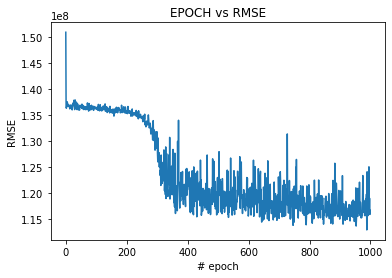
    


```python
plt.plot(history.history['mean_absolute_error'])
plt.xlabel('# epoch')
plt.ylabel('MAE')
plt.title('EPOCH vs MAE')
```


    Text(0.5, 1.0, 'EPOCH vs MAE')


    
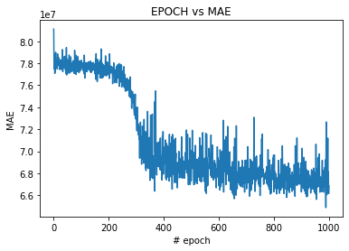
    


```python


```


```python
y_pred = model.predict(X_test)
plt.figure(figsize=(10,10))
plt.scatter(y_test, y_pred, c='purple')

p1 = max(max(y_pred), max(y_test))
p2 = min(min(y_pred), min(y_test))
plt.plot([p1, p2], [p1, p2], 'b-')
plt.xlabel('True Values', fontsize=15)
plt.ylabel('Predictions', fontsize=15)
plt.title('MLP Regression')
plt.show()
```


    
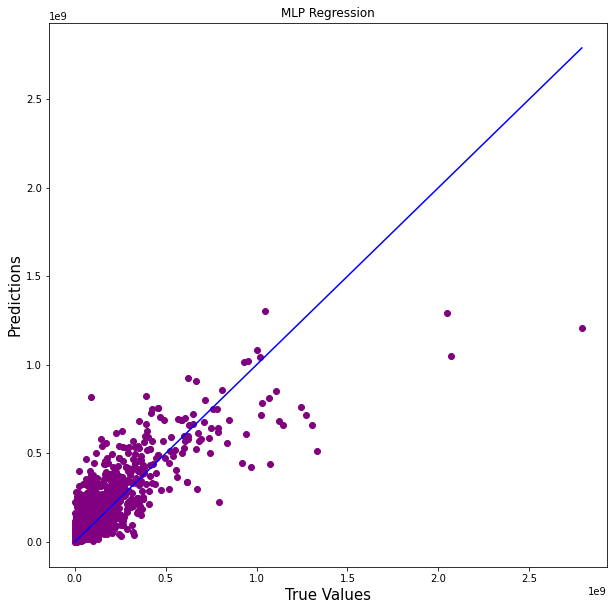
    


```python
plt.plot(abs(np.array(y_test).reshape(-1, 1) - y_pred), c='g', marker='o',  linestyle='')
```


    [<matplotlib.lines.Line2D at 0x1d31d8c99a0>]


    
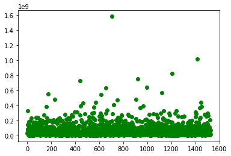
    


```python
print("MLP Regressor r2 score  train:",r2_score(y_train, model.predict(X_train)))
print("MLP Regressor r2 score  test:",r2_score(y_test, y_pred))
```

    MLP Regressor r2 score  train: 0.6496517343272787
    MLP Regressor r2 score  test: 0.6289338826700656
    


```python
from sklearn.neighbors import KNeighborsRegressor
```

# KNN Regressor


```python
knn = KNeighborsRegressor(n_neighbors=10)
knn.fit(X_train, y_train)
```


    KNeighborsRegressor(n_neighbors=10)


```python
# knn.predict(X_test)-y_test
y_pred = knn.predict(X_test)
plt.figure(figsize=(10,10))
plt.scatter(y_test, y_pred, c='magenta')

p1 = max(max(y_pred), max(y_test))
p2 = min(min(y_pred), min(y_test))
plt.plot([p1, p2], [p1, p2], 'b-')
plt.xlabel('True Values', fontsize=15)
plt.ylabel('Predictions', fontsize=15)
plt.title('Knn Regression')
plt.show()
```


    
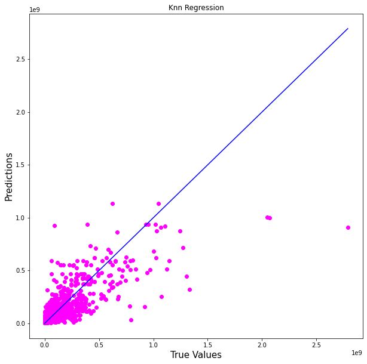
    


```python
mean_squared_error(y_pred, y_test, squared=False), mean_absolute_error(y_pred, y_test)
```


    (126378561.04647042, 64130231.37903014)


```python
plt.plot(abs(y_test - y_pred), c='g', marker='o',  linestyle='')
```


    [<matplotlib.lines.Line2D at 0x1d31ef420a0>]


    
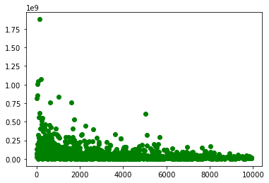
    


```python
print("Knn r2 score train:" ,r2_score(y_train, knn.predict(X_train)))
print("Knn r2 score test:" ,r2_score(y_test, y_pred))
```

    Knn r2 score train: 0.709480975918271
    Knn r2 score test: 0.60019373382864
    


```python
plot_learning_curve(knn, 'KNN Regression', x.drop('Revenue', axis=1), x['Revenue'])
```


    <module 'matplotlib.pyplot' from 'C:\\ProgramData\\Anaconda3\\lib\\site-packages\\matplotlib\\pyplot.py'>


    
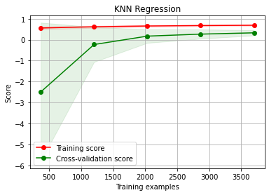
    


# Ridge Regression


```python
ridge = Ridge(alpha=0.1, normalize=True)
ridge.fit(X_train, y_train)
```


    Ridge(alpha=0.1, normalize=True)


```python
y_pred = ridge.predict(X_test)
plt.figure(figsize=(10,10))
plt.scatter(y_test, y_pred, c='c')

p1 = max(max(y_pred), max(y_test))
p2 = min(min(y_pred), min(y_test))
plt.plot([p1, p2], [p1, p2], 'b-')
plt.xlabel('True Values', fontsize=15)
plt.ylabel('Predictions', fontsize=15)
plt.title("Ridge Regression")
plt.show()
```


    
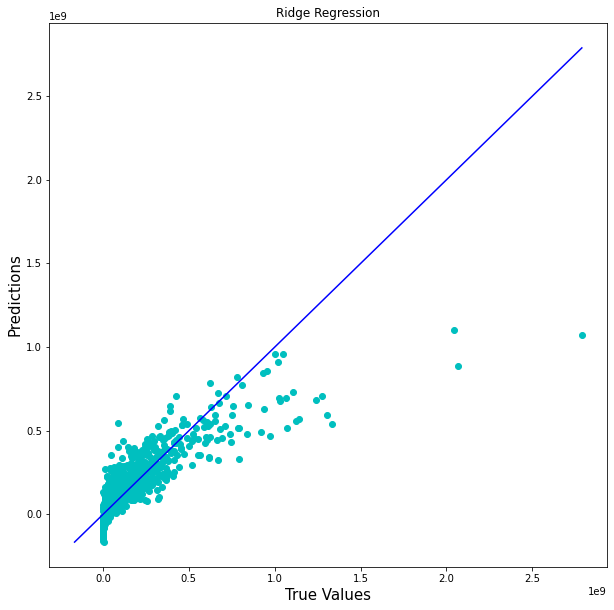
    


```python
plt.plot(abs(y_test - y_pred), c='g', marker='o',  linestyle='')
```


    [<matplotlib.lines.Line2D at 0x1d1f687b9d0>]


    
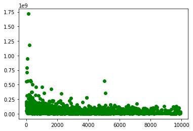
    


```python
print("ridge regression r2 score train:" ,r2_score(y_train, model.predict(X_train)))
print("ridge regression r2 score test :" ,r2_score(y_test, y_pred))
```

    ridge regression r2 score train: 0.605704042747785
    ridge regression r2 score test : 0.7140971110283509
    


```python
plot_learning_curve(ridge, 'ridge Regression', x.drop('Revenue', axis=1), x['Revenue'])
```


    <module 'matplotlib.pyplot' from 'C:\\ProgramData\\Anaconda3\\lib\\site-packages\\matplotlib\\pyplot.py'>


    
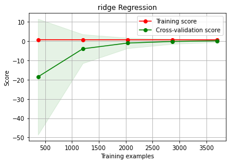
    


# Lasso Regression


```python
lasso = Lasso(alpha=100, max_iter=10000).fit(X_train, y_train)
```


```python
y_pred = lasso.predict(X_test)
plt.figure(figsize=(10,10))
plt.scatter(y_test, y_pred, c='g')

p1 = max(max(y_pred), max(y_test))
p2 = min(min(y_pred), min(y_test))
plt.plot([p1, p2], [p1, p2], 'b-')
plt.xlabel('True Values', fontsize=15)
plt.ylabel('Predictions', fontsize=15)
plt.title("Lasso Regression")
plt.show()
```


    
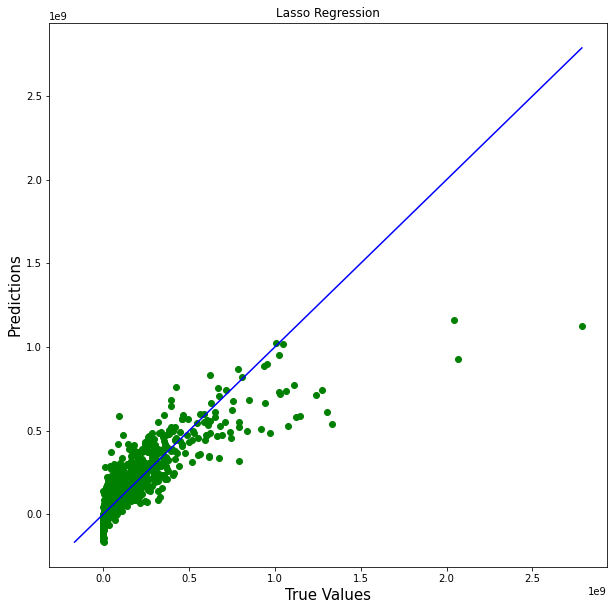
    


```python
plt.plot(abs(y_test - y_pred), c='g', marker='o',  linestyle='')
```


    [<matplotlib.lines.Line2D at 0x1d1f6868430>]


    
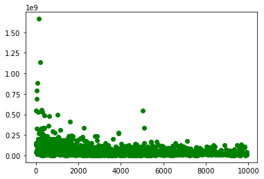
    


```python
print("lasso regression r2 score train:" ,r2_score(y_train, model.predict(X_train)))
print("lasso regression r2 score test :" ,r2_score(y_test, y_pred))
```

    lasso regression r2 score train: 0.605704042747785
    lasso regression r2 score test : 0.7173128031129512
    


```python

```
